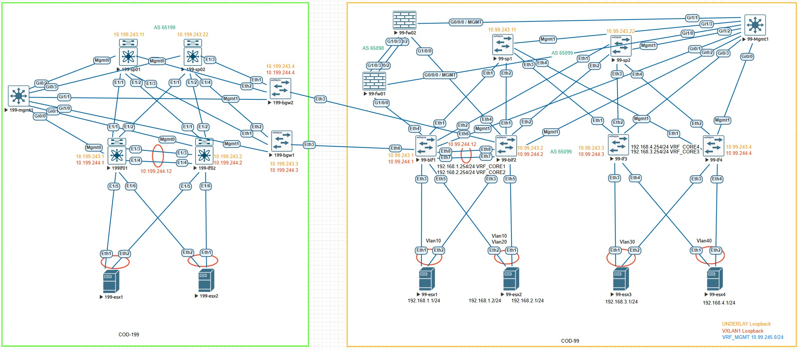

# Проектная работа:  Реализовать связность двух ЦОД с применением дизайна Close topology Multisite

## Задание
1. Настроить 2 POD POD-99 POD-199 
2. Настроить DCI связность
3. Сделать один растянутый влан под требования заказчика для L2 связности ВМ Заказчика между подами ( Vlan 99)
4. Настроить два  VRF в POD -199 - VRF13(изолированный), VRF14 - затерминировать VRF14 на фаерволлах POD99 для связности с VRF POD99


---

## Топология сети



## IP-план (Address Plan) 
## POD-99
<details>
<summary>IP Plan </summary>

### Underlay сеть (Fabric Links - Point-to-Point /31)

| Device Name | IP Address/Маска | Port      | Remote Device | Remote Port | Description         |
|-------------|------------------|-----------|---------------|-------------|---------------------|
| 99-blf1     | 10.99.241.0/31   | Ethernet1 | 99-sp1        | Ethernet1   | to Spine1           |
| 99-blf1     | 10.99.242.0/31   | Ethernet2 | 99-sp2        | Ethernet1   | to Spine2           |
| 99-blf1     | -                | Ethernet3 | 99-esx1       | Ethernet1   | Server Trunk        |
| 99-blf1     | -                | Ethernet4 | 99-fw01       | GI1/0/0     | to fw01             |
| 99-blf1     | -                | Ethernet5 | 99-esx2       | Ethernet2   | Server Trunk        |
| 99-blf2     | 10.99.241.2/31   | Ethernet1 | 99-sp1        | Ethernet2   | to Spine1           |
| 99-blf2     | 10.99.242.2/31   | Ethernet2 | 99-sp2        | Ethernet2   | to Spine2           |
| 99-blf2     | -                | Ethernet3 | 99-esx1       | Ethernet1   | Server Trunk        |
| 99-blf2     | -                | Ethernet5 | 99-esx2       | Ethernet2   | Server Trunk        |
| 99-blf2     | -                | Ethernet4 | 99-fw02       | GI1/0/1     | to fw02             |
| 99-lf3      | 10.99.241.4/31   | Ethernet1 | 99-sp1        | Ethernet3   | to Spine1           |
| 99-lf3      | 10.99.242.4/31   | Ethernet2 | 99-sp2        | Ethernet3   | to Spine2           |
| 99-lf3      | -                | Ethernet3 | 99-esx3       | Ethernet1   | Server Trunk        |
| 99-lf3      | -                | Ethernet4 | 99-esx4       | Ethernet2   | Server Trunk        |
| 99-lf4      | 10.99.241.6/31   | Ethernet1 | 99-sp1        | Ethernet4   | to Spine1           |
| 99-lf4      | 10.99.242.6/31   | Ethernet2 | 99-sp2        | Ethernet4   | to Spine2           |
| 99-lf4      | -                | Ethernet3 | 99-esx3       | Ethernet2   | Server Trunk        |
| 99-lf4      | -                | Ethernet4 | 99-esx4       | Ethernet1   | Server Trunk        |
| 99-fw01     | 10.99.242.12/31  |Eth-Trunk23| 99-fw02       |Eth-Trunk23  | HRP LINK            |

### Loopback адреса для BGP Underlay (Сеть 10.99.243.0/24)

| Device Name | Loopback0 Address | Description          |
|-------------|-------------------|----------------------|
| 99-blf1     | 10.99.243.1/32    | BGP Router-ID        |
| 99-blf2     | 10.99.243.2/32    | BGP Router-ID        |
| 99-lf3      | 10.99.243.3/32    | BGP Router-ID        |
| 99-lf4      | 10.99.243.4/32    | BGP Router-ID        |
| 99-sp1      | 10.99.243.11/32   | BGP Router-ID        |
| 99-sp2      | 10.99.243.22/32   | BGP Router-ID        |


### Loopback адреса для VXLAN NVE (Сеть 10.99.244.0/24)

| Device Name | Loopback1 Address | Description          |
|-------------|-------------------|----------------------|
| 99-blf1     | 10.99.244.1/32    | VTEP Source          |
| 99-blf2     | 10.99.244.2/32    | VTEP Source          |
| 99-lf3      | 10.99.244.3/32    | VTEP Source          |
| 99-lf4      | 10.99.244.4/32    | VTEP Source          |

### P2P адреса для VRF (Сеть 10.99.1.0/24)

| Device Name | Loopback0 Address | VRF         |
|-------------|-------------------|-------------|
| 99-fw01     | 10.99.1.0/31      | VRF_CORE_1  |
| 99-fw02     | 10.99.1.3/31      | VRF_CORE_1  |
| 99-blf1     | 10.99.1.1/31      | VRF_CORE_1  |
| 99-blf2     | 10.99.1.2/31      | VRF_CORE_1  |
| 99-fw01     | 10.99.2.0/31      | VRF_CORE_2  |
| 99-fw02     | 10.99.2.3/31      | VRF_CORE_2  |
| 99-blf1     | 10.99.2.1/31      | VRF_CORE_2  |
| 99-blf2     | 10.99.2.2/31      | VRF_CORE_2  |
| 99-fw01     | 10.99.3.0/31      | VRF_CORE_3  |
| 99-fw02     | 10.99.3.3/31      | VRF_CORE_3  |
| 99-blf1     | 10.99.3.1/31      | VRF_CORE_3  |
| 99-blf2     | 10.99.3.2/31      | VRF_CORE_3  |
| 99-fw01     | 10.99.4.0/31      | VRF_CORE_4  |
| 99-fw02     | 10.99.4.3/31      | VRF_CORE_4  |
| 99-blf1     | 10.99.4.1/31      | VRF_CORE_4  |
| 99-blf2     | 10.99.4.2/31      | VRF_CORE_4  |

### MGMT адреса (Сеть 10.99.245.0/24)

| Device Name | Loopback0 Address | Description   |
|-------------|-------------------|---------------|
| 99-blf1     | 10.99.245.1/32    | Mgmt ip       |
| 99-blf2     | 10.99.245.2/32    | Mgmt ip       |
| 99-lf3      | 10.99.245.3/32    | Mgmt ip       |
| 99-lf4      | 10.99.245.4/32    | Mgmt ip       |
| 99-sp1      | 10.99.245.11/32   | Mgmt ip       |
| 99-sp2      | 10.99.245.22/32   | Mgmt ip       |
| 99-fw01     | 10.99.245.252/32  | Mgmt ip       |
| 99-fw02     | 10.99.245.253/32  | Mgmt ip       |
| 99-fw       | 10.99.245.254/32  | VIP GW        |


### EVPN L2-домены (VLAN ↔ VNI Mapping)

| VLAN | Описание          | L2 VNI | Anycast Gateway   | Leaf с настроенным VNI |
|------|-------------------|--------|-------------------|------------------------|
| 10   | VLAN10   | 10010  | 192.168.1.254/24  | 99-blf1, 99-blf2 VRF_CORE1 |
| 20   | VLAN20   | 10020  | 192.168.2.254/24  | 99-blf1, 99-blf2 VRF_CORE2 |
| 30   | VLAN30   | 10030  | 192.168.3.254/24  | 99-lf3, 99-lf4 VRF_CORE3 |
| 40   | VLAN40   | 10040  | 192.168.4.254/24  | 99-lf3, 99-lf4 VRF_CORE4 |


### Конфигурация "ESXi" устройств 

| ESXi Device | Физические порты (Trunk) | Виртуальные интерфейсы (SVI)| IP Address/Маска | Gateway     |
|-------------|--------------------------|---------------------------|------------------|---------------|
| 99-esx1     | Eth1 → 99-blf1 Eth3   Po1| Vlan10 (SVI для VLAN10)   | 192.168.1.1/24   | 192.168.1.254 |
| 99-esx1     | Eth2 → 99-blf2 Eth3   Po1| Vlan10 (SVI для VLAN10)   | 192.168.1.1/24   | 192.168.1.254 |
| 99-esx2     | Eth1 → 99-blf1 Eth5   Po2| Vlan10 (SVI для VLAN10)   | 192.168.1.2/24   | 192.168.1.254 |
| 99-esx2     | Eth1 → 99-blf2 Eth5   Po2| Vlan20 (SVI для VLAN20)   | 192.168.2.1/24   | 192.168.2.254 |
| 99-esx2     | Eth1 → 99-blf1 Eth5   Po2| Vlan10 (SVI для VLAN10)   | 192.168.1.2/24   | 192.168.1.254 |
| 99-esx2     | Eth1 → 99-blf2 Eth5   Po2| Vlan20 (SVI для VLAN20)   | 192.168.2.1/24   | 192.168.2.254 |
| 99-esx3     | Eth1 → 99-lf3 Eth3    Po1| Vlan30 (SVI для VLAN30)   | 192.168.3.1/24   | 192.168.3.254 |
| 99-esx3     | Eth1 → 99-lf4 Eth3    Po1| Vlan30 (SVI для VLAN30)   | 192.168.3.1/24   | 192.168.3.254 |
| 99-esx4     | Eth1 → 99-lf3 Eth4    Po1| Vlan40 (SVI для VLAN40)   | 192.168.4.1/24   | 192.168.4.254 |
| 99-esx4     | Eth1 → 99-lf4 Eth4    Po1| Vlan40 (SVI для VLAN40)   | 192.168.4.1/24   | 192.168.4.254 |
| 99-esx3     | Eth1 → 99-lf3 Eth3    Po1| Vlan99 (SVI для VLAN99)   | 192.168.99.5/24  | -             |
| 99-esx3     | Eth1 → 99-lf4 Eth3    Po1| Vlan99 (SVI для VLAN99)   | 192.168.99.6/24  | -             |
| 99-esx4     | Eth1 → 99-lf3 Eth4    Po1| Vlan99 (SVI для VLAN99)   | 192.168.99.5/24  | -             |
| 99-esx4     | Eth1 → 99-lf4 Eth4    Po1| Vlan99 (SVI для VLAN99)   | 192.168.99.6/24  | -             |

</details>

## POD-199
<details>
<summary>IP Plan </summary>

### Underlay сеть (Fabric Links - Point-to-Point /31 из сети 10.199.241.0/24 10.199.242.0/24)

| Device Name | IP Address/Маска | Port            | Remote Device | Remote Port | Description         |
|-------------|------------------|-----------------|---------------|-------------|---------------------|
| 199-lf01    | 10.199.241.0/31  | Ethernet1/1     | 199-sp01      | Ethernet1/1 | to Spine1           |
| 199-lf01    | 10.199.242.0/31  | Ethernet1/2     | 199-sp02      | Ethernet1/1 | to Spine2           |
| 199-lf01    | -                | Ethernet1/3 Po34| 199-lf02      | Ethernet1/3 | 199-lf02 Po34       |
| 199-lf01    | -                | Ethernet1/4 Po34| 199-lf02      | Ethernet1/4 | 199-lf02 Po34       |
| 199-lf01    | -                | Ethernet1/5 Po5 | 199-esx1      | Ethernet1   | 199-esx1 et1        |
| 199-lf01    | -                | Ethernet1/6 Po6 | 199-esx2      | Ethernet2   | 199-esx2 et1        | 
| 199-lf02    | 10.199.241.2/31  | Ethernet1/1     | 199-sp01      | Ethernet1/2 | to Spine1           |
| 199-lf02    | 10.199.242.2/31  | Ethernet1/2     | 199-sp02      | Ethernet1/2 | to Spine2           |
| 199-lf02    | -                | Ethernet1/3 Po34| 199-lf01      | Ethernet1/3 | 199-lf01 Po34       |
| 199-lf02    | -                | Ethernet1/4 Po34| 199-lf01      | Ethernet1/4 | 199-lf01 Po34       |
| 199-lf02    | -                | Ethernet1/5 Po5 | 199-esx1      | Ethernet1   | 199-esx1 et1        |
| 199-lf02    | -                | Ethernet1/6 Po6 | 199-esx2      | Ethernet2   | 199-esx2 et1        | 
| 199-bgw1    | 10.199.241.4/31  | Ethernet1       | 199-sp01      | Ethernet1/3 | to Spine1           |
| 199-bgw1    | 10.199.242.4/31  | Ethernet2       | 199-sp02      | Ethernet1/3 | to Spine2           |
| 199-bgw2    | 10.199.241.6/31  | Ethernet1       | 199-sp01      | Ethernet1/4 | to Spine1           |
| 199-bgw2    | 10.199.242.6/31  | Ethernet2       | 199-sp02      | Ethernet1/4 | to Spine2           |
| 199-sp01    | 10.199.241.1/31  | Ethernet1/1     | 199-lf01      | Ethernet1/1 | to lf01 Et1/1       |
| 199-sp01    | 10.199.241.3/31  | Ethernet1/2     | 199-lf02      | Ethernet1/1 | to lf02 Et1/1       |
| 199-sp01    | 10.199.241.5/31  | Ethernet1/3     | 199-bgw1      | Ethernet1   | to bgw1 Et1         |
| 199-sp01    | 10.199.241.7/31  | Ethernet1/4     | 199-bgw2      | Ethernet1   | to bgw2 Et1         |
| 199-sp02    | 10.199.242.1/31  | Ethernet1/1     | 199-lf01      | Ethernet1/2 | to lf01 Et1/2       |
| 199-sp02    | 10.199.242.3/31  | Ethernet1/2     | 199-lf02      | Ethernet1/2 | to lf02 Et1/2       |
| 199-sp02    | 10.199.242.5/31  | Ethernet1/3     | 199-bgw1      | Ethernet2   | to bgw1 Et2         |
| 199-sp02    | 10.199.242.7/31  | Ethernet1/4     | 199-bgw2      | Ethernet2   | to bgw2 Et2         |


### Loopback 0 адреса для BGP  POD 199 (Сеть 10.199.243.0/24)

| Device Name | Loopback0 Address | Description          |
|-------------|-------------------|----------------------|
| 199-lf1     | 10.199.243.1/32   | BGP Router-ID        |
| 199-lf2     | 10.199.243.2/32   | BGP Router-ID        |
| 199-bgw1    | 10.199.243.33/32  | BGP Router-ID        |
| 199-bgw2    | 10.199.243.44/32  | BGP Router-ID        |
| 199-sp1     | 10.199.243.11/32  | BGP Router-ID        |
| 199-sp2     | 10.199.243.22/32  | BGP Router-ID        |


### Loopback адреса для VXLAN NVE POD 199 (Сеть 10.199.244.0/24)

| Device Name | Loopback1 Address | Description          |
|-------------|-------------------|----------------------|
| 199-lf1     | 10.199.244.1/32   | VTEP Source          |
| 199-lf2     | 10.199.244.1/32   | VTEP Source          |
| 199-bgw1    | 10.199.244.33/32   | VTEP Source          |
| 199-bgw2    | 10.199.244.34/32   | VTEP Source          |

### MGMT адреса (Сеть 10.199.245.0/24)

| Device Name | Loopback0 Address | Description   |
|-------------|-------------------|---------------|
| 199-lf1     | 10.199.245.1/32   | Mgmt ip       |
| 199-lf2     | 10.199.245.2/32   | Mgmt ip       |
| 199-bgw2    | 10.199.245.3/32   | Mgmt ip       |
| 199-bgw2    | 10.199.245.4/32   | Mgmt ip       |
| 199-sp1     | 10.199.245.11/32  | Mgmt ip       |
| 199-sp2     | 10.199.245.22/32  | Mgmt ip       |


### EVPN L2-домены (VLAN ↔ VNI Mapping)

| VLAN | Описание          | L2 VNI | Anycast Gateway   | Leaf с настроенным VNI |
|------|-------------------|--------|-------------------|------------------------|
| 13   | VLAN13   | 19913  | 192.168.13.254/24  | 199-lf01, 199-lf02 VRF_CORE1 |
| 14   | VLAN14   | 19914  | 192.168.14.254/24  | 199-lf01, 199-lf02 VRF_CORE2 |
| 99   | VLAN99   | 19999  | -                  | 199-lf01, 199-lf02      |


### Конфигурация "ESXi" устройств 

| ESXi Device | Физические порты (Trunk) | Виртуальные интерфейсы (SVI)| IP Address/Маска  | Gateway      |
|-------------|--------------------------|-----------------------------|-------------------|--------------|
| 199-esx1    | Po1 Eth1→ 199-lf01 Eth1/5| Vlan13 (SVI для VLAN10)   | 192.168.13.1/24    | 192.168.13.254|
| 199-esx1    | Po1 Eth1→ 199-lf01 Eth1/5| Vlan13 (SVI для VLAN10)   | 192.168.13.1/24    | 192.168.13.254|
| 199-esx1    | Po1 Eth1→ 199-lf01 Eth1/5| Vlan14 (SVI для VLAN10)   | 192.168.14.2/24    | 192.168.14.254|
| 199-esx1    | Po1 Eth1→ 199-lf01 Eth1/5| Vlan14 (SVI для VLAN10)   | 192.168.14.2/24    | 192.168.14.254|
| 199-esx1    | Po1 Eth1→ 199-lf01 Eth1/5| Vlan99 (SVI для VLAN99)   | 192.168.99.1/24    | -             |
| 199-esx1    | Po1 Eth1→ 199-lf01 Eth1/5| Vlan99 (SVI для VLAN99)   | 192.168.99.1/24    | -             |
| 199-esx2    | Po1 Eth1→ 199-lf01 Eth1/6| Vlan13 (SVI для VLAN20)   | 192.168.13.1/24    | 192.168.13.254|
| 199-esx2    | Po1 Eth2→ 199-lf02 Eth1/6| Vlan13 (SVI для VLAN20)   | 192.168.13.1/24    | 192.168.13.254|
| 199-esx2    | Po1 Eth1→ 199-lf01 Eth1/6| Vlan14 (SVI для VLAN20)   | 192.168.14.1/24    | 192.168.14.254|
| 199-esx2    | Po1 Eth2→ 199-lf02 Eth1/6| Vlan14 (SVI для VLAN20)   | 192.168.14.1/24    | 192.168.14.254|
| 199-esx2    | Po1 Eth1→ 199-lf02 Eth1/6| Vlan99 (SVI для VLAN99)   | 192.168.99.2/24    | -             |
| 199-esx1    | Po1 Eth1→ 199-lf02 Eth1/6| Vlan99 (SVI для VLAN99)   | 192.168.99.2/24    | -             |

</details>


## DCI
<details>
<summary>IP Plan DCI </summary>
### Underlay сеть (DCI Links - Point-to-Point /31 из сети 10.88.241.0/24 10.88.242.0/24)

| Device Name | IP Address/Маска | Port            | Remote Device | Remote Port | Description         |
|-------------|------------------|-----------------|---------------|-------------|---------------------|
| 199-bgw1    | 10.88.241.0/31   | Ethernet3       | 99-blf01      | Ethernet6   | DCI 99-blf01        |
| 199-bgw2    | 10.88.242.0/31   | Ethernet3       | 99-blf02      | Ethernet6   | DCI 99-blf02        |

### Loopback 0 адреса для BGP  DCI (Сеть 10.88.243.0/24)

| Device Name | Loopback0 Address | Description          |
|-------------|-------------------|----------------------|
| 99-blf01    | 10.88.243.1/32    | BGP Router-ID        |
| 99-blf02    | 10.88.243.2/32    | BGP Router-ID        |
| 199-bgw1    | 10.88.243.33/32   | BGP Router-ID        |
| 199-bgw2    | 10.88.243.44/32   | BGP Router-ID        |

### Loopback адреса для VXLAN NVE DCI (Сеть 10.88.244.0/24)

| Device Name | Loopback1 Address | Description          |
|-------------|-------------------|----------------------|
| 99-blf01    | 10.88.244.1/32    | VTEP Source          |
| 99-blf02    | 10.88.244.2/32    | VTEP Source          |
| 99-blf01/02 | 10.88.244.12/32   | VTEP Source secondary|
| 199-bgw1    | 10.88.244.33/32   | VTEP Source          |
| 199-bgw2    | 10.88.244.34/32   | VTEP Source          |

</details>
---

## Конфигурация 

## POD-99
<details>
<summary>POD-199 </summary>

### 99-fw01 

<details>
<summary>FW01 </summary>

```bash
router id 10.99.245.252
#
undo telnet server enable
undo telnet ipv6 server enable
#
clock timezone UTC add 00:00:00
#
 hrp enable
 hrp interface Eth-Trunk23 remote 10.99.241.13
 hrp standby config enable
 hrp adjust bgp-cost enable 10
 hrp track interface Eth-Trunk23
#
manager-user admin
password cipher @%@%RqS9%jPme(=~B>N'q<F-QjAt,%-6KExumX]iVOO,O-}NjAwQ@%@%
service-type ssh
level 15
#
interface Eth-Trunk23
 description HRP LINK to 99-fw02
 ip address 10.99.241.12 255.255.255.254
 service-manage http permit
 service-manage https permit
 service-manage ping permit
 service-manage ssh permit
 service-manage snmp permit
 service-manage telnet permit
 service-manage netconf permit
#
interface GigabitEthernet0/0/0
 undo shutdown
 ip binding vpn-instance default
 ip address 10.99.245.252 255.255.255.0
 service-manage http permit
 service-manage https permit
 service-manage ping permit
 service-manage ssh permit
 service-manage snmp permit
 service-manage telnet permit
 service-manage netconf permit
#
interface GigabitEthernet1/0/0
 description 99blf01-Et4
 undo shutdown
 service-manage ping permit
#
interface GigabitEthernet1/0/0.10
 vlan-type dot1q 10
 description Gateway_for_VRF_CORE_1_VLAN10
 ip address 10.99.1.0 255.255.255.254
 service-manage ping permit
#
interface GigabitEthernet1/0/0.20
 vlan-type dot1q 20
 description Gateway_for_VRF_CORE_2_VLAN20
 ip address 10.99.2.0 255.255.255.254
 service-manage ping permit
#
interface GigabitEthernet1/0/0.30
 vlan-type dot1q 30
 description Gateway_for_VRF_CORE_3_VLAN30
 ip address 10.99.3.0 255.255.255.254
 service-manage ping permit
#
interface GigabitEthernet1/0/0.40
 vlan-type dot1q 40
 description Gateway_for_VRF_CORE_4_VLAN40
 ip address 10.99.4.0 255.255.255.254
 service-manage ping permit
#
interface GigabitEthernet1/0/1
 description 99blf02-Et4
 undo shutdown
#
interface GigabitEthernet1/0/2
 description HRP LINK to 99-fw02
 undo shutdown
 eth-trunk 23
#
interface GigabitEthernet1/0/3
 description HRP LINK to 99-fw02
 undo shutdown
 eth-trunk 23
#
interface GigabitEthernet1/0/4
 undo shutdown
#
interface Virtual-if0
#
interface NULL0
#
firewall zone local
 set priority 100
#
firewall zone trust
 set priority 85
 add interface GigabitEthernet0/0/0
 add interface Eth-Trunk23
 add interface GigabitEthernet1/0/0.10
 add interface GigabitEthernet1/0/0
 add interface GigabitEthernet1/0/0.40
#
firewall zone untrust
 set priority 5
#
firewall zone dmz
 set priority 50
 add interface GigabitEthernet1/0/1
 add interface GigabitEthernet1/0/0.30
 add interface GigabitEthernet1/0/0.20

bgp 65098
 group blf01 external
 peer blf01 as-number 65099
 peer blf01 timer keepalive 3 hold 9
 peer 10.99.1.1 as-number 65099
 peer 10.99.1.1 group blf01
 peer 10.99.2.1 as-number 65099
 peer 10.99.2.1 group blf01
 peer 10.99.3.1 as-number 65099
 peer 10.99.3.1 group blf01
 peer 10.99.4.1 as-number 65099
 peer 10.99.4.1 group blf01
 group blf02 external
 peer blf02 as-number 65099
 peer blf02 ebgp-max-hop 10
 peer blf02 timer keepalive 3 hold 9
 peer 10.99.1.2 as-number 65099
 peer 10.99.1.2 group blf02
 peer 10.99.2.2 as-number 65099
 peer 10.99.2.2 group blf02
 peer 10.99.3.2 as-number 65099
 peer 10.99.3.2 group blf02
 peer 10.99.4.2 as-number 65099
 peer 10.99.4.2 group blf02
 #
 ipv4-family unicast
  undo synchronization
  default-route imported
  import-route static
  peer blf01 enable
  peer 10.99.1.1 enable
  peer 10.99.1.1 group blf01
  peer 10.99.2.1 enable
  peer 10.99.2.1 group blf01
  peer 10.99.3.1 enable
  peer 10.99.3.1 group blf01
  peer 10.99.4.1 enable
  peer 10.99.4.1 group blf01
  peer blf02 enable
  peer 10.99.1.2 enable
  peer 10.99.1.2 group blf02
  peer 10.99.2.2 enable
  peer 10.99.2.2 group blf02
  peer 10.99.3.2 enable
  peer 10.99.3.2 group blf02
  peer 10.99.4.2 enable
  peer 10.99.4.2 group blf02
#
ip route-static 0.0.0.0 0.0.0.0 NULL0
#
undo ssh server compatible-ssh1x enable
stelnet server enable
ssh authentication-type default password
#
user-interface con 0
 authentication-mode aaa
user-interface vty 0 4
 authentication-mode aaa
 protocol inbound ssh
user-interface vty 16 20

security-policy
 rule name Underlay
  source-address 10.99.0.0 21
  source-address 10.99.241.0 24
  destination-address 10.99.0.0 21
  destination-address 10.99.241.0 24
  action permit
 rule name VRF_10_30
  source-zone dmz
  destination-zone trust
  source-address 192.168.3.0 24
  destination-address 192.168.1.1 32
  action permit
#

 ```
 </details>

 ### 99-fw02 
<details>
<summary>FW02 </summary>

```bash
router id 10.99.245.253
#
 hrp enable
 hrp standby-device
 hrp interface Eth-Trunk23 remote 10.99.241.12
 hrp standby config enable
 hrp adjust bgp-cost enable 20
 hrp track interface Eth-Trunk23
#
ip vpn-instance default
 ipv4-family

#
interface Eth-Trunk23
 description HRP LINK to 99-fw01
 ip address 10.99.241.13 255.255.255.254
 service-manage http permit
 service-manage https permit
 service-manage ping permit
 service-manage ssh permit
 service-manage snmp permit
 service-manage telnet permit
 service-manage netconf permit
#
interface GigabitEthernet0/0/0
 undo shutdown
 ip binding vpn-instance default
 ip address 10.99.245.253 255.255.255.0
 service-manage http permit
 service-manage https permit
 service-manage ping permit
 service-manage ssh permit
 service-manage snmp permit
 service-manage telnet permit
 service-manage netconf permit
#
interface GigabitEthernet1/0/0
 description 99blf02-Et4
 undo shutdown
 ip address 10.99.242.9 255.255.255.254
 service-manage ping permit
#
interface GigabitEthernet1/0/0.10
 vlan-type dot1q 10
 description Gateway_for_VRF_CORE_1_VLAN10
 ip address 10.99.1.3 255.255.255.254
 service-manage ping permit
#
interface GigabitEthernet1/0/0.20
 vlan-type dot1q 20
 description Gateway_for_VRF_CORE_2_VLAN20
 ip address 10.99.2.3 255.255.255.254
 service-manage ping permit
#
interface GigabitEthernet1/0/0.30
 vlan-type dot1q 30
 description Gateway_for_VRF_CORE_3_VLAN30
 ip address 10.99.3.3 255.255.255.254
 service-manage ping permit
#
interface GigabitEthernet1/0/0.40
 vlan-type dot1q 40
 description Gateway_for_VRF_CORE_4_VLAN40
 ip address 10.99.4.3 255.255.255.254
 service-manage ping permit
#
interface GigabitEthernet1/0/1
 undo shutdown
 ip address 10.99.242.11 255.255.255.254
#
interface GigabitEthernet1/0/2
 description HRP LINK to 99-fw01
 undo shutdown
 eth-trunk 23
#
interface GigabitEthernet1/0/3
 description HRP LINK to 99-fw01
 undo shutdown
 eth-trunk 23
#
interface GigabitEthernet1/0/4
 undo shutdown
#
interface Virtual-if0
#
interface NULL0
#
firewall zone local
 set priority 100
#
firewall zone trust
 set priority 85
 add interface GigabitEthernet0/0/0
 add interface Eth-Trunk23
 add interface GigabitEthernet1/0/0.10
 add interface GigabitEthernet1/0/0
 add interface GigabitEthernet1/0/0.40
#
firewall zone untrust
 set priority 5
#
firewall zone dmz
 set priority 50
 add interface GigabitEthernet1/0/1
 add interface GigabitEthernet1/0/0.30
 add interface GigabitEthernet1/0/0.20
#
l2tp-group default-lns
#
bgp 65098
 group blf01 external
 peer blf01 as-number 65099
 peer blf01 ebgp-max-hop 10
 peer blf01 timer keepalive 3 hold 9
 peer 10.99.1.1 as-number 65099
 peer 10.99.1.1 group blf01
 peer 10.99.2.1 as-number 65099
 peer 10.99.2.1 group blf01
 peer 10.99.3.1 as-number 65099
 peer 10.99.3.1 group blf01
 peer 10.99.4.1 as-number 65099
 peer 10.99.4.1 group blf01
 group blf02 external
 peer blf02 as-number 65099
 peer blf02 timer keepalive 3 hold 9
 peer 10.99.1.2 as-number 65099
 peer 10.99.1.2 group blf02
 peer 10.99.2.2 as-number 65099
 peer 10.99.2.2 group blf02
 peer 10.99.3.2 as-number 65099
 peer 10.99.3.2 group blf02
 peer 10.99.4.2 as-number 65099
 peer 10.99.4.2 group blf02
 #
 ipv4-family unicast
  undo synchronization
  default-route imported
  import-route static
  peer blf01 enable
  peer 10.99.1.1 enable
  peer 10.99.1.1 group blf01
  peer 10.99.2.1 enable
  peer 10.99.2.1 group blf01
  peer 10.99.3.1 enable
  peer 10.99.3.1 group blf01
  peer 10.99.4.1 enable
  peer 10.99.4.1 group blf01
  peer blf02 enable
  peer 10.99.1.2 enable
  peer 10.99.1.2 group blf02
  peer 10.99.2.2 enable
  peer 10.99.2.2 group blf02
  peer 10.99.3.2 enable
  peer 10.99.3.2 group blf02
  peer 10.99.4.2 enable
  peer 10.99.4.2 group blf02
#
ip route-static 0.0.0.0 0.0.0.0 NULL0
#
security-policy
 rule name Underlay
  source-address 10.99.0.0 21
  source-address 10.99.241.0 24
  source-address 10.99.242.0 24
  destination-address 10.99.0.0 21
  destination-address 10.99.241.0 24
  destination-address 10.99.242.0 24
  action permit
 rule name VRF_10_30
  source-zone dmz
  destination-zone trust
  source-address 192.168.3.0 24
  destination-address 192.168.1.1 32
  action permit

 ```
</details>

### 99-blf1 (Border Leaf 1)

<details>
<summary>99-blf1 </summary>

```bash
! Command: show running-config
! device: 99-blf1 (vEOS-lab, EOS-4.29.1F)
!
! boot system flash:/vEOS-lab.swi
!
no aaa root
!
transceiver qsfp default-mode 4x10G
!
service routing protocols model multi-agent
!
hostname 99-blf1
!
spanning-tree mode mstp
spanning-tree edge-port bpduguard default
!
vlan 10
   name VLAN10
!
vlan 20
   name VLAN20
!
vlan 99
!
vlan 4094
   name MLAG-PEERLINK
   trunk group MLAG-PEERLINK
!
vrf instance MGMT
!
vrf instance VRF_13
!
vrf instance VRF_14
!
vrf instance VRF_CORE_1
!
vrf instance VRF_CORE_2
!
vrf instance VRF_CORE_3
!
vrf instance VRF_CORE_4
!
interface Port-Channel3
   description 99-esx1
   mtu 9100
   switchport trunk allowed vlan 10,20,99
   switchport mode trunk
   mlag 3
!
interface Port-Channel5
   mtu 9100
   switchport trunk allowed vlan 10,20
   switchport mode trunk
   mlag 5
!
interface Port-Channel78
   description MLAG_PEERLINK
   switchport mode trunk
   switchport trunk group MLAG-PEERLINK
   spanning-tree link-type point-to-point
!
interface Ethernet1
   description to-99-sp1-Eth1
   mtu 9100
   no switchport
   ip address 10.99.241.0/31
!
interface Ethernet2
   description to-99-sp2-Eth1
   mtu 9100
   no switchport
   ip address 10.99.242.0/31
!
interface Ethernet3
   description to-99-esx1-Eth1
   mtu 9100
   switchport trunk allowed vlan 10,20,90
   switchport mode trunk
   channel-group 3 mode active
!
interface Ethernet4
   description 99-fw01 G1/0/0
   no switchport
!
interface Ethernet4.10
   encapsulation dot1q vlan 10
   vrf VRF_CORE_1
   ip address 10.99.1.1/31
!
interface Ethernet4.14
   encapsulation dot1q vlan 14
   vrf VRF_14
   ip address 10.99.14.1/31
!
interface Ethernet4.20
   encapsulation dot1q vlan 20
   vrf VRF_CORE_2
   ip address 10.99.2.1/31
!
interface Ethernet4.30
   encapsulation dot1q vlan 30
   vrf VRF_CORE_3
   ip address 10.99.3.1/31
!
interface Ethernet4.40
   encapsulation dot1q vlan 40
   vrf VRF_CORE_4
   ip address 10.99.4.1/31
!
interface Ethernet5
   description 99-esx2-eth2
   mtu 9100
   speed forced 10000full
   switchport trunk allowed vlan 10,20
   switchport mode trunk
   channel-group 5 mode active
!
interface Ethernet6
   description to-199-bgw1-Eth3
   mtu 9100
   no switchport
   ip address 10.88.241.1/31
!
interface Ethernet7
   description Po78 lf2
   channel-group 78 mode active
!
interface Ethernet8
   description Po78 lf2
   channel-group 78 mode active
!
interface Ethernet9
!
interface Ethernet10
!
interface Loopback0
   description Router-ID
   ip address 10.99.243.1/32
!
interface Loopback1
   description VXLAN-Tunnel-Endpoint
   ip address 10.99.244.1/32
   ip address 10.99.244.12/32 secondary
!
interface Loopback10
   description BGP-Router-ID-DCI
   ip address 10.88.243.1/32
!
interface Loopback11
   description VTEP-Source-DCI
   ip address 10.88.244.1/32
!
interface Loopback13
   vrf VRF_13
   ip address 192.168.233.11/24
!
interface Loopback14
   vrf VRF_14
   ip address 192.168.244.11/24
!
interface Management1
   description MGMT
   vrf MGMT
   ip address 10.99.245.1/24
!
interface Vlan10
   description Vlan10
   mtu 9100
   vrf VRF_CORE_1
   ip address virtual 192.168.1.254/24
!
interface Vlan20
   description Vlan20
   mtu 9100
   vrf VRF_CORE_2
   ip address virtual 192.168.2.254/24
!
interface Vlan4094
   no autostate
   ip address 10.99.246.1/30
!
interface Vxlan1
   description VXLAN-Tunnel-Endpoint
   vxlan source-interface Loopback1
   vxlan udp-port 4789
   vxlan vlan 10 vni 10010
   vxlan vlan 20 vni 10020
   vxlan vlan 99 vni 19999
   vxlan vrf VRF_13 vni 19913
   vxlan vrf VRF_14 vni 19914
   vxlan vrf VRF_CORE_1 vni 10001
   vxlan vrf VRF_CORE_2 vni 10002
   vxlan vrf VRF_CORE_3 vni 10003
   vxlan vrf VRF_CORE_4 vni 10004
   vxlan learn-restrict any
!
ip virtual-router mac-address 00:00:00:00:00:01
!
ip routing
ip routing vrf MGMT
ip routing vrf VRF_13
ip routing vrf VRF_14
ip routing vrf VRF_CORE_1
ip routing vrf VRF_CORE_2
ip routing vrf VRF_CORE_3
ip routing vrf VRF_CORE_4
!
ip prefix-list DEFAULT
   seq 10 permit 0.0.0.0/0
!
ip prefix-list DEFAULT_3
   seq 10 permit 0.0.0.0/0
   seq 20 permit 192.168.3.0/24 le 32
   seq 30 permit 172.16.30.0/24 le 32
!
ip prefix-list DEFAULT_4
   seq 10 permit 0.0.0.0/0
   seq 20 permit 192.168.4.0/24 le 32
   seq 30 deny 192.168.0.0/16 le 32
!
ip prefix-list PL_BLF_TO_DCI
   seq 5 permit 10.88.243.1/32
   seq 10 permit 10.88.244.1/32
!
ip prefix-list PL_BLF_TO_SPINE
   seq 5 permit 10.99.243.1/32
   seq 10 permit 10.99.244.1/32
   seq 15 permit 10.88.243.1/32
   seq 20 permit 10.88.244.1/32
!
ip prefix-list VRF_CORES
   seq 10 permit 192.168.0.0/16 le 32
!
ip prefix-list VRF_CORE_4
   seq 10 permit 192.168.4.0/24
!
mlag configuration
   domain-id 12
   local-interface Vlan4094
   peer-address 10.99.246.2
   peer-address heartbeat 10.99.245.2 vrf MGMT
   peer-link Port-Channel78
   dual-primary detection delay 1 action errdisable all-interfaces
!
ip route vrf MGMT 0.0.0.0/0 10.99.245.254
!
route-map DEFAULT permit 10
   match ip address prefix-list DEFAULT
!
route-map RM_BLF_TO_DCI permit 10
   match ip address prefix-list PL_BLF_TO_DCI
!
route-map RM_BLF_TO_SPINE permit 10
   match ip address prefix-list PL_BLF_TO_SPINE
!
route-map VRFS_CORE permit 10
   match ip address prefix-list VRF_CORES
!
route-map VRF_CORE_3 permit 10
   match ip address prefix-list DEFAULT_3
!
route-map VRF_CORE_4 permit 10
   match ip address prefix-list DEFAULT_4
!
router bgp 65099
   router-id 10.99.243.1
   no bgp default ipv4-unicast
   timers bgp 3 9
   rd auto
   maximum-paths 10 ecmp 10
   neighbor DCI-EVPN peer group
   neighbor DCI-EVPN remote-as 65999
   neighbor DCI-EVPN update-source Loopback10
   neighbor DCI-EVPN ebgp-multihop 20
   neighbor DCI-EVPN send-community extended
   neighbor DCI-UNDERLAY peer group
   neighbor DCI-UNDERLAY remote-as 65999
   neighbor DCI-UNDERLAY ebgp-multihop 10
   neighbor DCI-UNDERLAY timers 3 9
   neighbor DCI-UNDERLAY send-community
   neighbor SPINE-EVPN peer group
   neighbor SPINE-EVPN remote-as 65099
   neighbor SPINE-EVPN update-source Loopback0
   neighbor SPINE-EVPN ebgp-multihop 2
   neighbor SPINE-EVPN send-community extended
   neighbor SPINE-UNDERLAY peer group
   neighbor SPINE-UNDERLAY remote-as 65099
   neighbor SPINE-UNDERLAY timers 3 9
   neighbor SPINE-UNDERLAY send-community
   neighbor 10.88.241.0 peer group DCI-UNDERLAY
   neighbor 10.88.243.33 peer group DCI-EVPN
   neighbor 10.99.1.3 ebgp-multihop 10
   neighbor 10.99.241.1 peer group SPINE-UNDERLAY
   neighbor 10.99.242.1 peer group SPINE-UNDERLAY
   neighbor 10.99.243.11 peer group SPINE-EVPN
   neighbor 10.99.243.22 peer group SPINE-EVPN
   neighbor 10.99.246.2 remote-as 65099
   neighbor 10.99.246.2 next-hop-self
   neighbor 10.99.246.2 send-community
   !
   vlan 10
      rd auto
      route-target both 65099:10010
      redistribute learned
   !
   vlan 99
      rd evpn domain all 10.88.243.1:99
      route-target both 65099:19999
      route-target import evpn domain remote 65999:19999
      route-target export evpn domain remote 65999:19999
      redistribute learned
   !
   address-family evpn
      neighbor DCI-EVPN activate
      neighbor DCI-EVPN default-route
      neighbor DCI-EVPN domain remote
      neighbor SPINE-EVPN activate
      domain identifier 2:2
      neighbor default next-hop-self received-evpn-routes route-type ip-prefix inter-domain
   !
   address-family ipv4
      neighbor DCI-UNDERLAY activate
      no neighbor SPINE-EVPN activate
      neighbor SPINE-UNDERLAY activate
      neighbor SPINE-UNDERLAY route-map RM_BLF_TO_SPINE out
      neighbor 10.99.246.2 activate
      network 10.88.243.1/32
      network 10.88.244.1/32
      network 10.99.243.1/32
      network 10.99.244.1/32
      network 10.99.244.12/32
   !
   vrf VRF_13
      rd 65099:19913
      route-target import evpn 65199:19913
      route-target export evpn 65199:19913
      !
      address-family ipv4
         redistribute connected
   !
   vrf VRF_14
      rd 65099:19914
      route-target import evpn 65199:19914
      route-target export evpn 65199:19914
      router-id 10.99.14.1
      timers bgp 60 180 min-hold-time 3
      neighbor 10.99.14.0 remote-as 65098
      neighbor 10.99.14.0 next-hop-self
      neighbor 10.99.14.0 update-source Ethernet4.14
      neighbor 10.99.14.0 route-map DEFAULT in
      neighbor 10.99.14.3 remote-as 65098
      neighbor 10.99.14.3 next-hop-self
      neighbor 10.99.14.3 update-source Ethernet4.14
      neighbor 10.99.14.3 ebgp-multihop 10
      neighbor 10.99.14.3 route-map DEFAULT in
      !
      address-family ipv4
         no neighbor 10.99.2.0 activate
         neighbor 10.99.14.0 activate
         neighbor 10.99.14.3 activate
         network 10.99.14.0/31
         redistribute connected
   !
   vrf VRF_CORE_1
      rd 65099:1011
      route-target import evpn 65099:101
      route-target export evpn 65099:101
      router-id 10.99.1.1
      timers bgp 60 180 min-hold-time 3
      neighbor 10.99.1.0 remote-as 65098
      neighbor 10.99.1.0 next-hop-self
      neighbor 10.99.1.0 update-source Ethernet4.10
      neighbor 10.99.1.0 route-map DEFAULT in
      neighbor 10.99.1.3 remote-as 65098
      neighbor 10.99.1.3 next-hop-self
      neighbor 10.99.1.3 update-source Ethernet4.10
      neighbor 10.99.1.3 ebgp-multihop 10
      neighbor 10.99.1.3 route-map DEFAULT in
      !
      address-family ipv4
         neighbor 10.99.1.0 activate
         neighbor 10.99.1.3 activate
         network 10.99.1.0/31
         redistribute connected
   !
   vrf VRF_CORE_2
      rd 65099:1021
      route-target import evpn 65099:102
      route-target export evpn 65099:102
      router-id 10.99.2.1
      timers bgp 60 180 min-hold-time 3
      neighbor 10.99.2.0 remote-as 65098
      neighbor 10.99.2.0 next-hop-self
      neighbor 10.99.2.0 update-source Ethernet4.20
      neighbor 10.99.2.0 route-map DEFAULT in
      neighbor 10.99.2.3 remote-as 65098
      neighbor 10.99.2.3 next-hop-self
      neighbor 10.99.2.3 update-source Ethernet4.20
      neighbor 10.99.2.3 ebgp-multihop 10
      neighbor 10.99.2.3 route-map DEFAULT in
      !
      address-family ipv4
         neighbor 10.99.2.0 activate
         neighbor 10.99.2.3 activate
         network 10.99.2.0/31
         redistribute connected
   !
   vrf VRF_CORE_3
      rd 65099:1031
      route-target import evpn 65099:103
      route-target export evpn 65099:103
      router-id 10.99.3.1
      timers bgp 60 180 min-hold-time 3
      neighbor 10.99.3.0 remote-as 65098
      neighbor 10.99.3.0 next-hop-self
      neighbor 10.99.3.0 update-source Ethernet4.30
      neighbor 10.99.3.0 route-map DEFAULT in
      neighbor 10.99.3.3 remote-as 65098
      neighbor 10.99.3.3 next-hop-self
      neighbor 10.99.3.3 update-source Ethernet4.30
      neighbor 10.99.3.3 ebgp-multihop 10
      neighbor 10.99.3.3 route-map DEFAULT in
      !
      address-family ipv4
         neighbor 10.99.3.0 activate
         neighbor 10.99.3.3 activate
         network 10.99.3.0/31
         redistribute connected
   !
   vrf VRF_CORE_4
      rd 65099:1041
      route-target import evpn 65099:104
      route-target export evpn 65099:104
      router-id 10.99.4.1
      timers bgp 60 180 min-hold-time 3
      neighbor 10.99.4.0 remote-as 65098
      neighbor 10.99.4.0 next-hop-self
      neighbor 10.99.4.0 update-source Ethernet4.40
      neighbor 10.99.4.0 route-map DEFAULT in
      neighbor 10.99.4.3 remote-as 65098
      neighbor 10.99.4.3 next-hop-self
      neighbor 10.99.4.3 update-source Ethernet4.40
      neighbor 10.99.4.3 ebgp-multihop 10
      neighbor 10.99.4.3 route-map DEFAULT in
      !
      address-family ipv4
         neighbor 10.99.4.0 activate
         neighbor 10.99.4.3 activate
         network 10.99.4.0/31
         redistribute connected
!
end


 ```
 </details>

 
 ### 99-blf2 (Border Leaf 2)

<details>
<summary>99-Blf2 </summary>

 ```bash
hostname 99-blf2
!
spanning-tree mode mstp
spanning-tree edge-port bpduguard default
!
vlan 10
   name VLAN10
!
vlan 20
   name VLAN20
!
vlan 4094
   name MLAG-PEERLINK
   trunk group MLAG-PEERLINK
!
vrf instance MGMT
!
vrf instance VRF_CORE_1
!
vrf instance VRF_CORE_2
!
vrf instance VRF_CORE_3
!
vrf instance VRF_CORE_4
!
interface Port-Channel3
   description 99-esx1
   mtu 9100
   switchport trunk allowed vlan 10,20
   switchport mode trunk
   mlag 3
!
interface Port-Channel5
   mtu 9100
   switchport trunk allowed vlan 10,20
   switchport mode trunk
   mlag 5
!
interface Port-Channel78
   description MLAG_PEERLINK
   switchport mode trunk
   switchport trunk group MLAG-PEERLINK
   spanning-tree link-type point-to-point
!
interface Ethernet1
   description to-99-sp1-Eth2
   mtu 9100
   no switchport
   ip address 10.99.241.2/31
!
interface Ethernet2
   description to-99-sp2-Eth2
   mtu 9100
   no switchport
   ip address 10.99.242.2/31
!
interface Ethernet3
   description 99-esx1 et2
   mtu 9100
   switchport trunk allowed vlan 10,20
   switchport mode trunk
   channel-group 3 mode active
!
interface Ethernet4
   description 99-fw01 G1/0/0
   mtu 9100
   no switchport
!
interface Ethernet4.10
   encapsulation dot1q vlan 10
   vrf VRF_CORE_1
   ip address 10.99.1.2/31
!
interface Ethernet4.20
   encapsulation dot1q vlan 20
   vrf VRF_CORE_2
   ip address 10.99.2.2/31
!
interface Ethernet4.30
   encapsulation dot1q vlan 30
   vrf VRF_CORE_3
   ip address 10.99.3.2/31
!
interface Ethernet4.40
   encapsulation dot1q vlan 40
   vrf VRF_CORE_4
   ip address 10.99.4.2/31
!
interface Ethernet5
   description 99-esx2 et1
   mtu 9100
   speed forced 10000full
   switchport trunk allowed vlan 10,20
   switchport mode trunk
   channel-group 5 mode active
!
interface Ethernet6
   description to-199-bgw2-Eth3
   mtu 9100
   no switchport
   ip address 10.88.242.1/31
   no shutdown
!
interface Ethernet7
   description Po78 lf1
   channel-group 78 mode active
!
interface Ethernet8
   description Po78 lf1
   channel-group 78 mode active
!
interface Loopback0
   description Router-ID
   ip address 10.99.243.2/32
!
interface Loopback1
   description VTEP-Source
   ip address 10.99.244.2/32

interface Loopback10
   description BGP-Router-ID-DCI
   ip address 10.88.243.2/32
!
interface Loopback11
   description VTEP-Source-DCI
   ip address 10.88.244.2/32

interface Management1
   description MGMT
   vrf MGMT
   ip address 10.99.245.2/24
!
interface Vlan10
   description Vlan10
   mtu 9100
   vrf VRF_CORE_1
   ip address virtual 192.168.1.100/24
!
interface Vlan20
   description Vlan20
   mtu 9100
   vrf VRF_CORE_2
   ip address virtual 192.168.2.100/24
!
interface Vlan4094
   no autostate
   ip address 10.99.246.2/30
!
interface Vxlan1
   description VXLAN-Tunnel-Endpoint
   vxlan source-interface Loopback1
   vxlan udp-port 4789
   vxlan vlan 10 vni 10010
   vxlan vlan 20 vni 10020
   vxlan vlan 99 vni 19999
   vxlan vrf VRF_CORE_1 vni 10001
   vxlan vrf VRF_CORE_2 vni 10002
   vxlan vrf VRF_CORE_3 vni 10003
   vxlan vrf VRF_CORE_4 vni 10004
   vxlan learn-restrict any
!
ip virtual-router mac-address 00:00:00:00:00:01
!
ip routing
ip routing vrf MGMT
ip routing vrf VRF_CORE_1
ip routing vrf VRF_CORE_2
ip routing vrf VRF_CORE_3
ip routing vrf VRF_CORE_4
!
ip prefix-list DEFAULT
   seq 10 permit 0.0.0.0/0
!

ip prefix-list PL_BLF_TO_SPINE seq 5 permit 10.99.243.2/32
ip prefix-list PL_BLF_TO_SPINE seq 10 permit 10.99.244.2/32
ip prefix-list PL_BLF_TO_SPINE seq 15 permit 10.88.243.2/32
ip prefix-list PL_BLF_TO_SPINE seq 20 permit 10.88.244.2/32

ip prefix-list PL_BLF_TO_DCI seq 5 permit 10.88.243.2/32
ip prefix-list PL_BLF_TO_DCI seq 10 permit 10.88.244.2/32
route-map RM_BLF_TO_SPINE permit 10
   match ip address prefix-list PL_BLF_TO_SPINE

route-map RM_BLF_TO_DCI permit 10
   match ip address prefix-list PL_BLF_TO_DCI

mlag configuration
   domain-id 12
   local-interface Vlan4094
   peer-address 10.99.246.1
   peer-address heartbeat 10.99.245.1 vrf MGMT
   peer-link Port-Channel78
   dual-primary detection delay 1 action errdisable all-interfaces
!
ip route vrf MGMT 0.0.0.0/0 10.99.245.254
!
route-map DEFAULT permit 10
   match ip address prefix-list DEFAULT
!
router bgp 65099
   router-id 10.99.243.2
   no bgp default ipv4-unicast
   timers bgp 3 9
   maximum-paths 10 ecmp 10
   neighbor SPINE-EVPN peer group
   neighbor SPINE-EVPN remote-as 65099
   neighbor SPINE-EVPN update-source Loopback0
   neighbor SPINE-EVPN ebgp-multihop 2
   neighbor SPINE-EVPN send-community extended
   neighbor SPINE-UNDERLAY peer group
   neighbor SPINE-UNDERLAY remote-as 65099
   neighbor SPINE-UNDERLAY bfd
   neighbor SPINE-UNDERLAY timers 3 9
   neighbor SPINE-UNDERLAY send-community
   neighbor 10.99.241.3 peer group SPINE-UNDERLAY
   neighbor 10.99.242.3 peer group SPINE-UNDERLAY
   neighbor 10.99.243.11 peer group SPINE-EVPN
   neighbor 10.99.243.22 peer group SPINE-EVPN
   neighbor 10.99.246.1 remote-as 65099
   neighbor 10.99.246.1 next-hop-self
   neighbor 10.99.246.1 send-community

   neighbor DCI-EVPN peer group
   neighbor DCI-EVPN remote-as 65999
   neighbor DCI-EVPN update-source Loopback10
   neighbor DCI-EVPN ebgp-multihop 2
   neighbor DCI-EVPN send-community extended
   neighbor DCI-UNDERLAY peer group
   neighbor DCI-UNDERLAY remote-as 65999
   neighbor DCI-UNDERLAY timers 3 9
   neighbor DCI-UNDERLAY send-community
   neighbor 10.88.242.0 peer group DCI-UNDERLAY
   neighbor 10.88.243.44 peer group DCI-EVPN

   !
   vlan 10
      rd auto
      route-target both 65099:10010
      redistribute learned
   !
   address-family evpn
      neighbor SPINE-EVPN activate
      neighbor DCI-EVPN activate
   !
   address-family ipv4
      neighbor SPINE-UNDERLAY activate
      neighbor 10.99.246.1 activate
      network 10.99.243.2/32
      network 10.99.244.2/32
      neighbor SPINE-UNDERLAY route-map RM_BLF_TO_SPINE out
      neighbor DCI-UNDERLAY activate
      neighbor DCI-UNDERLAY route-map RM_BLF_TO_DCI out
      network 10.88.243.2/32
      network 10.88.244.2/32
   !
   vrf VRF_CORE_1
      rd 65099:1012
      route-target import evpn 65099:101
      route-target export evpn 65099:101
      router-id 10.99.1.2
      neighbor 10.99.1.0 remote-as 65098
      neighbor 10.99.1.0 next-hop-self
      neighbor 10.99.1.0 update-source Ethernet4.10
      neighbor 10.99.1.0 ebgp-multihop 10
      neighbor 10.99.1.0 route-map DEFAULT in
      neighbor 10.99.1.3 remote-as 65098
      neighbor 10.99.1.3 next-hop-self
      neighbor 10.99.1.3 update-source Ethernet4.10
      neighbor 10.99.1.3 route-map DEFAULT in
      !
      address-family ipv4
         neighbor 10.99.1.0 activate
         neighbor 10.99.1.3 activate
         network 10.99.1.2/31
         redistribute connected
   !
   vrf VRF_CORE_2
      rd 65099:1022
      route-target import evpn 65099:102
      route-target export evpn 65099:102
      router-id 10.99.2.2
      neighbor 10.99.2.0 remote-as 65098
      neighbor 10.99.2.0 next-hop-self
      neighbor 10.99.2.0 update-source Ethernet4.20
      neighbor 10.99.2.0 ebgp-multihop 10
      neighbor 10.99.2.0 route-map DEFAULT in
      neighbor 10.99.2.3 remote-as 65098
      neighbor 10.99.2.3 next-hop-self
      neighbor 10.99.2.3 update-source Ethernet4.20
      neighbor 10.99.2.3 route-map DEFAULT in
      !
      address-family ipv4
         neighbor 10.99.2.0 activate
         neighbor 10.99.2.3 activate
         network 10.99.2.2/31
         redistribute connected
   !
   vrf VRF_CORE_3
      rd 65099:1032
      route-target import evpn 65099:103
      route-target export evpn 65099:103
      router-id 10.99.3.2
      neighbor 10.99.3.0 remote-as 65098
      neighbor 10.99.3.0 next-hop-self
      neighbor 10.99.3.0 update-source Ethernet4.30
      neighbor 10.99.3.0 ebgp-multihop 10
      neighbor 10.99.3.0 route-map DEFAULT in
      neighbor 10.99.3.3 remote-as 65098
      neighbor 10.99.3.3 next-hop-self
      neighbor 10.99.3.3 update-source Ethernet4.30
      neighbor 10.99.3.3 route-map DEFAULT in
      !
      address-family ipv4
         neighbor 10.99.3.0 activate
         neighbor 10.99.3.3 activate
         network 10.99.3.2/31
         redistribute connected
   !
   vrf VRF_CORE_4
      rd 65099:1042
      route-target import evpn 65099:104
      route-target export evpn 65099:104
      router-id 10.99.4.2
      neighbor 10.99.4.0 remote-as 65098
      neighbor 10.99.4.0 next-hop-self
      neighbor 10.99.4.0 update-source Ethernet4.40
      neighbor 10.99.4.0 ebgp-multihop 10
      neighbor 10.99.4.0 route-map DEFAULT in
      neighbor 10.99.4.3 remote-as 65098
      neighbor 10.99.4.3 next-hop-self
      neighbor 10.99.4.3 update-source Ethernet4.40
      neighbor 10.99.4.3 route-map DEFAULT in
      !
      address-family ipv4
         neighbor 10.99.4.0 activate
         neighbor 10.99.4.3 activate
         network 10.99.4.2/31
         redistribute connected
!

 ```
</details>

### 99-lf3 (Leaf 3)

<details>
<summary>99-Lf3 </summary>

```bash
hostname 99-lf3
!
spanning-tree mode mstp
!
vlan 10
   name VLAN10
!
vlan 20
   name VLAN20
!
vlan 30
   name VLAN30
!
vlan 40
   name VLAN40
!
vrf instance MGMT
!
vrf instance VRF_CORE_1
!
vrf instance VRF_CORE_2
!
vrf instance VRF_CORE_3
!
vrf instance VRF_CORE_4
!
interface Port-Channel3
   switchport trunk allowed vlan 30
   switchport mode trunk
   !
   evpn ethernet-segment
      identifier 0000:0000:0000:0000:3403
      designated-forwarder election algorithm preference 100
      route-target import 00:00:00:00:34:03
   lacp system-id 0000.0000.3403
!
interface Port-Channel4
   switchport trunk allowed vlan 40
   switchport mode trunk
   !
   evpn ethernet-segment
      identifier 0000:0000:0000:0000:3404
      designated-forwarder election algorithm preference 100
      route-target import 00:00:00:00:34:04
   lacp system-id 0000.0000.3404
!
interface Ethernet1
   description to-99-sp1-Eth3
   mtu 9100
   no switchport
   ip address 10.99.241.4/31
!
interface Ethernet2
   description to-99-sp2-Eth3
   mtu 9100
   no switchport
   ip address 10.99.242.4/31
!
interface Ethernet3
   description to esx3 int et 1
   mtu 9100
   switchport trunk allowed vlan 30
   switchport mode trunk
   channel-group 3 mode active
!
interface Ethernet4
   description to esx4 et1
   mtu 9100
   switchport trunk allowed vlan 40
   switchport mode trunk
   channel-group 4 mode active
!
interface Ethernet5
!
interface Ethernet6
!
interface Ethernet7
!
interface Ethernet8
!
interface Loopback0
   description Router-ID
   ip address 10.99.243.3/32
!
interface Loopback1
   description VTEP-Source
   ip address 10.99.244.3/32
!
interface Management1
   vrf MGMT
   ip address 10.99.245.3/24
!
interface Vlan30
   description Vlan30
   mtu 9100
   vrf VRF_CORE_3
   ip address virtual 192.168.3.254/24
!
interface Vlan40
   description Vlan40
   mtu 9100
   vrf VRF_CORE_4
   ip address virtual 192.168.4.254/24
!
interface Vxlan1
   description VXLAN-Tunnel-Endpoint
   vxlan source-interface Loopback1
   vxlan udp-port 4789
   vxlan vlan 30 vni 10030
   vxlan vlan 40 vni 10040
   vxlan vrf VRF_CORE_1 vni 10001
   vxlan vrf VRF_CORE_2 vni 10002
   vxlan vrf VRF_CORE_3 vni 10003
   vxlan vrf VRF_CORE_4 vni 10004
   vxlan learn-restrict any
!
ip virtual-router mac-address 00:00:00:00:00:01
!
ip routing
ip routing vrf MGMT
ip routing vrf VRF_CORE_1
ip routing vrf VRF_CORE_2
ip routing vrf VRF_CORE_3
ip routing vrf VRF_CORE_4
!
ip route vrf MGMT 0.0.0.0/0 10.99.245.254
!
router bgp 65099
   router-id 10.99.243.3
   no bgp default ipv4-unicast
   timers bgp 3 9
   maximum-paths 10 ecmp 10
   neighbor SPINE-EVPN peer group
   neighbor SPINE-EVPN remote-as 65099
   neighbor SPINE-EVPN update-source Loopback0
   neighbor SPINE-EVPN ebgp-multihop 2
   neighbor SPINE-EVPN send-community extended
   neighbor SPINE-UNDERLAY peer group
   neighbor SPINE-UNDERLAY remote-as 65099
   neighbor SPINE-UNDERLAY bfd
   neighbor SPINE-UNDERLAY timers 3 9
   neighbor SPINE-UNDERLAY send-community
   neighbor 10.99.241.5 peer group SPINE-UNDERLAY
   neighbor 10.99.242.5 peer group SPINE-UNDERLAY
   neighbor 10.99.243.11 peer group SPINE-EVPN
   neighbor 10.99.243.22 peer group SPINE-EVPN
   !
   vlan 30
      rd auto
      route-target both 65099:10030
      redistribute learned
   !
   vlan 40
      rd auto
      route-target both 65099:10040
      redistribute learned
   !
   address-family evpn
      neighbor SPINE-EVPN activate
   !
   address-family ipv4
      neighbor SPINE-UNDERLAY activate
      network 10.99.243.3/32
      network 10.99.244.3/32
   !
   vrf VRF_CORE_1
      rd 65099:1013
      route-target import evpn 65099:101
      route-target export evpn 65099:101
      !
      address-family ipv4
         redistribute connected
   !
   vrf VRF_CORE_2
      rd 65099:1023
      route-target import evpn 65099:102
      route-target export evpn 65099:102
      !
      address-family ipv4
         redistribute connected
   !
   vrf VRF_CORE_3
      rd 65099:1033
      route-target import evpn 65099:103
      route-target export evpn 65099:103
      !
      address-family ipv4
         redistribute connected
   !
   vrf VRF_CORE_4
      rd 65099:1043
      route-target import evpn 65099:104
      route-target export evpn 65099:104
      !
      address-family ipv4
         redistribute connected
!

 ```
</details>

 ### 99-lf4 (Leaf 4)

 <details>
<summary>99-Lf4 </summary>

```bash


hostname 99-lf4
!
spanning-tree mode mstp
!
vlan 10
   name VLAN10
!
vlan 20
   name VLAN20
!
vlan 30
   name VLAN30
!
vlan 40
   name vlan40
!
vrf instance MGMT
!
vrf instance VRF_CORE_1
!
vrf instance VRF_CORE_2
!
vrf instance VRF_CORE_3
!
vrf instance VRF_CORE_4
!
interface Port-Channel3
   switchport trunk allowed vlan 30
   switchport mode trunk
   !
   evpn ethernet-segment
      identifier 0000:0000:0000:0000:3403
      designated-forwarder election algorithm preference 90
      route-target import 00:00:00:00:34:03
   lacp system-id 0000.0000.3403
!
interface Port-Channel4
   switchport trunk allowed vlan 40
   switchport mode trunk
   !
   evpn ethernet-segment
      identifier 0000:0000:0000:0000:3404
      designated-forwarder election algorithm preference 100
      route-target import 00:00:00:00:34:04
   lacp system-id 0000.0000.3404
!
interface Ethernet1
   description to-99-sp1-Eth4
   mtu 9100
   no switchport
   ip address 10.99.241.6/31
!
interface Ethernet2
   description to-99-sp2-Eth4
   mtu 9100
   no switchport
   ip address 10.99.242.6/31
!
interface Ethernet3
   description to esx3 int et2
   mtu 9100
   switchport trunk allowed vlan 30
   switchport mode trunk
   channel-group 3 mode active
!
interface Ethernet4
   description to esx4 int et 2
   mtu 9100
   switchport trunk allowed vlan 40
   switchport mode trunk
   channel-group 4 mode active
!
interface Ethernet5
!
interface Ethernet6
!
interface Ethernet7
!
interface Ethernet8
!
interface Loopback0
   description Router-ID
   ip address 10.99.243.4/32
!
interface Loopback1
   description VTEP-Source
   ip address 10.99.244.4/32
!
interface Management1
   vrf MGMT
   ip address 10.99.245.4/24
!
interface Vlan30
   description Vlan30
   mtu 9100
   vrf VRF_CORE_3
   ip address virtual 192.168.3.254/24
!
interface Vlan40
   description Vlan40
   mtu 9100
   vrf VRF_CORE_4
   ip address virtual 192.168.4.254/24
!
interface Vxlan1
   description VXLAN-Tunnel-Endpoint
   vxlan source-interface Loopback1
   vxlan udp-port 4789
   vxlan vlan 30 vni 10030
   vxlan vlan 40 vni 10040
   vxlan vrf VRF_CORE_1 vni 10001
   vxlan vrf VRF_CORE_2 vni 10002
   vxlan vrf VRF_CORE_3 vni 10003
   vxlan vrf VRF_CORE_4 vni 10004
   vxlan learn-restrict any
!
ip virtual-router mac-address 00:00:00:00:00:01
!
ip routing
ip routing vrf MGMT
ip routing vrf VRF_CORE_1
ip routing vrf VRF_CORE_2
ip routing vrf VRF_CORE_3
ip routing vrf VRF_CORE_4
!
ip route vrf MGMT 0.0.0.0/0 10.99.245.254
!
router bgp 65099
   router-id 10.99.243.4
   no bgp default ipv4-unicast
   timers bgp 3 9
   maximum-paths 10 ecmp 10
   neighbor SPINE-EVPN peer group
   neighbor SPINE-EVPN remote-as 65099
   neighbor SPINE-EVPN update-source Loopback0
   neighbor SPINE-EVPN ebgp-multihop 2
   neighbor SPINE-EVPN send-community extended
   neighbor SPINE-UNDERLAY peer group
   neighbor SPINE-UNDERLAY remote-as 65099
   neighbor SPINE-UNDERLAY timers 3 9
   neighbor SPINE-UNDERLAY send-community
   neighbor 10.99.241.7 peer group SPINE-UNDERLAY
   neighbor 10.99.242.7 peer group SPINE-UNDERLAY
   neighbor 10.99.243.11 peer group SPINE-EVPN
   neighbor 10.99.243.22 peer group SPINE-EVPN
   !
   vlan 30
      rd auto
      route-target both 65099:10030
      redistribute learned
   !
   vlan 40
      rd auto
      route-target both 65099:10040
      redistribute learned
   !
   address-family evpn
      neighbor SPINE-EVPN activate
   !
   address-family ipv4
      neighbor SPINE-UNDERLAY activate
      network 10.99.243.4/32
      network 10.99.244.4/32
   !
   vrf VRF_CORE_1
      rd 65099:1014
      route-target import evpn 65099:101
      route-target export evpn 65099:101
      !
      address-family ipv4
         redistribute connected
   !
   vrf VRF_CORE_2
      rd 65099:1024
      route-target import evpn 65099:102
      route-target export evpn 65099:102
      !
      address-family ipv4
         redistribute connected
   !
   vrf VRF_CORE_3
      rd 65099:1034
      route-target import evpn 65099:103
      route-target export evpn 65099:103
      !
      address-family ipv4
         redistribute connected
   !
   vrf VRF_CORE_4
      rd 65099:1044
      route-target import evpn 65099:104
      route-target export evpn 65099:104
      !
      address-family ipv4
         redistribute connected
!
end

 ```
</details>

 ### 99-sp1 (Spine 1)
<details>
<summary>99-Sp1 </summary>


 ```bash
configure terminal
hostname 99-sp1

ip routing
service routing protocols model multi-agent

vrf instance MGMT
 ip routing 

interface Management 1
vrf MGMT
ip address 10.99.245.11/24

interface Ethernet1
   description to-99-blf1-Eth1
   no switchport
   mtu 9100
   ip address 10.99.241.1/31
   

interface Ethernet2
   description to-99-blf2-Eth1
   no switchport
   mtu 9100
   ip address 10.99.241.3/31
   

interface Ethernet3
   description to-99-lf3-Eth1
   no switchport
   mtu 9100
   ip address 10.99.241.5/31
   

interface Ethernet4
   description to-99-lf4-Eth1
   no switchport
   mtu 9100
   ip address 10.99.241.7/31
   

interface Loopback0
   description Router-ID
   ip address 10.99.243.11/32

router bgp 65099
   router-id 10.99.243.11
   no bgp default ipv4-unicast
   timers bgp 3 9
   maximum-paths 10 ecmp 10
   
   neighbor LEAF-UNDERLAY peer group
   neighbor LEAF-UNDERLAY remote-as 65099
   neighbor LEAF-UNDERLAY route-reflector-client
   neighbor LEAF-UNDERLAY send-community
   neighbor LEAF-UNDERLAY next-hop-self
   neighbor LEAF-UNDERLAY bfd interval 300 min-rx 300 multiplier 3
   bgp listen range 10.99.241.0/24 peer-group LEAF-UNDERLAY remote-as 65099
   
   neighbor LEAF-EVPN peer group
   neighbor LEAF-EVPN remote-as 65099
   neighbor LEAF-EVPN update-source Loopback0
   neighbor LEAF-EVPN route-reflector-client
   neighbor LEAF-EVPN send-community extended
   neighbor 10.99.243.1 peer group LEAF-EVPN
   neighbor 10.99.243.2 peer group LEAF-EVPN
   neighbor 10.99.243.3 peer group LEAF-EVPN
   neighbor 10.99.243.4 peer group LEAF-EVPN
   
   address-family ipv4
      neighbor LEAF-UNDERLAY activate
      network 10.99.243.11/32
   
   address-family evpn
      neighbor LEAF-EVPN activate
 ```
</details>


 ### 99-sp2 (Spine 2)

<details>
<summary>99-Sp2 </summary>

 ```bash
configure terminal
hostname 99-sp2

ip routing
service routing protocols model multi-agent

vrf instance MGMT
 ip routing 

interface Management 1
vrf MGMT
ip address 10.99.245.22/24

interface Ethernet1
   description to-99-blf1-Eth2
   no switchport
   mtu 9100
   ip address 10.99.242.1/31
   

interface Ethernet2
   description to-99-blf2-Eth2
   no switchport
   mtu 9100
   ip address 10.99.242.3/31
   

interface Ethernet3
   description to-99-lf3-Eth2
   no switchport
   mtu 9100
   ip address 10.99.242.5/31
   

interface Ethernet4
   description to-99-lf4-Eth2
   no switchport
   mtu 9100
   ip address 10.99.242.7/31
   

interface Loopback0
   description Router-ID
   ip address 10.99.243.22/32

router bgp 65099
   router-id 10.99.243.22
   no bgp default ipv4-unicast
   timers bgp 3 9
   maximum-paths 10 ecmp 10
   
   neighbor LEAF-UNDERLAY peer group
   neighbor LEAF-UNDERLAY remote-as 65099
   neighbor LEAF-UNDERLAY route-reflector-client
   neighbor LEAF-UNDERLAY send-community
   neighbor LEAF-UNDERLAY next-hop-self
   neighbor LEAF-UNDERLAY bfd interval 300 min-rx 300 multiplier 3
   bgp listen range 10.99.241.0/24 peer-group LEAF-UNDERLAY remote-as 65099
   
   neighbor LEAF-EVPN peer group
   neighbor LEAF-EVPN remote-as 65099
   neighbor LEAF-EVPN update-source Loopback0
   neighbor LEAF-EVPN route-reflector-client
   neighbor LEAF-EVPN send-community extended
   neighbor 10.99.243.1 peer group LEAF-EVPN
   neighbor 10.99.243.2 peer group LEAF-EVPN
   neighbor 10.99.243.3 peer group LEAF-EVPN
   neighbor 10.99.243.4 peer group LEAF-EVPN
   
   address-family ipv4
      neighbor LEAF-UNDERLAY activate
      network 10.99.243.22/32
   
   address-family evpn
      neighbor LEAF-EVPN activate

 ```
 </details>
 

  ### 99-esxN (ESX N)

<details>
<summary>ESXi </summary>

 ```bash
configure terminal
hostname 99-esxN

ip routing
vlan N0

interface Ethernet1
   description to-99-lf4-Eth3
   switchport mode trunk
   switchport trunk allowed vlan 10,20
   mtu 9100
   no shutdown


interface Vlan10
   description VMKernel-VLAN10
   ip address 192.168.1.N/24
   mtu 9100
   no shutdown


ip route 0.0.0.0/0 192.168.1.254

 ```
### 99-esx2 (ESX 2)
```bash
 hostname 99-esx2
 spanning-tree mode mstp
 vlan 10,20
 vrf instance VRF_CORE_1
 vrf instance VRF_CORE_2

interface Ethernet1
   description to-99-blf2-Eth3
   mtu 9100
   switchport trunk allowed vlan 10,20
   switchport mode trunk

interface Ethernet2
   description to-99-lf3-Eth4
   mtu 9100
   switchport trunk allowed vlan 10,20
   switchport mode trunk


interface Vlan10
   description VMKernel-VLAN10
   mtu 9100
   vrf VRF_CORE_1
   ip address 192.168.1.2/24

interface Vlan20
   description VMKernel-VLAN20
   mtu 9100
   vrf VRF_CORE_2
   ip address 192.168.2.1/24

ip routing
ip routing vrf VRF_CORE_1
ip routing vrf VRF_CORE_2

ip route vrf VRF_CORE_1 0.0.0.0/0 192.168.1.254
ip route vrf VRF_CORE_2 0.0.0.0/0 192.168.2.254
```
</details>
</details>

## POD-199
<details>
<summary>POD-199 </summary>

 ### 199-lf01 (Leaf 01)

<details>
<summary>199-lf01 </summary>

```bash
configure terminal
hostname 199-lf01

feature udld
feature lacp
feature vpc
feature lldp
feature bfd
feature interface-vlan
feature vn-segment-vlan-based
feature ospf
feature bgp
feature nv overlay
nv overlay evpn
feature ngoam

clock timezone MSK 3 0

vlan 13
  name VLAN13
  vn-segment 19913
vlan 14
  name VLAN14
  vn-segment 19914
vlan 99
  name VLAN99
  vn-segment 19999

fabric forwarding anycast-gateway-mac 0000.0199.0001


vrf context VRF_13
  vni 19913
  rd auto
  address-family ipv4 unicast
    route-target import 65199:19913
    route-target import 65199:19913 evpn
    route-target export 65199:19913
    route-target export 65199:19913 evpn

vrf context VRF_14
  vni 19914
  rd auto
  address-family ipv4 unicast
    route-target import 65199:19914
    route-target import 65199:19914 evpn
    route-target export 65199:19914
    route-target export 65199:19914 evpn

interface mgmt0
  description OOB_Management
  vrf member management
  ip address 10.199.245.1/24

vpc domain 1
  role priority 200
  peer-keepalive destination 10.199.245.2 source 10.199.245.1 vrf management interval 1000 timeout 6 hold-timeout 3
  peer-gateway
  peer-switch
  auto-recovery reload-delay 600
  ip arp synchronize
  ipv6 nd synchronize

route-map PERMIT_VRF permit 10

udld aggressive

interface port-channel34
  description 199-lf02_Po34
  switchport
  switchport mode trunk
  switchport trunk allowed vlan all
  spanning-tree port type network
  vpc peer-link
  no shutdown


interface Ethernet1/3
  description to 199-lf02 Eth1/3 (Po34)
  switchport mode trunk
  switchport trunk allowed vlan all
  channel-group 34 mode active
  udld aggressive
  no shutdown

interface Ethernet1/4
  description to 199-lf02 Eth1/4 (Po34)
  switchport mode trunk
  switchport trunk allowed vlan all
  channel-group 34 mode active
  udld aggressive
  no shutdown

  interface Ethernet1/1
  description to 199-sp01 Eth1/1
  no switchport
  ip address 10.199.241.0/31
  no shutdown
  mtu 9216

interface Ethernet1/2
  description to 199-sp02 Eth1/1
  no switchport
  ip address 10.199.242.0/31
  no shutdown
  mtu 9216

interface port-channel5
  description to 199-esx1_Po1
  switchport
  switchport mode trunk
  switchport trunk allowed vlan 13,14,99
  spanning-tree port type edge trunk
  mtu 9216
  vpc 5
  no shutdown

interface Ethernet1/5
  description to 199-esx1_Eth1
  switchport mode trunk
  switchport trunk allowed vlan 13,14,99
  channel-group 5 mode active
  mtu 9216
  udld aggressive
  no shutdown

 interface port-channel6
  description to 199-esx2_Po1
  switchport
  switchport mode trunk
  switchport trunk allowed vlan 13,14,99
  spanning-tree port type edge trunk
  mtu 9216
  vpc 6
  no shutdown 

interface Ethernet1/6
  description to 199-esx2_Eth1
  switchport mode trunk
  switchport trunk allowed vlan 13,14,99
  mtu 9216
  channel-group 6 mode active
  no shutdown 

interface Vlan13
  description VLAN13
  mtu 9216
  no shutdown
  vrf member VRF_13
  no ip redirects
  ip address 192.168.13.254/24
  no ipv6 redirects
  fabric forwarding mode anycast-gateway

interface Vlan14
  description VLAN14
  mtu 9216
  no shutdown
  vrf member VRF_14
  no ip redirects
  ip address 192.168.14.254/24
  no ipv6 redirects
  fabric forwarding mode anycast-gateway

interface Vlan99
  description VLAN99
  mtu 9216
  no shutdown

interface loopback0
  description BGP_Router-ID
  ip address 10.199.243.1/32

interface loopback1
  description VTEP_Source
  ip address 10.199.244.1/32
  ip address 10.199.244.12/32 secondary

interface nve1
  no shutdown
  description VXLAN_Tunnel
  host-reachability protocol bgp
  advertise virtual-rmac
  source-interface loopback1
  member vni 19913 associate-vrf
  member vni 19914 associate-vrf
  member vni 19999
    ingress-replication protocol bgp


router bgp 65199
  router-id 10.199.243.1
  timers bgp 3 9
  bestpath as-path multipath-relax
  log-neighbor-changes
  address-family ipv4 unicast
    network 10.199.243.1/32
    network 10.199.244.1/32
    network 10.199.244.12/32
    maximum-paths 8
  address-family l2vpn evpn
    maximum-paths 8
    advertise-pip
  template peer SPINE-OVERLAY
    remote-as 65199
    update-source loopback0
    timers 6 18
    address-family l2vpn evpn
      send-community
      send-community extended
  template peer SPINE-UNDERLAY
    remote-as 65199
    timers 6 18
    address-family ipv4 unicast
      soft-reconfiguration inbound always
  neighbor 10.199.241.1
    inherit peer SPINE-UNDERLAY
  neighbor 10.199.242.1
    inherit peer SPINE-UNDERLAY
  neighbor 10.199.243.11
    inherit peer SPINE-OVERLAY
  neighbor 10.199.243.22
    inherit peer SPINE-OVERLAY
  vrf VRF_13
    log-neighbor-changes
    address-family ipv4 unicast
    redistribute direct route-map PERMIT_VRF
         maximum-paths 4
  vrf VRF_14
    log-neighbor-changes
    address-family ipv4 unicast
    redistribute direct route-map PERMIT_VRF
      maximum-paths 4
 ``` 
 
</details>

### 199-lf02 (Leaf 02)

<details>
<summary>199-lf02 </summary>

```bash
configure terminal
hostname 199-lf02

feature udld
feature lacp
feature vpc
feature lldp
feature bfd
feature interface-vlan
feature vn-segment-vlan-based
feature ospf
feature bgp
feature nv overlay
nv overlay evpn
feature ngoam

clock timezone MSK 3 0


vlan 13
  name VLAN13
  vn-segment 19913
vlan 14
  name VLAN14
  vn-segment 19914
vlan 99
  name VLAN99
  vn-segment 19999

fabric forwarding anycast-gateway-mac 0000.0199.0001


vrf context VRF_13
  vni 19913
  rd auto
  address-family ipv4 unicast
    route-target import 65199:19913
    route-target import 65199:19913 evpn
    route-target export 65199:19913
    route-target export 65199:19913 evpn

vrf context VRF_14
  vni 19914
  rd auto
  address-family ipv4 unicast
    route-target import 65199:19914
    route-target import 65199:19914 evpn
    route-target export 65199:19914
    route-target export 65199:19914 evpn

interface mgmt0
  description OOB_Management
  vrf member management
  ip address 10.199.245.2/24

vpc domain 1
  role priority 300
  peer-keepalive destination 10.199.245.1 source 10.199.245.2 vrf management interval 1000 timeout 6 hold-timeout 3 
  peer-gateway
  peer-switch
  auto-recovery reload-delay 600
  ip arp synchronize
  ipv6 nd synchronize

route-map PERMIT_VRF permit 10
udld aggressive

interface port-channel34
  description 199-lf01_Po34
  switchport
  switchport mode trunk
  switchport trunk allowed vlan all
  spanning-tree port type network
  vpc peer-link
  no shutdown

 interface Ethernet1/3
  description to 199-lf01 Eth1/3 (Po34)
  switchport mode trunk
  switchport trunk allowed vlan all
  channel-group 34 mode active
  udld aggressive
  no shutdown

interface Ethernet1/4
  description to 199-lf01 Eth1/4 (Po34)
  switchport mode trunk
  switchport trunk allowed vlan all
  channel-group 34 mode active
  udld aggressive
  no shutdown 

interface Ethernet1/1
  description to 199-sp01 Eth1/2
  no switchport
  ip address 10.199.241.2/31
  no shutdown

interface Ethernet1/2
  description to 199-sp02 Eth1/2
  no switchport
  ip address 10.199.242.2/31
  no shutdown

interface port-channel5
  description to 199-esx1_Po1
  switchport
  switchport mode trunk
  switchport trunk allowed vlan 13,14,99
  spanning-tree port type edge trunk
  mtu 9216
  vpc 5
  no shutdown

interface Ethernet1/5
  description to 199-esx1_Eth1
  switchport mode trunk
  switchport trunk allowed vlan 13,14,99
  channel-group 5 mode active
  mtu 9216
  udld aggressive
  no shutdown

 interface port-channel6
  description to 199-esx2_Po1
  switchport
  switchport mode trunk
  switchport trunk allowed vlan 13,14,99
  spanning-tree port type edge trunk
  mtu 9216
  vpc 6
  no shutdown 

 interface Ethernet1/6
  description to 199-esx2_Eth2
  switchport mode trunk
  switchport trunk allowed vlan 13,14,99
  mtu 9216
  channel-group 6 mode active
  no shutdown 

interface Vlan13
  description VLAN13
  mtu 9216
  no shutdown
  vrf member VRF_13
  no ip redirects
  ip address 192.168.13.254/24
  no ipv6 redirects
  fabric forwarding mode anycast-gateway

interface Vlan14
  description VLAN14
  mtu 9216
  no shutdown
  vrf member VRF_14
  no ip redirects
  ip address 192.168.14.254/24
  no ipv6 redirects
  fabric forwarding mode anycast-gateway

interface Vlan99
  description VLAN99
  mtu 9216
  no shutdown

interface loopback0
  description BGP_Router-ID
  ip address 10.199.243.2/32

interface loopback1
  description VTEP_Source
  ip address 10.199.244.2/32
  ip address 10.199.244.12/32 secondary


interface nve1
  no shutdown
  description VXLAN_Tunnel
  host-reachability protocol bgp
  advertise virtual-rmac
  source-interface loopback1
  member vni 19913 associate-vrf
  suppress-arp
  member vni 19914 associate-vrf
  suppress-arp
  member vni 19999
    ingress-replication protocol bgp

router bgp 65199
  router-id 10.199.243.2
  timers bgp 3 9
  bestpath as-path multipath-relax
  log-neighbor-changes
  address-family ipv4 unicast
    network 10.199.243.2/32
    network 10.199.244.2/32
    network 10.199.244.12/32
    maximum-paths 8
  address-family l2vpn evpn
    maximum-paths 8
    advertise-pip
  template peer SPINE-OVERLAY
    remote-as 65199
    update-source loopback0
    timers 6 18
    address-family l2vpn evpn
      send-community
      send-community extended
  template peer SPINE-UNDERLAY
    remote-as 65199
    timers 6 18
    address-family ipv4 unicast
      soft-reconfiguration inbound always
  neighbor 10.199.241.3
    inherit peer SPINE-UNDERLAY
  neighbor 10.199.242.3
    inherit peer SPINE-UNDERLAY
  neighbor 10.199.243.11
    inherit peer SPINE-OVERLAY
  neighbor 10.199.243.22
    inherit peer SPINE-OVERLAY
  vrf VRF_13
    log-neighbor-changes
    address-family ipv4 unicast
    redistribute direct route-map PERMIT_VRF
      maximum-paths 4
  vrf VRF_14
    log-neighbor-changes
    address-family ipv4 unicast
    redistribute direct route-map PERMIT_VRF
      maximum-paths 4

```
</details>

### 199-sp01 (Spine 01)

<details>
<summary>199-sp01 </summary>

```bash
configure terminal
hostname 199-sp01

feature udld
feature lldp
feature bfd
feature ospf
feature bgp
feature nv overlay
nv overlay evpn
feature ngoam

clock timezone MSK 3 0

route-map NEXTHOP permit 10
   set ip next-hop unchanged

interface mgmt0
  description OOB_Management
  vrf member management
  ip address 10.199.245.11/24

interface Ethernet1/1
  description to 199-lf01 Eth1/1
  no switchport
  ip address 10.199.241.1/31
  mtu 9216
  no shutdown

interface Ethernet1/2
  description to 199-lf02 Eth1/1
  no switchport
  ip address 10.199.241.3/31
  mtu 9216
  no shutdown

interface Ethernet1/3
  description to 199-bgw1 Eth1
  no switchport
  ip address 10.199.241.5/31
  mtu 9216
  no shutdown

interface Ethernet1/4
  description to 199-bgw2 Eth1
  no switchport
  ip address 10.199.241.7/31
  mtu 9216
  no shutdown

 interface loopback0
  description BGP_Router-ID
  ip address 10.199.243.11/32


 router bgp 65199
  router-id 10.199.243.11
  timers bgp 3 9
  bestpath as-path multipath-relax
  log-neighbor-changes

 address-family ipv4 unicast
    network 10.199.243.11/32
    maximum-paths 8

 address-family l2vpn evpn
    maximum-paths 8

  template peer UNDERLAY
    remote-as 65199
    timers 6 18
    address-family ipv4 unicast
      route-reflector-client
      next-hop-self
      soft-reconfiguration inbound always 

  template peer UNDERLAY-EBGP
    remote-as 65999
    timers 6 18
    address-family ipv4 unicast
    next-hop-self
      soft-reconfiguration inbound always 

 template peer OVERLAY
    remote-as 65199
    update-source loopback0
    timers 6 18
    address-family l2vpn evpn
    route-map NEXTHOP out
      route-reflector-client
      send-community
      send-community extended 

template peer OVERLAY-EBGP
    remote-as 65999
    update-source loopback0
    timers 6 18
    ebgp-multihop 10
    address-family l2vpn evpn
    route-map NEXTHOP out
      send-community
      send-community extended


 neighbor 10.199.241.0
    description 199-lf01-underlay
    inherit peer UNDERLAY
  
  neighbor 10.199.241.2
    description 199-lf02-underlay
    inherit peer UNDERLAY
  
  neighbor 10.199.241.4
    description 199-bgw1-underlay
    inherit peer UNDERLAY-EBGP
  
  neighbor 10.199.241.6
    description 199-bgw2-underlay
    inherit peer UNDERLAY-EBGP


   neighbor 10.199.243.1
    description 199-lf01-overlay
    inherit peer OVERLAY
  
   neighbor 10.199.243.2
    description 199-lf02-overlay
    inherit peer OVERLAY
  
   neighbor 10.199.243.33
    description 199-bgw1-overlay
    inherit peer OVERLAY-EBGP
  
  neighbor 10.199.243.44
    description 199-bgw2-overlay
    inherit peer OVERLAY-EBGP                  
```

</details>

### 199-sp02 (Spine 02)

<details>
<summary>199-sp02 </summary>

```bash 
configure terminal
hostname 199-sp02

feature udld
feature lldp
feature bfd
feature ospf
feature bgp
feature nv overlay
nv overlay evpn
feature ngoam

clock timezone MSK 3 0

route-map NEXTHOP permit 10
   set ip next-hop unchanged

interface mgmt0
  description OOB_Management
  vrf member management
  ip address 10.199.245.22/24

interface Ethernet1/1
  description to 199-lf01 Eth1/2
  no switchport
  ip address 10.199.242.1/31
  mtu 9216
  no shutdown

interface Ethernet1/2
  description to 199-lf02 Eth1/2
  no switchport
  ip address 10.199.242.3/31
  mtu 9216
  no shutdown

interface Ethernet1/3
  description to 199-bgw1 Eth2
  no switchport
  ip address 10.199.242.5/31
  mtu 9216
  no shutdown

interface Ethernet1/4
  description to 199-bgw2 Eth2
  no switchport
  ip address 10.199.242.7/31
  mtu 9216
  no shutdown

interface loopback0
  description BGP_Router-ID
  ip address 10.199.243.22/32


router bgp 65199
  router-id 10.199.243.22
  timers bgp 3 9
  bestpath as-path multipath-relax
  log-neighbor-changes

  address-family ipv4 unicast
    network 10.199.243.22/32
    maximum-paths 8
  address-family l2vpn evpn
      maximum-paths 8

 template peer UNDERLAY
    remote-as 65199
    timers 6 18
    address-family ipv4 unicast
      route-reflector-client
      next-hop-self
      soft-reconfiguration inbound always

    template peer UNDERLAY-EBGP
    remote-as 65999
    timers 6 18
    address-family ipv4 unicast
    next-hop-self
      soft-reconfiguration inbound always   

  template peer OVERLAY
    remote-as 65199
    update-source loopback0
    timers 6 18
    address-family l2vpn evpn
    route-map NEXTHOP out
      route-reflector-client
      send-community
      send-community extended
   
   template peer OVERLAY-EBGP
    remote-as 65999
    update-source loopback0
    timers 6 18
    address-family l2vpn evpn
    route-map NEXTHOP out
      send-community
      send-community extended

  neighbor 10.199.242.0
    description 199-lf01-underlay
    inherit peer UNDERLAY
  
  neighbor 10.199.242.2
    description 199-lf02-underlay
    inherit peer UNDERLAY
  
  neighbor 10.199.242.4
    description 199-bgw1-underlay
    inherit peer UNDERLAY-EBGP
  
  neighbor 10.199.242.6
    description 199-bgw2-underlay
    inherit peer UNDERLAY-EBGP
   
   neighbor 10.199.243.1
    description 199-lf01-overlay
    inherit peer OVERLAY

   neighbor 10.199.243.2
    description 199-lf02-overlay
    inherit peer OVERLAY

  neighbor 10.199.243.33
    description 199-bgw1-overlay
    inherit peer OVERLAY-EBGP
  
  neighbor 10.199.243.44
    description 199-bgw2-overlay
    inherit peer OVERLAY-EBGP            
```
</details>

### 199-bgw01 (BGW 01)

<details>
<summary>199-bgw01 </summary>

```bash
hostname 199-bgw1
!
spanning-tree mode mstp
!
vlan 99
   name VLAN99
!
vrf instance MGMT
!
vrf instance VRF_13
!
vrf instance VRF_14
!
interface Ethernet1
   description to-199-sp01-Eth1/3
   mtu 9214
   no switchport
   ip address 10.199.241.4/31
!
interface Ethernet2
   description to-199-sp02-Eth1/3
   mtu 9214
   no switchport
   ip address 10.199.242.4/31
!
interface Ethernet3
   description to-99-blf01-Eth6
   mtu 9214
   no switchport
   ip address 10.88.241.0/31
!
interface Ethernet4
!
interface Ethernet5
!
interface Ethernet6
!
interface Ethernet7
!
interface Ethernet8
!
interface Loopback0
   description BGP-Router-ID-POD199
   ip address 10.199.243.33/32
!
interface Loopback1
   description VTEP-Source-POD199
   ip address 10.199.244.33/32
!
interface Loopback10
   description BGP-Router-ID-DCI
   ip address 10.88.243.33/32
!
interface Loopback11
   description VTEP-Source-DCI
   ip address 10.88.244.33/32
!
interface Loopback13
   vrf VRF_13
   ip address 192.168.133.3/24
!
interface Loopback14
   vrf VRF_14
   ip address 192.168.144.3/24
!
interface Management1
   description OOB_Management
   vrf MGMT
   ip address 10.199.245.33/24
!
interface Vxlan1
   description VXLAN-Tunnel-Endpoint
   vxlan source-interface Loopback1
   vxlan udp-port 4789
   vxlan vlan 99 vni 19999
   vxlan vrf VRF_13 vni 19913
   vxlan vrf VRF_14 vni 19914
   vxlan learn-restrict any
!
ip routing
ip routing vrf MGMT
ip routing vrf VRF_13
ip routing vrf VRF_14
!
ip prefix-list PL_BGW_TO_DCI seq 5 permit 10.88.243.33/32
ip prefix-list PL_BGW_TO_DCI seq 10 permit 10.88.244.33/32
ip prefix-list PL_BGW_TO_SPINE seq 5 permit 10.199.243.33/32
ip prefix-list PL_BGW_TO_SPINE seq 10 permit 10.199.244.33/32
!
route-map RM_BGW_TO_DCI permit 10
   match ip address prefix-list PL_BGW_TO_DCI
!
route-map RM_BGW_TO_SPINE!
route-map TEST permit 10
   match route-type vpn
!
router bgp 65999
   router-id 10.tended
   neighbor DCI-UNDERLAY peer group
   neighbor DCI-UNDERLAY remote-as 65099
   neighbor DCI-UNDERLAY ebgp-muimum-routes 12000
   neighbor SPINE-UNDERLAY peer group
   neighbor SPINE-UNDERLAY remote-as 65199
   neighbor SPINE
      rd evpn domain all 10.88.243.33:99
      route-target both 65199:19999
      route-target import evpn domain
   !
   address-family evpn
      neighbor DCI-EVPN activate
      neighbor DCI-EVPN domain remote
      neighborefault next-hop-self received-evpn-routes route-typ !
   address-family ipv4
      neighbor DCI-UNDERLAY activate
      neighbor SPINE-UNDERLAY activate
      neighbor SPINE-UNDERLAY route-map RM_BGW_TO_SPINE out
      network 10.88.243.33/32
      network 10.88.244.33/32
      network 10.199.243.33/32
      network 10.199.244.33/32
   !
   vrf VRF_13
      rd 65881:19913
      route-target import evpn 65199:19913
      route-target export evpn 65199:19913
      !
      address-family ipv4
         redistribute connected
   !
   vrf VRF_14
      rd 65881:19914
      route-target import evpn 65199:19914
      route-target export evpn 65199:19914
      !
      address-family ipv4
         redistribute connected
!
end


 ```

</details>

### 199-bgw02 (BGW 02)

<details>
<summary>199-bgw02 </summary>

```bash
hostname 199-bgw2
spanning-tree mode mstp
vlan 99
   name VLAN99
vrf instance VRF_13
vrf instance VRF_14
vrf instance MGMT

interface Ethernet1
   description to-199-sp01-Eth1/4
   mtu 9214
   no switchport
   ip address 10.199.241.6/31

interface Ethernet2
   description to-199-sp02-Eth1/4
   mtu 9214
   no switchport
   ip address 10.199.242.6/31

interface Ethernet3
   description to-99-blf02-Eth6
   mtu 9216
   no switchport
   ip address 10.88.242.0/31
   no shutdown

interface Loopback0
   description BGP-Router-ID-POD199
   ip address 10.199.243.44/32

interface Loopback1
   description VTEP-Source-POD199
   ip address 10.199.244.44/32

interface Loopback10
   description BGP-Router-ID-DCI
   ip address 10.88.243.44/32

interface Loopback11
   description VTEP-Source-DCI
   ip address 10.88.244.44/32

interface Management1
   description OOB_Management
   vrf MGMT
   ip address 10.199.245.4/24

interface Vxlan1
   description VXLAN-Tunnel-Endpoint
   vxlan source-interface Loopback1
   vxlan udp-port 4789
   vxlan vlan 99 vni 19999
   vxlan vrf VRF_13 vni 19913
   vxlan vrf VRF_14 vni 19914

ip routing
ip routing vrf MGMT
ip routing vrf VRF_13
ip routing vrf VRF_14
service routing protocols model multi-agent

ip prefix-list PL_BGW_TO_SPINE seq 5 permit 10.199.243.44/32
ip prefix-list PL_BGW_TO_SPINE seq 10 permit 10.199.244.44/32

ip prefix-list PL_BGW_TO_DCI seq 5 permit 10.88.243.44/32
ip prefix-list PL_BGW_TO_DCI seq 10 permit 10.88.244.44/32

route-map RM_BGW_TO_SPINE permit 10
   match ip address prefix-list PL_BGW_TO_SPINE

route-map RM_BGW_TO_DCI permit 10
   match ip address prefix-list PL_BGW_TO_DCI

router bgp 65999
   router-id 10.199.243.44
   no bgp default ipv4-unicast
   timers bgp 3 9
   maximum-paths 10 ecmp 10
   
   neighbor SPINE-EVPN peer group
   neighbor SPINE-EVPN remote-as 65199
   neighbor SPINE-EVPN update-source Loopback0
   neighbor SPINE-EVPN ebgp-multihop 2
   neighbor SPINE-EVPN send-community extended
   neighbor SPINE-EVPN maximum-routes 12000
   
   neighbor SPINE-UNDERLAY peer group
   neighbor SPINE-UNDERLAY remote-as 65199
   neighbor SPINE-UNDERLAY timers 3 9
   neighbor SPINE-UNDERLAY send-community
   
   neighbor DCI-EVPN peer group
   neighbor DCI-EVPN remote-as 65099
   neighbor DCI-EVPN update-source Loopback10
   neighbor DCI-EVPN ebgp-multihop 8
   neighbor DCI-EVPN send-community extended
   
   neighbor DCI-UNDERLAY peer group
   neighbor DCI-UNDERLAY remote-as 65099
   neighbor DCI-UNDERLAY timers 3 9
   neighbor DCI-UNDERLAY send-community


   neighbor 10.199.241.7 peer group SPINE-UNDERLAY
   neighbor 10.199.242.7 peer group SPINE-UNDERLAY
   neighbor 10.199.243.11 peer group SPINE-EVPN
   neighbor 10.199.243.22 peer group SPINE-EVPN
   
   neighbor 10.88.242.1 peer group DCI-UNDERLAY
   neighbor 10.88.243.2 peer group DCI-EVPN

   vlan 99
      rd evpn domain all 65882:99
      route-target both 65199:19999
      route-target import export evpn domain remote 65099:99
      redistribute learned


 address-family evpn
      neighbor SPINE-EVPN activate
      neighbor DCI-EVPN activate

  address-family ipv4
      neighbor SPINE-UNDERLAY activate
      neighbor SPINE-UNDERLAY route-map RM_BGW_TO_SPINE out
      neighbor DCI-UNDERLAY activate
      neighbor DCI-UNDERLAY route-map RM_BGW_TO_DCI out
      network 10.199.243.44/32
      network 10.199.244.44/32
      network 10.88.243.44/32
      network 10.88.244.44/32
   
    vrf VRF_13
      rd 65882:19913
      route-target import evpn 65199:19913
      route-target export evpn 65199:19913
      !
      address-family ipv4
         redistribute connected

   
   vrf VRF_14
      rd 65882:19914
      route-target import evpn 65199:19914
      route-target export evpn 65199:19914
      !
      address-family ipv4
         redistribute connected


```

</details>

</details>


---

## Проверка IP связности
 ## 1. Проверка маршрутной информации
 ```
 199-sp02(config)# sh bgp ipv4 unicast summary
BGP summary information for VRF default, address family IPv4 Unicast
BGP router identifier 10.199.243.22, local AS number 65199
BGP table version is 27, IPv4 Unicast config peers 4, capable peers 2
6 network entries and 7 paths using 1640 bytes of memory
BGP attribute entries [2/368], BGP AS path entries [0/0]
BGP community entries [0/0], BGP clusterlist entries [0/0]
6 received paths for inbound soft reconfiguration
6 identical, 0 modified, 0 filtered received paths using 0 bytes

Neighbor        V    AS MsgRcvd MsgSent   TblVer  InQ OutQ Up/Down  State/PfxRcd
10.199.242.0    4 65199      69      69       27    0    0 00:06:28 3
10.199.242.2    4 65199      70      71       27    0    0 00:02:33 3
10.199.242.4    4 65199       0       0        0    0    0 00:06:35 Idle
10.199.242.6    4 65199       0       0        0    0    0 00:06:35 Idle
199-sp02(config)#
199-sp02(config)# sh bgp l2vpn evpn summary
BGP summary information for VRF default, address family L2VPN EVPN
BGP router identifier 10.199.243.22, local AS number 65199
BGP table version is 9, L2VPN EVPN config peers 4, capable peers 2
2 network entries and 2 paths using 504 bytes of memory
BGP attribute entries [1/184], BGP AS path entries [0/0]
BGP community entries [0/0], BGP clusterlist entries [0/0]

Neighbor        V    AS MsgRcvd MsgSent   TblVer  InQ OutQ Up/Down  State/PfxRcd
10.199.243.1    4 65199      64      64        9    0    0 00:05:58 1
10.199.243.2    4 65199      64      65        9    0    0 00:02:35 1
10.199.243.3    4 65199       0       0        0    0    0 00:06:06 Idle
10.199.243.4    4 65199       0       0        0    0    0 00:06:06 Idle
199-sp02(config)#
199-sp02(config)# ^C
199-sp02(config)# sh bgp l2vpn evpn
BGP routing table information for VRF default, address family L2VPN EVPN
BGP table version is 9, Local Router ID is 10.199.243.22
Status: s-suppressed, x-deleted, S-stale, d-dampened, h-history, *-valid, >-best
Path type: i-internal, e-external, c-confed, l-local, a-aggregate, r-redist, I-i
njected
Origin codes: i - IGP, e - EGP, ? - incomplete, | - multipath, & - backup, 2 - b
est2

   Network            Next Hop            Metric     LocPrf     Weight Path
Route Distinguisher: 10.199.243.1:32866
*>i[3]:[0]:[32]:[10.199.244.12]/88
                      10.199.244.12                     100          0 i

Route Distinguisher: 10.199.243.2:32866
*>i[3]:[0]:[32]:[10.199.244.12]/88
                      10.199.244.12                     100          0 i


```
Также глянем таблицы bgp для VRF_CORE_2 и 4

```
99-blf1#sh ip bgp vrf VRF_CORE_2
BGP routing table information for VRF VRF_CORE_2
Router identifier 10.99.2.1, local AS number 65099
AS Path Attributes: Or-ID - Originator ID, C-LST - Cluster List, LL Nexthop - Link Local Nexthop

          Network                Next Hop              Metric  AIGP       LocPref Weight  Path
 * >      0.0.0.0/0              10.99.2.0             0       -          100     0       65098 ?
 *  Ec    0.0.0.0/0              10.99.244.2           0       -          100     0       65098 ? Or-ID: 10.99.243.2 C-LST: 10.99.243.22
 *  ec    0.0.0.0/0              10.99.244.2           0       -          100     0       65098 ? Or-ID: 10.99.243.2 C-LST: 10.99.243.11
 *        0.0.0.0/0              10.99.2.3             20      -          100     0       65098 ?
 * >E     10.99.2.0/31           -                     -       -          -       0       i
 *  e     10.99.2.0/31           -                     -       -          -       0       i
 * >Ec    10.99.2.2/31           10.99.244.2           0       -          100     0       i Or-ID: 10.99.243.2 C-LST: 10.99.243.11
 *  ec    10.99.2.2/31           10.99.244.2           0       -          100     0       i Or-ID: 10.99.243.2 C-LST: 10.99.243.22
 * >      192.168.2.0/24         -                     -       -          -       0       i
 *        192.168.2.0/24         10.99.244.2           0       -          100     0       i Or-ID: 10.99.243.2 C-LST: 10.99.243.22
 *        192.168.2.0/24         10.99.244.2           0       -          100     0       i Or-ID: 10.99.243.2 C-LST: 10.99.243.11

99-blf1#sh ip bgp vrf VRF_CORE_4
BGP routing table information for VRF VRF_CORE_4
Router identifier 10.99.4.1, local AS number 65099
Route status codes: s - suppressed, * - valid, > - active, E - ECMP head, e - ECMP
                    S - Stale, c - Contributing to ECMP, b - backup, L - labeled-unicast
                    % - Pending BGP convergence
Origin codes: i - IGP, e - EGP, ? - incomplete
RPKI Origin Validation codes: V - valid, I - invalid, U - unknown
AS Path Attributes: Or-ID - Originator ID, C-LST - Cluster List, LL Nexthop - Link Local Nexthop

          Network                Next Hop              Metric  AIGP       LocPref Weight  Path
 * >      0.0.0.0/0              10.99.4.0             0       -          100     0       65098 ?
 *  Ec    0.0.0.0/0              10.99.244.2           0       -          100     0       65098 ? Or-ID: 10.99.243.2 C-LST: 10.99.243.11
 *  ec    0.0.0.0/0              10.99.244.2           0       -          100     0       65098 ? Or-ID: 10.99.243.2 C-LST: 10.99.243.22
 *        0.0.0.0/0              10.99.4.3             20      -          100     0       65098 ?
 * >E     10.99.4.0/31           -                     -       -          -       0       i
 *  e     10.99.4.0/31           -                     -       -          -       0       i
 * >Ec    10.99.4.2/31           10.99.244.2           0       -          100     0       i Or-ID: 10.99.243.2 C-LST: 10.99.243.11
 *  ec    10.99.4.2/31           10.99.244.2           0       -          100     0       i Or-ID: 10.99.243.2 C-LST: 10.99.243.22
 * >Ec    192.168.4.0/24         10.99.244.3           0       -          100     0       i Or-ID: 10.99.243.3 C-LST: 10.99.243.11
 *  ec    192.168.4.0/24         10.99.244.3           0       -          100     0       i Or-ID: 10.99.243.3 C-LST: 10.99.243.22
 *  ec    192.168.4.0/24         10.99.244.4           0       -          100     0       i Or-ID: 10.99.243.4 C-LST: 10.99.243.11
 *  ec    192.168.4.0/24         10.99.244.4           0       -          100     0       i Or-ID: 10.99.243.4 C-LST: 10.99.243.22
 * >Ec    192.168.4.1/32         10.99.244.4           0       -          100     0       i Or-ID: 10.99.243.4 C-LST: 10.99.243.22
 *  ec    192.168.4.1/32         10.99.244.4           0       -          100     0       i Or-ID: 10.99.243.4 C-LST: 10.99.243.11
 *  ec    192.168.4.1/32         10.99.244.3           0       -          100     0       i Or-ID: 10.99.243.3 C-LST: 10.99.243.11
 *  ec    192.168.4.1/32         10.99.244.3           0       -          100     0       i Or-ID: 10.99.243.3 C-LST: 10.99.243.22


```
Видим что летят маршруты от хостов в этих vrf через несколько путей и несколько дефолтов с приоритетным по MED  с fw01 с значением 0, по-скольку в данный момент Активна первая нода fw 

Таблица Тайп-5 роутов evpn также содержит все нужное

```
99-blf1#sh bgp evpn route-type ip-prefix ipv4
BGP routing table information for VRF default
Router identifier 10.99.243.1, local AS number 65099
Route status codes: * - valid, > - active, S - Stale, E - ECMP head, e - ECMP
                    c - Contributing to ECMP, % - Pending BGP convergence
Origin codes: i - IGP, e - EGP, ? - incomplete
AS Path Attributes: Or-ID - Originator ID, C-LST - Cluster List, LL Nexthop - Link Local Nexthop

          Network                Next Hop              Metric  LocPref Weight  Path
 * >      RD: 65099:1011 ip-prefix 0.0.0.0/0
                                 -                     0       100     0       65098 ?
 * >Ec    RD: 65099:1012 ip-prefix 0.0.0.0/0
                                 10.99.244.2           0       100     0       65098 ? Or-ID: 10.99.243.2 C-LST: 10.99.243.11
 *  ec    RD: 65099:1012 ip-prefix 0.0.0.0/0
                                 10.99.244.2           0       100     0       65098 ? Or-ID: 10.99.243.2 C-LST: 10.99.243.22
 * >      RD: 65099:1021 ip-prefix 0.0.0.0/0
                                 -                     0       100     0       65098 ?
 * >Ec    RD: 65099:1022 ip-prefix 0.0.0.0/0
                                 10.99.244.2           0       100     0       65098 ? Or-ID: 10.99.243.2 C-LST: 10.99.243.22
 *  ec    RD: 65099:1022 ip-prefix 0.0.0.0/0
                                 10.99.244.2           0       100     0       65098 ? Or-ID: 10.99.243.2 C-LST: 10.99.243.11
 * >      RD: 65099:1031 ip-prefix 0.0.0.0/0
                                 -                     0       100     0       65098 ?
 * >Ec    RD: 65099:1032 ip-prefix 0.0.0.0/0
                                 10.99.244.2           0       100     0       65098 ? Or-ID: 10.99.243.2 C-LST: 10.99.243.11
 *  ec    RD: 65099:1032 ip-prefix 0.0.0.0/0
                                 10.99.244.2           0       100     0       65098 ? Or-ID: 10.99.243.2 C-LST: 10.99.243.22
 * >      RD: 65099:1041 ip-prefix 0.0.0.0/0
                                 -                     0       100     0       65098 ?
 * >Ec    RD: 65099:1042 ip-prefix 0.0.0.0/0
                                 10.99.244.2           0       100     0       65098 ? Or-ID: 10.99.243.2 C-LST: 10.99.243.11
 *  ec    RD: 65099:1042 ip-prefix 0.0.0.0/0
                                 10.99.244.2           0       100     0       65098 ? Or-ID: 10.99.243.2 C-LST: 10.99.243.22
 * >Ec    RD: 65099:1011 ip-prefix 10.99.1.0/31
                                 -                     -       -       0       i
 *  ec    RD: 65099:1011 ip-prefix 10.99.1.0/31
                                 -                     -       -       0       i
 * >Ec    RD: 65099:1012 ip-prefix 10.99.1.2/31
                                 10.99.244.2           -       100     0       i Or-ID: 10.99.243.2 C-LST: 10.99.243.11
 *  ec    RD: 65099:1012 ip-prefix 10.99.1.2/31
                                 10.99.244.2           -       100     0       i Or-ID: 10.99.243.2 C-LST: 10.99.243.22
 * >Ec    RD: 65099:1021 ip-prefix 10.99.2.0/31
                                 -                     -       -       0       i
 *  ec    RD: 65099:1021 ip-prefix 10.99.2.0/31
                                 -                     -       -       0       i
 * >Ec    RD: 65099:1022 ip-prefix 10.99.2.2/31
                                 10.99.244.2           -       100     0       i Or-ID: 10.99.243.2 C-LST: 10.99.243.11
 *  ec    RD: 65099:1022 ip-prefix 10.99.2.2/31
                                 10.99.244.2           -       100     0       i Or-ID: 10.99.243.2 C-LST: 10.99.243.22
 * >Ec    RD: 65099:1031 ip-prefix 10.99.3.0/31
                                 -                     -       -       0       i
 *  ec    RD: 65099:1031 ip-prefix 10.99.3.0/31
                                 -                     -       -       0       i
 * >Ec    RD: 65099:1032 ip-prefix 10.99.3.2/31
                                 10.99.244.2           -       100     0       i Or-ID: 10.99.243.2 C-LST: 10.99.243.11
 *  ec    RD: 65099:1032 ip-prefix 10.99.3.2/31
                                 10.99.244.2           -       100     0       i Or-ID: 10.99.243.2 C-LST: 10.99.243.22
 * >Ec    RD: 65099:1041 ip-prefix 10.99.4.0/31
                                 -                     -       -       0       i
 *  ec    RD: 65099:1041 ip-prefix 10.99.4.0/31
                                 -                     -       -       0       i
 * >Ec    RD: 65099:1042 ip-prefix 10.99.4.2/31
                                 10.99.244.2           -       100     0       i Or-ID: 10.99.243.2 C-LST: 10.99.243.11
 *  ec    RD: 65099:1042 ip-prefix 10.99.4.2/31
                                 10.99.244.2           -       100     0       i Or-ID: 10.99.243.2 C-LST: 10.99.243.22
 * >      RD: 65099:1011 ip-prefix 192.168.1.0/24
                                 -                     -       -       0       i
 * >Ec    RD: 65099:1012 ip-prefix 192.168.1.0/24
                                 10.99.244.2           -       100     0       i Or-ID: 10.99.243.2 C-LST: 10.99.243.11
 *  ec    RD: 65099:1012 ip-prefix 192.168.1.0/24
                                 10.99.244.2           -       100     0       i Or-ID: 10.99.243.2 C-LST: 10.99.243.22
 * >      RD: 65099:1021 ip-prefix 192.168.2.0/24
                                 -                     -       -       0       i
 * >Ec    RD: 65099:1022 ip-prefix 192.168.2.0/24
                                 10.99.244.2           -       100     0       i Or-ID: 10.99.243.2 C-LST: 10.99.243.11
 *  ec    RD: 65099:1022 ip-prefix 192.168.2.0/24
                                 10.99.244.2           -       100     0       i Or-ID: 10.99.243.2 C-LST: 10.99.243.22
 * >Ec    RD: 65099:1033 ip-prefix 192.168.3.0/24
                                 10.99.244.3           -       100     0       i Or-ID: 10.99.243.3 C-LST: 10.99.243.22
 *  ec    RD: 65099:1033 ip-prefix 192.168.3.0/24
                                 10.99.244.3           -       100     0       i Or-ID: 10.99.243.3 C-LST: 10.99.243.11
 * >Ec    RD: 65099:1034 ip-prefix 192.168.3.0/24
                                 10.99.244.4           -       100     0       i Or-ID: 10.99.243.4 C-LST: 10.99.243.11
 *  ec    RD: 65099:1034 ip-prefix 192.168.3.0/24
                                 10.99.244.4           -       100     0       i Or-ID: 10.99.243.4 C-LST: 10.99.243.22
 * >Ec    RD: 65099:1043 ip-prefix 192.168.4.0/24
                                 10.99.244.3           -       100     0       i Or-ID: 10.99.243.3 C-LST: 10.99.243.11
 *  ec    RD: 65099:1043 ip-prefix 192.168.4.0/24
                                 10.99.244.3           -       100     0       i Or-ID: 10.99.243.3 C-LST: 10.99.243.22
 * >Ec    RD: 65099:1044 ip-prefix 192.168.4.0/24
                                 10.99.244.4           -       100     0       i Or-ID: 10.99.243.4 C-LST: 10.99.243.11
 *  ec    RD: 65099:1044 ip-prefix 192.168.4.0/24
                                 10.99.244.4           -       100     0       i Or-ID: 10.99.243.4 C-LST: 10.99.243.22
99-blf1#

```
Проверим маршруты на фаерволле
```
HRP_M<99-fw01>disp ip routing-table
Route Flags: R - relay, D - download to fib
------------------------------------------------------------------------------
Routing Tables: Public
         Destinations : 23       Routes : 23

Destination/Mask    Proto   Pre  Cost      Flags NextHop         Interface

        0.0.0.0/0   Static  60   0           D   0.0.0.0         NULL0
      10.99.1.0/31  Direct  0    0           D   10.99.1.0       GigabitEthernet1/0/0.10
      10.99.1.0/32  Direct  0    0           D   127.0.0.1       GigabitEthernet1/0/0.10
      10.99.1.2/31  EBGP    255  0           D   10.99.1.1       GigabitEthernet1/0/0.10
      10.99.2.0/31  Direct  0    0           D   10.99.2.0       GigabitEthernet1/0/0.20
      10.99.2.0/32  Direct  0    0           D   127.0.0.1       GigabitEthernet1/0/0.20
      10.99.2.2/31  EBGP    255  0           D   10.99.2.1       GigabitEthernet1/0/0.20
      10.99.3.0/31  Direct  0    0           D   10.99.3.0       GigabitEthernet1/0/0.30
      10.99.3.0/32  Direct  0    0           D   127.0.0.1       GigabitEthernet1/0/0.30
      10.99.3.2/31  EBGP    255  0           D   10.99.3.1       GigabitEthernet1/0/0.30
      10.99.4.0/31  Direct  0    0           D   10.99.4.0       GigabitEthernet1/0/0.40
      10.99.4.0/32  Direct  0    0           D   127.0.0.1       GigabitEthernet1/0/0.40
      10.99.4.2/31  EBGP    255  0           D   10.99.4.1       GigabitEthernet1/0/0.40
   10.99.241.12/31  Direct  0    0           D   10.99.241.12    Eth-Trunk23
   10.99.241.12/32  Direct  0    0           D   127.0.0.1       Eth-Trunk23
      127.0.0.0/8   Direct  0    0           D   127.0.0.1       InLoopBack0
      127.0.0.1/32  Direct  0    0           D   127.0.0.1       InLoopBack0
    192.168.1.0/24  EBGP    255  0           D   10.99.1.1       GigabitEthernet1/0/0.10
    192.168.2.0/24  EBGP    255  0           D   10.99.2.1       GigabitEthernet1/0/0.20
    192.168.3.0/24  EBGP    255  0           D   10.99.3.1       GigabitEthernet1/0/0.30
    192.168.3.1/32  EBGP    255  0           D   10.99.3.1       GigabitEthernet1/0/0.30
    192.168.4.0/24  EBGP    255  0           D   10.99.4.1       GigabitEthernet1/0/0.40
    192.168.4.1/32  EBGP    255  0           D   10.99.4.1       GigabitEthernet1/0/0.40

```
Видим что летят специфики с хостов, в идеале нужно навесить RM чтоб отфильтровывать их и не добавлять в таблицу маршрутизации, но в данном размере инсталляции это не критично.


## 2. Проверка межсерверной связности между VM 
Проверяем согласно правилам:
1. 
2. 
3. 

```
99-esx3#sh ip int br
                                                                        Address
Interface      IP Address        Status     Protocol              MTU   Owner
-------------- ----------------- ---------- ------------------ -------- -------
Vlan30         192.168.3.1/24    up         up                   1500
```

### 1. Permit 192.168.2.0/24 <-> 192.168.3.0/24
```
99-esx3#ping 192.168.2.1 source 192.168.3.1
PING 192.168.2.1 (192.168.2.1) 72(100) bytes of data.
80 bytes from 192.168.2.1: icmp_seq=1 ttl=59 time=72.5 ms
80 bytes from 192.168.2.1: icmp_seq=2 ttl=59 time=66.6 ms
80 bytes from 192.168.2.1: icmp_seq=3 ttl=59 time=57.9 ms
80 bytes from 192.168.2.1: icmp_seq=4 ttl=59 time=50.5 ms
80 bytes from 192.168.2.1: icmp_seq=5 ttl=59 time=43.3 ms

--- 192.168.2.1 ping statistics ---
5 packets transmitted, 5 received, 0% packet loss, time 44ms
rtt min/avg/max/mdev = 43.307/58.205/72.542/10.561 ms, pipe 5, ipg/ewma 11.074/64.595 ms
```

### 2. Permit 192.168.1.0/24 <-> 192.168.4.0/24
```
99-esx1(config)#ping 192.168.4.1 source 192.168.1.1
PING 192.168.4.1 (192.168.4.1) 72(100) bytes of data.
80 bytes from 192.168.4.1: icmp_seq=1 ttl=60 time=83.0 ms
80 bytes from 192.168.4.1: icmp_seq=2 ttl=60 time=75.1 ms
80 bytes from 192.168.4.1: icmp_seq=3 ttl=60 time=68.6 ms
80 bytes from 192.168.4.1: icmp_seq=4 ttl=60 time=61.6 ms
80 bytes from 192.168.4.1: icmp_seq=5 ttl=60 time=54.2 ms

--- 192.168.4.1 ping statistics ---
5 packets transmitted, 5 received, 0% packet loss, time 44ms
rtt min/avg/max/mdev = 54.259/68.560/83.099/10.071 ms, pipe 5, ipg/ewma 11.201/75.099 ms
```

### 3. Permit Permit 192.168.3.0/24 -> 192.168.1.1/32 Правило открыто только в одну сторону 
```
99-esx3#ping 192.168.1.1
PING 192.168.1.1 (192.168.1.1) 72(100) bytes of data.
80 bytes from 192.168.1.1: icmp_seq=1 ttl=60 time=39.9 ms
80 bytes from 192.168.1.1: icmp_seq=2 ttl=60 time=40.1 ms
80 bytes from 192.168.1.1: icmp_seq=3 ttl=60 time=55.4 ms
80 bytes from 192.168.1.1: icmp_seq=4 ttl=60 time=48.0 ms
80 bytes from 192.168.1.1: icmp_seq=5 ttl=60 time=41.1 ms

--- 192.168.1.1 ping statistics ---
5 packets transmitted, 5 received, 0% packet loss, time 74ms
rtt min/avg/max/mdev = 39.942/44.955/55.489/6.059 ms, pipe 4, ipg/ewma 18.702/42.484 ms
99-esx3#

99-esx1#ping 192.168.3.1 source 192.168.1.1
PING 192.168.3.1 (192.168.3.1) from 192.168.1.1 : 72(100) bytes of data.

--- 192.168.3.1 ping statistics ---
5 packets transmitted, 0 received, 100% packet loss, time 44ms
```

### 4. Deny any <-> any
```
ping 192.168.4.1 source 192.168.3.1
PING 192.168.4.1 (192.168.4.1) from 192.168.3.1 : 72(100) bytes of data.

--- 192.168.4.1 ping statistics ---
5 packets transmitted, 0 received, 100% packet loss, time 47ms
```

Также глянем на трассировки чтоб убедиться что трафик ходит через фаерволл
```
99-esx3#traceroute 192.168.1.1 source 192.168.3.1
traceroute to 192.168.1.1 (192.168.1.1), 30 hops max, 60 byte packets
 1  _gateway (192.168.3.254)  53.959 ms  59.580 ms  59.118 ms
 2  10.99.3.1 (10.99.3.1)  64.585 ms  67.371 ms  72.484 ms
 3  * * *
 4  10.99.1.1 (10.99.1.1)  81.663 ms  90.553 ms  97.639 ms
 5  192.168.1.1 (192.168.1.1)  147.651 ms  151.227 ms  158.305 ms

 99-esx3#traceroute 192.168.4.1 source 192.168.3.1
traceroute to 192.168.4.1 (192.168.4.1), 30 hops max, 60 byte packets
 1  _gateway (192.168.3.254)  42.000 ms  43.850 ms  45.862 ms
 2  10.99.3.1 (10.99.3.1)  87.427 ms  92.298 ms  96.835 ms
 3  * * *
 4  * * *
 5  * * *
 6  * * *

99-esx1#traceroute 192.168.4.1 source 192.168.1.1
traceroute to 192.168.4.1 (192.168.4.1), 30 hops max, 60 byte packets
 1  192.168.1.254 (192.168.1.254)  53.269 ms  52.145 ms  53.001 ms
 2  * * *
 3  10.99.4.1 (10.99.4.1)  54.010 ms  73.348 ms  85.311 ms
 4  192.168.4.254 (192.168.4.254)  118.831 ms  115.890 ms  119.739 ms
 5  192.168.4.1 (192.168.4.1)  149.415 ms  150.610 ms  157.753 ms
99-esx1#

```

Также любопытный момент, если посмотреть vxlan vni , то увидим, что каждый vni под vrf все равно мапится с вланом, но на каждом свиче это разные вланы, то есть единого L2 все же нет.

```
99-lf3#sh vxlan vni
VNI to VLAN Mapping for Vxlan1
VNI         VLAN       Source       Interface           802.1Q Tag
----------- ---------- ------------ ------------------- ----------
10030       30         static       Ethernet3           30
                                    Port-Channel3       30
                                    Vxlan1              30
10040       40         static       Ethernet4           40
                                    Port-Channel4       40
                                    Vxlan1              40

VNI to dynamic VLAN Mapping for Vxlan1
VNI         VLAN       VRF              Source
----------- ---------- ---------------- ------------
10001       4094       VRF_CORE_1       evpn
10002       4093       VRF_CORE_2       evpn
10003       4091       VRF_CORE_3       evpn
10004       4092       VRF_CORE_4       evpn

99-blf1# sh vxlan vni
VNI to VLAN Mapping for Vxlan1
VNI         VLAN       Source       Interface           802.1Q Tag
----------- ---------- ------------ ------------------- ----------
10010       10         static       Ethernet3           10
                                    Ethernet5           10
                                    Port-Channel3       10
                                    Port-Channel5       10
                                    Vxlan1              10
10020       20         static       Ethernet3           20
                                    Ethernet5           20
                                    Port-Channel3       20
                                    Port-Channel5       20
                                    Vxlan1              20

VNI to dynamic VLAN Mapping for Vxlan1
VNI         VLAN       VRF              Source
----------- ---------- ---------------- ------------
10001       4079       VRF_CORE_1       evpn
10002       4084       VRF_CORE_2       evpn
10003       4081       VRF_CORE_3       evpn
10004       4080       VRF_CORE_4       evpn

```

