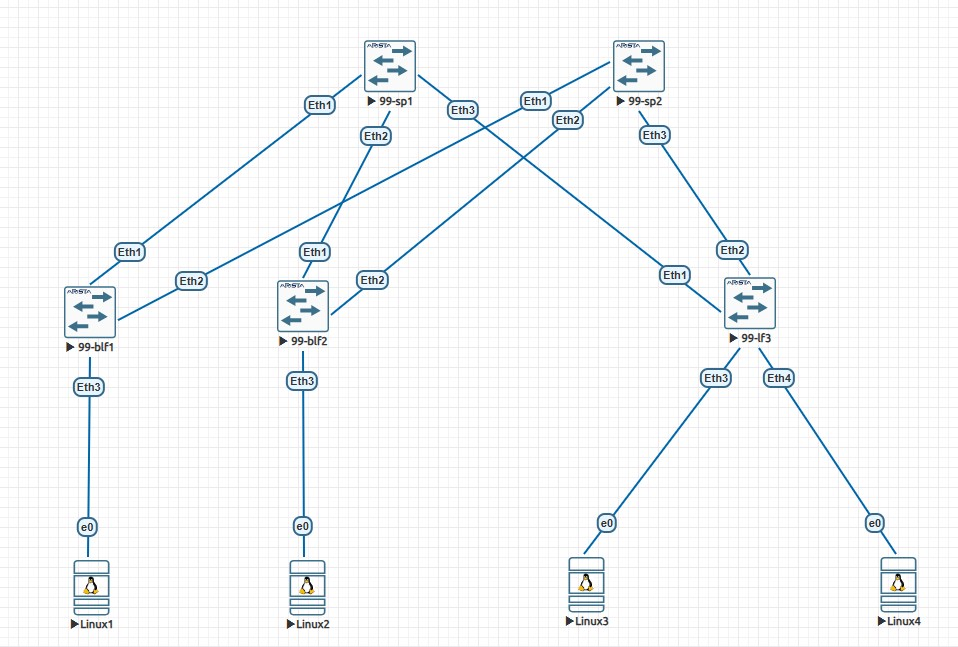

# Лабораторная работа: Настройка IP-адресации в сети ЦОД

## Топология сети


## Задание
1. Разработать и задокументировать адресное пространство
2. Настроить IP адреса на каждом активном порту
3. Задокументировать все изменения

---

## IP-план (Address Plan)

### Underlay сеть (Fabric Links - Point-to-Point /31)
| Device Name | IP Address/Маска | Port | Remote Device | Remote Port | Description |
|-------------|------------------|------|---------------|-------------|-------------|
| 99-blf1 | 10.99.241.0/31 | Ethernet1 | 99-sp1 | Ethernet1 | to Spine1 |
| 99-blf1 | 10.99.242.0/31 | Ethernet2 | 99-sp2 | Ethernet1 | to Spine2 |
| 99-blf1 | 192.168.1.254/24 | Ethernet3 | Linux1 | Eth0 | Server Network1 |
| 99-blf2 | 10.99.241.2/31 | Ethernet1 | 99-sp1 | Ethernet2 | to Spine1 |
| 99-blf2 | 10.99.242.2/31 | Ethernet2 | 99-sp2 | Ethernet2 | to Spine2 |
| 99-blf2 | 192.168.2.254/24 | Ethernet3 | Linux2 | Eth0 | Server Network2 |
| 99-lf3 | 10.99.241.4/31 | Ethernet1 | 99-sp1 | Ethernet3 | to Spine1 |
| 99-lf3 | 10.99.242.4/31 | Ethernet2 | 99-sp2 | Ethernet3 | to Spine2 |
| 99-lf3 | 192.168.3.254/24 | Ethernet3 | Linux3 | Eth0 | Server Network3 |
| 99-lf3 | 192.168.3.254/24 | Ethernet4 | Linux4 | Eth0 | Server Network3 |
| 99-sp1 | 10.99.241.1/31 | Ethernet1 | 99-blf1 | Ethernet1 | to BorderLeaf1 |
| 99-sp1 | 10.99.241.3/31 | Ethernet2 | 99-blf2 | Ethernet1 | to BorderLeaf2 |
| 99-sp1 | 10.99.241.5/31 | Ethernet3 | 99-lf3 | Ethernet1 | to Leaf3 |
| 99-sp2 | 10.99.242.1/31 | Ethernet1 | 99-blf1 | Ethernet2 | to BorderLeaf1 |
| 99-sp2 | 10.99.242.3/31 | Ethernet2 | 99-blf2 | Ethernet2 | to BorderLeaf2 |
| 99-sp2 | 10.99.242.5/31 | Ethernet3 | 99-lf3 | Ethernet2 | to Leaf3 |

### Серверные ВМ
| Device Name | IP Address/Маска | Port | Gateway | Description |
|-------------|------------------|------|---------|-------------|
| Linux1 | 192.168.1.2/24 | Eth0 | 192.168.1.254 | VM1 |
| Linux2 | 192.168.2.2/24 | Eth0 | 192.168.2.254 | VM2 |
| Linux3 | 192.168.3.2/24 | Eth0 | 192.168.3.254 | VM3 |
| Linux4 | 192.168.3.3/24 | Eth0 | 192.168.3.254 | VM4 |

### Сводная таблица сетей
| Сеть | Диапазон | Маска | Назначение | VLAN | Gateway |
|------|----------|-------|------------|------|---------|
| 10.99.241.0/24 | 10.99.241.0 - 10.99.241.255 | /24 | Spine1 ↔ Leaf линки | - | - |
| 10.99.242.0/24 | 10.99.242.0 - 10.99.242.255 | /24 | Spine2 ↔ Leaf линки | - | - |
| 192.168.1.0/24 | 192.168.1.0 - 192.168.1.255 | /24 | Серверная сеть 1 | 10 | 192.168.1.254 |
| 192.168.2.0/24 | 192.168.2.0 - 192.168.2.255 | /24 | Серверная сеть 2 | 20 | 192.168.2.254 |
| 192.168.3.0/24 | 192.168.3.0 - 192.168.3.255 | /24 | Серверная сеть 3 | 30 | 192.168.3.254 |

**Примечание:** Linux3 и Linux4 находятся в одной подсети 192.168.3.0/24 на одном VLAN 30

---

## Конфигурация оборудования

### 99-blf1 (Border Leaf 1)
```
configure terminal
hostname 99-blf1
vlan 10
name SERVER-NETWORK-1
interface Ethernet1
description to-99-sp1-E1
no switchport
ip address 10.99.241.0/31
no shutdown
interface Ethernet2
description to-99-sp2-E1
no switchport
ip address 10.99.242.0/31
no shutdown
interface Ethernet3
description to-Linux1
switchport mode access
switchport access vlan 10
no shutdown
interface Vlan10
description Server-Network-1
ip address 192.168.1.254/24
```

### 99-blf2 (Border Leaf 2)
```
configure terminal
hostname 99-blf2
vlan 20
name SERVER-NETWORK-2
interface Ethernet1
description to-99-sp1-E2
no switchport
ip address 10.99.241.2/31
no shutdown
interface Ethernet2
description to-99-sp2-E2
no switchport
ip address 10.99.242.2/31
no shutdown
interface Ethernet3
description to-Linux2
switchport mode access
switchport access vlan 20
no shutdown
interface Vlan20
description Server-Network-2
ip address 192.168.2.254/24
```
### 99-lf3 (Leaf 3)
```
configure terminal
hostname 99-lf3
vlan 30
name SERVER-NETWORK-3
interface Ethernet1
description to-99-sp1-E3
no switchport
ip address 10.99.241.4/31
no shutdown
interface Ethernet2
description to-99-sp2-E3
no switchport
ip address 10.99.242.4/31
no shutdown
interface Ethernet3
description to-Linux3
switchport mode access
switchport access vlan 30
no shutdown
interface Ethernet4
description to-Linux4
switchport mode access
switchport access vlan 30
no shutdown
interface Vlan30
description Server-Network-3
ip address 192.168.3.254/24
```

### 99-sp1 (Spine 1)
```
configure terminal
hostname 99-sp1
interface Ethernet1
description to-99-blf1-E1
no switchport
ip address 10.99.241.1/31
no shutdown
interface Ethernet2
description to-99-blf2-E1
no switchport
ip address 10.99.241.3/31
no shutdown
interface Ethernet3
description to-99-lf3-E1
no switchport
ip address 10.99.241.5/31
no shutdown
```
### 99-sp2 (Spine 2)
```
configure terminal
hostname 99-sp2
interface Ethernet1
description to-99-blf1-E2
no switchport
ip address 10.99.242.1/31
no shutdown
interface Ethernet2
description to-99-blf2-E2
no switchport
ip address 10.99.242.3/31
no shutdown
interface Ethernet3
description to-99-lf3-E2
no switchport
ip address 10.99.242.5/31
no shutdown
```