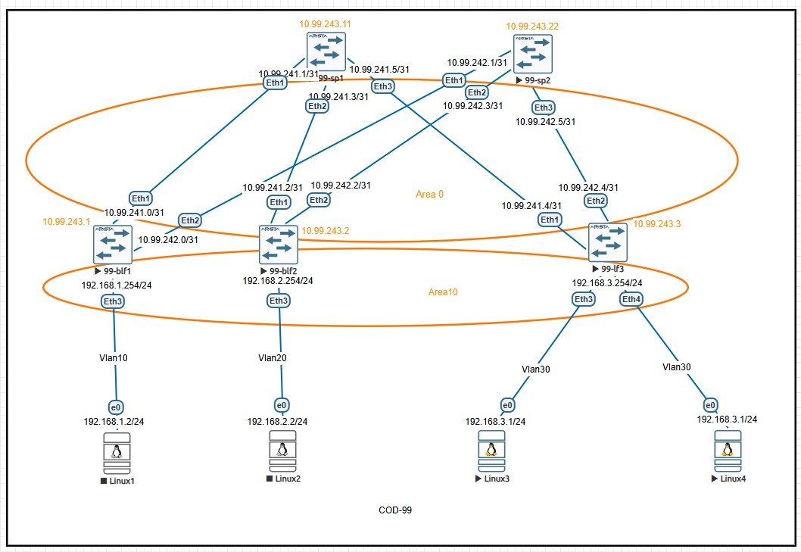

# Лабораторная работа: Настройка Underlay сети с использованием OSPF

## Задание
1. Настроить OSPF в Underlay сети для обеспечения IP-связности между всеми сетевыми устройствами
2. Задокументировать:
   - План работы
   - Схему сети
   - Конфигурацию устройств
3. Проверить IP-связность между устройствами в OSPF домене

---

## Топология сети

## IP-план (Address Plan)

### Underlay сеть (Fabric Links - Point-to-Point /31)
| Device Name | IP Address/Маска | Port | Remote Device | Remote Port | Description |
|-------------|------------------|------|---------------|-------------|-------------|
| 99-blf1 | 10.99.241.0/31 | Ethernet1 | 99-sp1 | Ethernet1 | to Spine1 |
| 99-blf1 | 10.99.242.0/31 | Ethernet2 | 99-sp2 | Ethernet1 | to Spine2 |
| 99-blf1 | 192.168.1.254/24 | Ethernet3 | Linux1 | Eth0 | Server Network1 |
| 99-blf2 | 10.99.241.2/31 | Ethernet1 | 99-sp1 | Ethernet2 | to Spine1 |
| 99-blf2 | 10.99.242.2/31 | Ethernet2 | 99-sp2 | Ethernet2 | to Spine2 |
| 99-blf2 | 192.168.2.254/24 | Ethernet3 | Linux2 | Eth0 | Server Network2 |
| 99-lf3 | 10.99.241.4/31 | Ethernet1 | 99-sp1 | Ethernet3 | to Spine1 |
| 99-lf3 | 10.99.242.4/31 | Ethernet2 | 99-sp2 | Ethernet3 | to Spine2 |
| 99-lf3 | 192.168.3.254/24 | Ethernet3 | Linux3 | Eth0 | Server Network3 |
| 99-lf3 | 192.168.3.254/24 | Ethernet4 | Linux4 | Eth0 | Server Network3 |
| 99-sp1 | 10.99.241.1/31 | Ethernet1 | 99-blf1 | Ethernet1 | to BorderLeaf1 |
| 99-sp1 | 10.99.241.3/31 | Ethernet2 | 99-blf2 | Ethernet1 | to BorderLeaf2 |
| 99-sp1 | 10.99.241.5/31 | Ethernet3 | 99-lf3 | Ethernet1 | to Leaf3 |
| 99-sp2 | 10.99.242.1/31 | Ethernet1 | 99-blf1 | Ethernet2 | to BorderLeaf1 |
| 99-sp2 | 10.99.242.3/31 | Ethernet2 | 99-blf2 | Ethernet2 | to BorderLeaf2 |
| 99-sp2 | 10.99.242.5/31 | Ethernet3 | 99-lf3 | Ethernet2 | to Leaf3 |

### Серверные ВМ
| Device Name | IP Address/Маска | Port | Gateway | Description |
|-------------|------------------|------|---------|-------------|
| Linux1 | 192.168.1.2/24 | Eth0 | 192.168.1.254 | VM1 |
| Linux2 | 192.168.2.2/24 | Eth0 | 192.168.2.254 | VM2 |
| Linux3 | 192.168.1.1/24 | Eth0 | 192.168.1.254 | VM3 |
| Linux4 | 192.168.2.1/24 | Eth0 | 192.168.2.254 | VM4 |

### Loopback адреса для OSPF (Сеть 10.99.243.0/24) - Area 0
| Device Name | Loopback Address | Router-ID | Description |
|-------------|------------------|-----------|-------------|
| 99-blf1 | 10.99.243.1/32 | 10.99.243.1 | Border Leaf 1 Loopback |
| 99-blf2 | 10.99.243.2/32 | 10.99.243.2 | Border Leaf 2 Loopback |
| 99-lf3 | 10.99.243.3/32 | 10.99.243.3 | Leaf 3 Loopback |
| 99-sp1 | 10.99.243.11/32 | 10.99.243.11 | Spine 1 Loopback |
| 99-sp2 | 10.99.243.22/32 | 10.99.243.22 | Spine 2 Loopback |

### Серверные сети - Area 10
| Device Name | Server Network | VLAN | Gateway | VM IP | Area |
|-------------|----------------|------|---------|-------|------|
| 99-blf1 | 192.168.1.0/24 | 10 | 192.168.1.254 | 192.168.1.2 | Area 10 |
| 99-blf2 | 192.168.2.0/24 | 20 | 192.168.2.254 | 192.168.2.2 | Area 10 |
| 99-lf3 | 192.168.3.0/24 | 30 | 192.168.3.254 | 192.168.3.1 | Area 10 |
| 99-lf3 | 192.168.2.0/24 | 30 | 192.168.3.254 | 192.168.3.2 | Area 10 |
---

## Конфигурация OSPF

### 99-blf1 (Border Leaf 1)
```bash
configure terminal
vlan 10

interface Ethernet1
   description to-99-sp1-E1
   mtu 9194
   no switchport
   ip address 10.99.241.0/31
   ip ospf neighbor bfd
   ip ospf dead-interval 3
   ip ospf hello-interval 1
   ip ospf network point-to-point
   ip ospf area 0.0.0.0

interface Ethernet2
   description to-99-sp2-E1
   mtu 9194
   no switchport
   ip address 10.99.242.0/31
   ip ospf neighbor bfd
   ip ospf dead-interval 3
   ip ospf hello-interval 1
   ip ospf network point-to-point
   ip ospf area 0.0.0.0

interface Ethernet3
   description to-Linux1
   mtu 9194
   switchport access vlan 10

interface Loopback0
   description OSPF Router-ID and Underlay Management
   ip address 10.99.243.1/32

interface Vlan10
   description Server-Network-1
   ip address 192.168.1.254/24
   ip ospf area 0.0.0.10

ip routing

router ospf 1
   router-id 10.99.243.1
   bfd default
   passive-interface default
   no passive-interface Ethernet1
   no passive-interface Ethernet2
   network 10.99.243.1/32 area 0.0.0.0
   network 192.168.1.0/24 area 0.0.0.10
   max-lsa 12000
   maximum-paths 4
 ```

 ### 99-blf2 (Border Leaf 2)
 ```bash
 configure terminal
vlan 20
   name SERVER-NETWORK-2

interface Ethernet1
   description to-99-sp1-E2
   mtu 9194
   no switchport
   ip address 10.99.241.2/31
   ip ospf dead-interval 3
   ip ospf hello-interval 1
   ip ospf network point-to-point
   ip ospf area 0.0.0.0

interface Ethernet2
   description to-99-sp2-E2
   mtu 9194
   no switchport
   ip address 10.99.242.2/31
   ip ospf dead-interval 3
   ip ospf hello-interval 1
   ip ospf network point-to-point
   ip ospf area 0.0.0.0

interface Ethernet3
   description to-Linux2
   mtu 9100
   switchport access vlan 20

interface Loopback0
   description OSPF Router-ID and Underlay Management
   ip address 10.99.243.2/32

interface Vlan20
   description Server-Network-2
   ip address 192.168.2.254/24

ip routing

router ospf 1
   router-id 10.99.243.2
   bfd default
   passive-interface default
   no passive-interface Ethernet1
   no passive-interface Ethernet2
   no passive-interface Ethernet3
   passive-interface Vlan20
   network 10.99.243.2/32 area 0.0.0.0
   network 192.168.2.0/24 area 0.0.0.10
   max-lsa 12000
   maximum-paths 4

 ```
### 99-lf3 (Leaf 3)
```bash
vlan 30
   name SERVER-NETWORK-3

interface Ethernet1
   description to-99-sp1-E3
   mtu 9194
   no switchport
   ip address 10.99.241.4/31
   ip ospf dead-interval 3
   ip ospf hello-interval 1
   ip ospf network point-to-point
   ip ospf area 0.0.0.0

interface Ethernet2
   description to-99-sp2-E3
   mtu 9194
   no switchport
   ip address 10.99.242.4/31
   ip ospf dead-interval 3
   ip ospf hello-interval 1
   ip ospf network point-to-point
   ip ospf area 0.0.0.0

interface Ethernet3
   description to-Linux3
   mtu 9194
   switchport access vlan 30

interface Ethernet4
   description to-Linux4
   mtu 9194
   switchport access vlan 30

interface Loopback0
   description OSPF Router-ID and Underlay Management
   ip address 10.99.243.3/32

interface Vlan30
   description Server-Network-3
   ip address 192.168.3.254/24

ip routing

router ospf 1
   router-id 10.99.243.3
   bfd default
   passive-interface default
   no passive-interface Ethernet1
   no passive-interface Ethernet2
   passive-interface Ethernet3
   passive-interface Vlan30
   network 10.99.243.3/32 area 0.0.0.0
   network 192.168.3.0/24 area 0.0.0.10
   max-lsa 12000
   maximum-paths 4

 ```
 ### 99-sp1 (Spine 1)
 ```bash
 configure terminal
 interface Ethernet1
   description to-99-blf1-E1
   mtu 9194
   no switchport
   ip address 10.99.241.1/31
   ip ospf dead-interval 3
   ip ospf hello-interval 1
   ip ospf network point-to-point
   ip ospf area 0.0.0.0

interface Ethernet2
   description to-99-blf2-E1
   mtu 9194
   no switchport
   ip address 10.99.241.3/31
   ip ospf dead-interval 3
   ip ospf hello-interval 1
   ip ospf network point-to-point
   ip ospf area 0.0.0.0

interface Ethernet3
   description to-99-lf3-E1
   mtu 9194
   no switchport
   ip address 10.99.241.5/31
   ip ospf dead-interval 3
   ip ospf hello-interval 1
   ip ospf network point-to-point
   ip ospf area 0.0.0.0

interface Loopback0
   description OSPF Router-ID and Underlay Management
   ip address 10.99.243.11/32

ip routing

router ospf 1
   router-id 10.99.243.11
   bfd default
   network 10.99.243.11/32 area 0.0.0.0
   max-lsa 12000
   maximum-paths 4

 ```
 ### 99-sp2 (Spine 2)
 ```bash
 interface Ethernet1
   description to-99-blf1-E2
   mtu 9194
   no switchport
   ip address 10.99.242.1/31
   ip ospf dead-interval 3
   ip ospf hello-interval 1
   ip ospf network point-to-point
   ip ospf area 0.0.0.0

 interface Ethernet2
   description to-99-blf2-E2
   mtu 9194
   no switchport
   ip address 10.99.242.3/31
   ip ospf dead-interval 3
   ip ospf hello-interval 1
   ip ospf network point-to-point
   ip ospf area 0.0.0.0

 interface Ethernet3
   description to-99-lf3-E2
   mtu 9194
   no switchport
   ip address 10.99.242.5/31
   ip ospf dead-interval 3
   ip ospf hello-interval 1
   ip ospf network point-to-point
   ip ospf area 0.0.0.0

interface Loopback0
   description OSPF Router-ID and Underlay Management
   ip address 10.99.243.22/32

 ip routing

 router ospf 1
   router-id 10.99.243.22
   bfd default
   network 10.99.243.22/32 area 0.0.0.0
   max-lsa 12000
   maximum-paths 4

 ```
