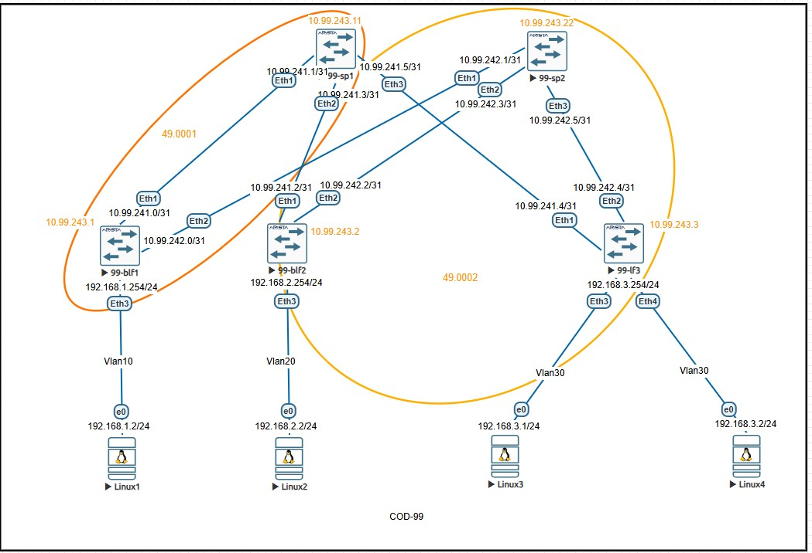

# Лабораторная работа:  Настройка Underlay сети с использованием IS-IS

## Задание
1. Настроить IS-IS в Underlay сети для обеспечения IP-связности между всеми сетевыми устройствами
2. Задокументировать:
   - Схему сети
   - Конфигурацию устройств
3. Проверить IP-связность между устройствами в IS-IS домене

---

## Топология сети

## IP-план (Address Plan)

### Underlay сеть (Fabric Links - Point-to-Point /31)
| Device Name | IP Address/Маска | Port | Remote Device | Remote Port | Description |
|-------------|------------------|------|---------------|-------------|-------------|
| 99-blf1 | 10.99.241.0/31 | Ethernet1 | 99-sp1 | Ethernet1 | to Spine1 |
| 99-blf1 | 10.99.242.0/31 | Ethernet2 | 99-sp2 | Ethernet1 | to Spine2 |
| 99-blf1 | 192.168.1.254/24 | Ethernet3 | Linux1 | Eth0 | Server Network1 |
| 99-blf2 | 10.99.241.2/31 | Ethernet1 | 99-sp1 | Ethernet2 | to Spine1 |
| 99-blf2 | 10.99.242.2/31 | Ethernet2 | 99-sp2 | Ethernet2 | to Spine2 |
| 99-blf2 | 192.168.2.254/24 | Ethernet3 | Linux2 | Eth0 | Server Network2 |
| 99-lf3 | 10.99.241.4/31 | Ethernet1 | 99-sp1 | Ethernet3 | to Spine1 |
| 99-lf3 | 10.99.242.4/31 | Ethernet2 | 99-sp2 | Ethernet3 | to Spine2 |
| 99-lf3 | 192.168.3.254/24 | Ethernet3 | Linux3 | Eth0 | Server Network3 |
| 99-lf3 | 192.168.3.254/24 | Ethernet4 | Linux4 | Eth0 | Server Network3 |
| 99-sp1 | 10.99.241.1/31 | Ethernet1 | 99-blf1 | Ethernet1 | to BorderLeaf1 |
| 99-sp1 | 10.99.241.3/31 | Ethernet2 | 99-blf2 | Ethernet1 | to BorderLeaf2 |
| 99-sp1 | 10.99.241.5/31 | Ethernet3 | 99-lf3 | Ethernet1 | to Leaf3 |
| 99-sp2 | 10.99.242.1/31 | Ethernet1 | 99-blf1 | Ethernet2 | to BorderLeaf1 |
| 99-sp2 | 10.99.242.3/31 | Ethernet2 | 99-blf2 | Ethernet2 | to BorderLeaf2 |
| 99-sp2 | 10.99.242.5/31 | Ethernet3 | 99-lf3 | Ethernet2 | to Leaf3 |

### Серверные ВМ
| Device Name | IP Address/Маска | Port | Gateway | Description |
|-------------|------------------|------|---------|-------------|
| Linux1 | 192.168.1.2/24 | Eth0 | 192.168.1.254 | VM1 |
| Linux2 | 192.168.2.2/24 | Eth0 | 192.168.2.254 | VM2 |
| Linux3 | 192.168.1.1/24 | Eth0 | 192.168.1.254 | VM3 |
| Linux4 | 192.168.2.1/24 | Eth0 | 192.168.2.254 | VM4 |

### Loopback адреса и NET адреса для IS-IS (Сеть 10.99.243.0/24)
| Device Name |	Loopback Address |	NET Address |	System-ID |	Level |	Description |
|-------------|--------------------|---------------|------------|-------|--------------|
|99-blf1 | 10.99.243.1/32	| 49.0001.0100.9924.3001.00	| 0100.9924.3001	| L1-L2	| BLeaf1
|99-blf2	| 10.99.243.2/32	| 49.0001.0100.9924.3002.00	| 0100.9924.3002	| L1-L2	| BLeaf2
|99-lf3	| 10.99.243.3/32	| 49.0001.0100.9924.3003.00	| 0100.9924.3003	| L1-L2	| Leaf3
|99-sp1	| 10.99.243.11/32	| 49.0001.0100.9924.3011.00	| 0100.9924.3011	| L2	| Spine1
|99-sp2	| 10.99.243.22/32	| 49.0001.0100.9924.3022.00	| 0100.9924.3022	| L2	| Spine2


### Серверные сети 
| Device Name | Server Network | VLAN | Gateway | VM IP |
|-------------|----------------|------|---------|-------|
| 99-blf1 | 192.168.1.0/24 | 10 | 192.168.1.254 | 192.168.1.2 |
| 99-blf2 | 192.168.2.0/24 | 20 | 192.168.2.254 | 192.168.2.2 |
| 99-lf3 | 192.168.3.0/24 | 30 | 192.168.3.254 | 192.168.3.1 |
| 99-lf3 | 192.168.2.0/24 | 30 | 192.168.3.254 | 192.168.3.2 |
---

## Конфигурация IS-IS

### 99-blf1 (Border Leaf 1)
```bash
configure terminal
vlan 10

interface Ethernet1
   description to-99-sp1-E1
   mtu 9194
   no switchport
   ip address 10.99.241.0/31
   ip ospf neighbor bfd
   ip ospf dead-interval 3
   ip ospf hello-interval 1
   ip ospf network point-to-point
   ip ospf area 0.0.0.0

interface Ethernet2
   description to-99-sp2-E1
   mtu 9194
   no switchport
   ip address 10.99.242.0/31
   ip ospf neighbor bfd
   ip ospf dead-interval 3
   ip ospf hello-interval 1
   ip ospf network point-to-point
   ip ospf area 0.0.0.0

interface Ethernet3
   description to-Linux1
   mtu 9194
   switchport access vlan 10

interface Loopback0
   description OSPF Router-ID and Underlay Management
   ip address 10.99.243.1/32

interface Vlan10
   description Server-Network-1
   ip address 192.168.1.254/24
   ip ospf area 0.0.0.10

ip routing

router ospf 1
   router-id 10.99.243.1
   bfd default
   passive-interface default
   no passive-interface Ethernet1
   no passive-interface Ethernet2
   network 10.99.243.1/32 area 0.0.0.0
   network 192.168.1.0/24 area 0.0.0.10
   max-lsa 12000
   maximum-paths 4
 ```

 ### 99-blf2 (Border Leaf 2)
 ```bash
 configure terminal
vlan 20
   name SERVER-NETWORK-2

interface Ethernet1
   description to-99-sp1-E2
   mtu 9194
   no switchport
   ip address 10.99.241.2/31
   ip ospf dead-interval 3
   ip ospf hello-interval 1
   ip ospf network point-to-point
   ip ospf area 0.0.0.0

interface Ethernet2
   description to-99-sp2-E2
   mtu 9194
   no switchport
   ip address 10.99.242.2/31
   ip ospf dead-interval 3
   ip ospf hello-interval 1
   ip ospf network point-to-point
   ip ospf area 0.0.0.0

interface Ethernet3
   description to-Linux2
   mtu 9100
   switchport access vlan 20

interface Loopback0
   description OSPF Router-ID and Underlay Management
   ip address 10.99.243.2/32

interface Vlan20
   description Server-Network-2
   ip address 192.168.2.254/24

ip routing

router ospf 1
   router-id 10.99.243.2
   bfd default
   passive-interface default
   no passive-interface Ethernet1
   no passive-interface Ethernet2
   no passive-interface Ethernet3
   passive-interface Vlan20
   network 10.99.243.2/32 area 0.0.0.0
   network 192.168.2.0/24 area 0.0.0.10
   max-lsa 12000
   maximum-paths 4

 ```
### 99-lf3 (Leaf 3)
```bash
vlan 30
   name SERVER-NETWORK-3

interface Ethernet1
   description to-99-sp1-E3
   mtu 9194
   no switchport
   ip address 10.99.241.4/31
   ip ospf dead-interval 3
   ip ospf hello-interval 1
   ip ospf network point-to-point
   ip ospf area 0.0.0.0

interface Ethernet2
   description to-99-sp2-E3
   mtu 9194
   no switchport
   ip address 10.99.242.4/31
   ip ospf dead-interval 3
   ip ospf hello-interval 1
   ip ospf network point-to-point
   ip ospf area 0.0.0.0

interface Ethernet3
   description to-Linux3
   mtu 9194
   switchport access vlan 30

interface Ethernet4
   description to-Linux4
   mtu 9194
   switchport access vlan 30

interface Loopback0
   description OSPF Router-ID and Underlay Management
   ip address 10.99.243.3/32

interface Vlan30
   description Server-Network-3
   ip address 192.168.3.254/24

ip routing

router ospf 1
   router-id 10.99.243.3
   bfd default
   passive-interface default
   no passive-interface Ethernet1
   no passive-interface Ethernet2
   passive-interface Ethernet3
   passive-interface Vlan30
   network 10.99.243.3/32 area 0.0.0.0
   network 192.168.3.0/24 area 0.0.0.10
   max-lsa 12000
   maximum-paths 4

 ```
 ### 99-sp1 (Spine 1)
 ```bash
 configure terminal
 interface Ethernet1
   description to-99-blf1-E1
   mtu 9194
   no switchport
   ip address 10.99.241.1/31
   ip ospf dead-interval 3
   ip ospf hello-interval 1
   ip ospf network point-to-point
   ip ospf area 0.0.0.0

interface Ethernet2
   description to-99-blf2-E1
   mtu 9194
   no switchport
   ip address 10.99.241.3/31
   ip ospf dead-interval 3
   ip ospf hello-interval 1
   ip ospf network point-to-point
   ip ospf area 0.0.0.0

interface Ethernet3
   description to-99-lf3-E1
   mtu 9194
   no switchport
   ip address 10.99.241.5/31
   ip ospf dead-interval 3
   ip ospf hello-interval 1
   ip ospf network point-to-point
   ip ospf area 0.0.0.0

interface Loopback0
   description OSPF Router-ID and Underlay Management
   ip address 10.99.243.11/32

ip routing

router ospf 1
   router-id 10.99.243.11
   bfd default
   network 10.99.243.11/32 area 0.0.0.0
   max-lsa 12000
   maximum-paths 4

 ```
 ### 99-sp2 (Spine 2)
 ```bash
 interface Ethernet1
   description to-99-blf1-E2
   mtu 9194
   no switchport
   ip address 10.99.242.1/31
   ip ospf dead-interval 3
   ip ospf hello-interval 1
   ip ospf network point-to-point
   ip ospf area 0.0.0.0

 interface Ethernet2
   description to-99-blf2-E2
   mtu 9194
   no switchport
   ip address 10.99.242.3/31
   ip ospf dead-interval 3
   ip ospf hello-interval 1
   ip ospf network point-to-point
   ip ospf area 0.0.0.0

 interface Ethernet3
   description to-99-lf3-E2
   mtu 9194
   no switchport
   ip address 10.99.242.5/31
   ip ospf dead-interval 3
   ip ospf hello-interval 1
   ip ospf network point-to-point
   ip ospf area 0.0.0.0

interface Loopback0
   description OSPF Router-ID and Underlay Management
   ip address 10.99.243.22/32

 ip routing

 router ospf 1
   router-id 10.99.243.22
   bfd default
   network 10.99.243.22/32 area 0.0.0.0
   max-lsa 12000
   maximum-paths 4

 ```
---

## Проверка IP связности
 ## 1. Проверка OSPF соседств
```
99-sp1#sh bfd peers
VRF name: default
-----------------
DstAddr         MyDisc   YourDisc  Interface/Transport    Type          LastUp
----------- ---------- ----------- -------------------- ------- ---------------
10.99.241.0 1672013279  482287968        Ethernet1(22)  normal  01/17/26 21:32
10.99.241.2 2790314007 3610619606        Ethernet2(20)  normal  01/17/26 20:27
10.99.241.4  207972812 2313860642        Ethernet3(19)  normal  01/17/26 20:27

   LastDown            LastDiag    State
-------------- ------------------- -----
         NA       No Diagnostic       Up
         NA       No Diagnostic       Up
         NA       No Diagnostic       Up

99-sp1#
99-sp1#sh ip ospf neighbor
Neighbor ID     Instance VRF      Pri State                  Dead Time   Address         Interface
10.99.243.1     1        default  0   FULL                   00:00:01    10.99.241.0     Ethernet1
10.99.243.2     1        default  0   FULL                   00:00:01    10.99.241.2     Ethernet2
10.99.243.3     1        default  0   FULL                   00:00:01    10.99.241.4     Ethernet3
```
## 2. Проверка OSPF маршрутов
```
99-sp1#show ip route ospf

VRF: default

 O        10.99.242.0/31 [110/20]
           via 10.99.241.0, Ethernet1
 O        10.99.242.2/31 [110/20]
           via 10.99.241.2, Ethernet2
 O        10.99.242.4/31 [110/20]
           via 10.99.241.4, Ethernet3
 O        10.99.243.1/32 [110/20]
           via 10.99.241.0, Ethernet1
 O        10.99.243.2/32 [110/20]
           via 10.99.241.2, Ethernet2
 O        10.99.243.3/32 [110/20]
           via 10.99.241.4, Ethernet3
 O        10.99.243.22/32 [110/30]
           via 10.99.241.0, Ethernet1
           via 10.99.241.2, Ethernet2
           via 10.99.241.4, Ethernet3
 O IA     192.168.1.0/24 [110/20]
           via 10.99.241.0, Ethernet1
 O IA     192.168.2.0/24 [110/20]
           via 10.99.241.2, Ethernet2
 O IA     192.168.3.0/24 [110/20]
           via 10.99.241.4, Ethernet3
```
## 3. Проверка межсерверной связности между VM 
 

## 4. Проверка связности между loopback адресами
```
99-blf1#ping 10.99.243.2 source 10.99.243.1
PING 10.99.243.2 (10.99.243.2) from 10.99.243.1 : 72(100) bytes of data.
80 bytes from 10.99.243.2: icmp_seq=1 ttl=63 time=5.52 ms
80 bytes from 10.99.243.2: icmp_seq=2 ttl=63 time=2.95 ms
80 bytes from 10.99.243.2: icmp_seq=3 ttl=63 time=2.95 ms
80 bytes from 10.99.243.2: icmp_seq=4 ttl=63 time=2.58 ms
80 bytes from 10.99.243.2: icmp_seq=5 ttl=63 time=2.71 ms

--- 10.99.243.2 ping statistics ---
5 packets transmitted, 5 received, 0% packet loss, time 22ms
rtt min/avg/max/mdev = 2.583/3.342/5.522/1.098 ms, ipg/ewma 5.425/4.387 ms
99-blf1#
99-blf1#
99-blf1#ping 10.99.243.3 source 10.99.243.1
PING 10.99.243.3 (10.99.243.3) from 10.99.243.1 : 72(100) bytes of data.
80 bytes from 10.99.243.3: icmp_seq=1 ttl=63 time=4.50 ms
80 bytes from 10.99.243.3: icmp_seq=2 ttl=63 time=4.03 ms
80 bytes from 10.99.243.3: icmp_seq=3 ttl=63 time=4.37 ms
80 bytes from 10.99.243.3: icmp_seq=4 ttl=63 time=2.96 ms
80 bytes from 10.99.243.3: icmp_seq=5 ttl=63 time=3.26 ms

--- 10.99.243.3 ping statistics ---
5 packets transmitted, 5 received, 0% packet loss, time 21ms
rtt min/avg/max/mdev = 2.962/3.825/4.503/0.611 ms, ipg/ewma 5.172/4.126 ms
99-blf1#
99-blf1#ping 10.99.243.11 source 10.99.243.1
PING 10.99.243.11 (10.99.243.11) from 10.99.243.1 : 72(100) bytes of data.
80 bytes from 10.99.243.11: icmp_seq=1 ttl=64 time=4.38 ms
80 bytes from 10.99.243.11: icmp_seq=2 ttl=64 time=1.44 ms
80 bytes from 10.99.243.11: icmp_seq=3 ttl=64 time=1.27 ms
80 bytes from 10.99.243.11: icmp_seq=4 ttl=64 time=1.23 ms
80 bytes from 10.99.243.11: icmp_seq=5 ttl=64 time=1.29 ms

--- 10.99.243.11 ping statistics ---
5 packets transmitted, 5 received, 0% packet loss, time 17ms
rtt min/avg/max/mdev = 1.234/1.921/4.379/1.230 ms, ipg/ewma 4.147/3.104 ms
99-blf1#
99-blf1#ping 10.99.243.22 source 10.99.243.1
PING 10.99.243.22 (10.99.243.22) from 10.99.243.1 : 72(100) bytes of data.
80 bytes from 10.99.243.22: icmp_seq=1 ttl=64 time=2.33 ms
80 bytes from 10.99.243.22: icmp_seq=2 ttl=64 time=0.958 ms
80 bytes from 10.99.243.22: icmp_seq=3 ttl=64 time=1.11 ms
80 bytes from 10.99.243.22: icmp_seq=4 ttl=64 time=1.16 ms
80 bytes from 10.99.243.22: icmp_seq=5 ttl=64 time=1.25 ms

--- 10.99.243.22 ping statistics ---
5 packets transmitted, 5 received, 0% packet loss, time 10ms
rtt min/avg/max/mdev = 0.958/1.360/2.328/0.492 ms, ipg/ewma 2.507/1.833 ms
```
