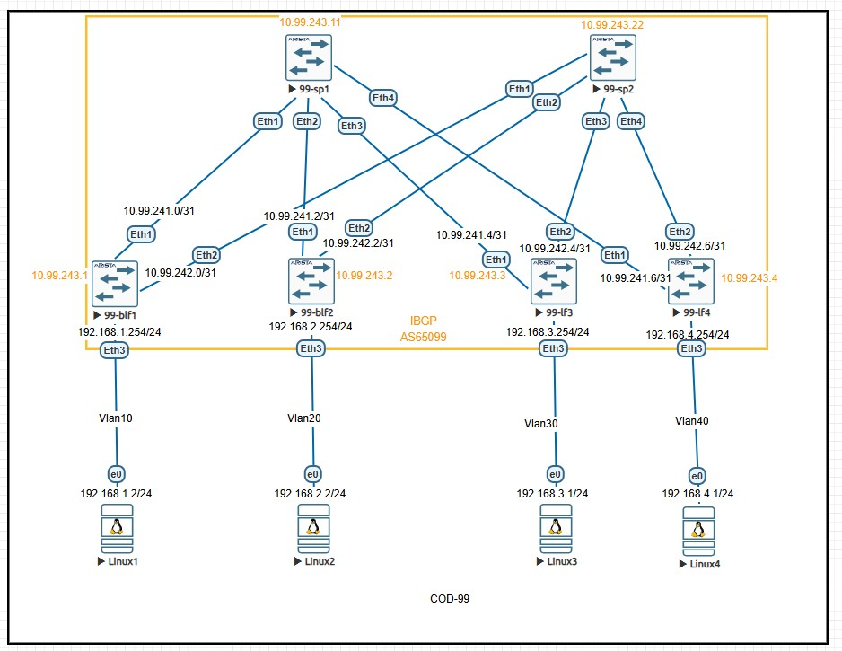
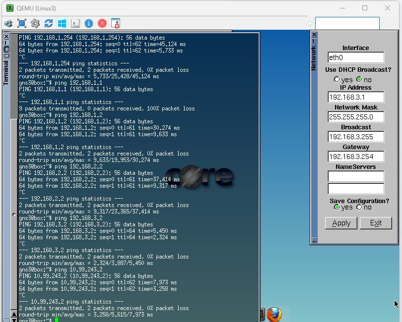

# Лабораторная работа:  Настройка Underlay сети с использованием BGP

## Задание
1. Настроить IBGP в Underlay сети для обеспечения IP-связности между всеми сетевыми устройствами
2. Задокументировать:
   - Схему сети
   - Конфигурацию устройств
3. Проверить IP-связность между устройствами в BGP домене

---

## Топология сети

## IP-план (Address Plan)

### Underlay сеть (Fabric Links - Point-to-Point /31)
| Device Name | IP Address/Маска | Port | Remote Device | Remote Port | Description |
|-------------|------------------|------|---------------|-------------|-------------|
| 99-blf1 | 10.99.241.0/31 | Ethernet1 | 99-sp1 | Ethernet1 | to Spine1 |
| 99-blf1 | 10.99.242.0/31 | Ethernet2 | 99-sp2 | Ethernet1 | to Spine2 |
| 99-blf1 | 192.168.1.254/24 | Ethernet3 | Linux1 | Eth0 | Server Network1 |
| 99-blf2 | 10.99.241.2/31 | Ethernet1 | 99-sp1 | Ethernet2 | to Spine1 |
| 99-blf2 | 10.99.242.2/31 | Ethernet2 | 99-sp2 | Ethernet2 | to Spine2 |
| 99-blf2 | 192.168.2.254/24 | Ethernet3 | Linux2 | Eth0 | Server Network2 |
| 99-lf3 | 10.99.241.4/31 | Ethernet1 | 99-sp1 | Ethernet3 | to Spine1 |
| 99-lf3 | 10.99.242.4/31 | Ethernet2 | 99-sp2 | Ethernet3 | to Spine2 |
| 99-lf3 | 192.168.3.254/24 | Ethernet3 | Linux3 | Eth0 | Server Network3 |
| 99-lf3 | 192.168.3.254/24 | Ethernet4 | Linux4 | Eth0 | Server Network3 |
| 99-sp1 | 10.99.241.1/31 | Ethernet1 | 99-blf1 | Ethernet1 | to BorderLeaf1 |
| 99-sp1 | 10.99.241.3/31 | Ethernet2 | 99-blf2 | Ethernet1 | to BorderLeaf2 |
| 99-sp1 | 10.99.241.5/31 | Ethernet3 | 99-lf3 | Ethernet1 | to Leaf3 |
| 99-sp2 | 10.99.242.1/31 | Ethernet1 | 99-blf1 | Ethernet2 | to BorderLeaf1 |
| 99-sp2 | 10.99.242.3/31 | Ethernet2 | 99-blf2 | Ethernet2 | to BorderLeaf2 |
| 99-sp2 | 10.99.242.5/31 | Ethernet3 | 99-lf3 | Ethernet2 | to Leaf3 |

### Серверные ВМ
| Device Name | IP Address/Маска | Port | Gateway | Description |
|-------------|------------------|------|---------|-------------|
| Linux1 | 192.168.1.2/24 | Eth0 | 192.168.1.254 | VM1 |
| Linux2 | 192.168.2.2/24 | Eth0 | 192.168.2.254 | VM2 |
| Linux3 | 192.168.1.1/24 | Eth0 | 192.168.1.254 | VM3 |
| Linux4 | 192.168.2.1/24 | Eth0 | 192.168.2.254 | VM4 |

### Loopback адреса и NET адреса для IS-IS (Сеть 10.99.243.0/24)
| Device Name |	Loopback Address |	NET Address |	System-ID |	Level |	Description |
|-------------|--------------------|---------------|------------|-------|--------------|
|99-blf1 | 10.99.243.1/32	| 49.0001.0100.9924.3001.00	| 0100.9924.3001	| L1-L2	| BLeaf1
|99-blf2	| 10.99.243.2/32	| 49.0002.0100.9924.3002.00	| 0100.9924.3002	| L1-L2	| BLeaf2
|99-lf3	| 10.99.243.3/32	| 49.0002.0100.9924.3003.00	| 0100.9924.3003	| L1-L2	| Leaf3
|99-sp1	| 10.99.243.11/32	| 49.0001.0100.9924.3011.00	| 0100.9924.3011	| L2	| Spine1
|99-sp2	| 10.99.243.22/32	| 49.0002.0100.9924.3022.00	| 0100.9924.3022	| L2	| Spine2


### Серверные сети 
| Device Name | Server Network | VLAN | Gateway | VM IP |
|-------------|----------------|------|---------|-------|
| 99-blf1 | 192.168.1.0/24 | 10 | 192.168.1.254 | 192.168.1.2 |
| 99-blf2 | 192.168.2.0/24 | 20 | 192.168.2.254 | 192.168.2.2 |
| 99-lf3 | 192.168.3.0/24 | 30 | 192.168.3.254 | 192.168.3.1 |
| 99-lf3 | 192.168.2.0/24 | 30 | 192.168.3.254 | 192.168.3.2 |
---

## Конфигурация IS-IS
## MTU интерфейсов при конфигурации выставлен 1500 , при больших значениях isis не заводится.
### 99-blf1 (Border Leaf 1)
```bash
configure terminal

vlan 10
name SERVER-NETWORK-1

ip routing

router isis UNDERLAY
   net 49.0001.0100.9924.3001.00
    is-type level-1-2
    address-family ipv4 unicast
      maximum-paths 4
   bfd all-interfaces
   log-adjacency-changes


interface Ethernet1
   description to-99-sp1-E1
   mtu 1500
   no switchport
   ip address 10.99.241.0/31
   isis enable UNDERLAY
   isis circuit-type level-2
   isis network point-to-point
   isis bfd
   no shutdown

interface Ethernet2
   description to-99-sp2-E1
   mtu 1500
   no switchport
   ip address 10.99.242.0/31
   isis enable UNDERLAY
   isis circuit-type level-2
   isis network point-to-point
   isis bfd
   no shutdown

interface Ethernet3
   description to-Linux1
   mtu 1500
   switchport access vlan 10

interface Loopback0
description IS-IS Router-ID and Underlay Management
   ip address 10.99.243.1/32
   isis enable UNDERLAY
   isis passive

interface Vlan10
   description Server-Network-1
   ip address 192.168.1.254/24
   isis enable UNDERLAY
   isis circuit-type level-1
   isis passive

 ```

 ### 99-blf2 (Border Leaf 2)
 ```bash
 configure terminal

 ip routing

router isis UNDERLAY
   net 49.0002.0100.9924.3002.00
   is-type level-1-2
   address-family ipv4 unicast
      maximum-paths 4
   bfd all-interfaces
   log-adjacency-changes

vlan 20
   name SERVER-NETWORK-2

interface Ethernet1
   description to-99-sp1-E2
   mtu 1500
   no switchport
   ip address 10.99.241.2/31
   isis enable UNDERLAY
   isis circuit-type level-2
   isis network point-to-point
   isis bfd
   no shutdown


interface Ethernet2
   description to-99-sp2-E2
   mtu 1500
   no switchport
   ip address 10.99.242.2/31
   isis enable UNDERLAY
   isis circuit-type level-2
   isis network point-to-point
   isis bfd
   no shutdown

interface Ethernet3
   description to-Linux2
   mtu 1500
   switchport access vlan 20

interface Loopback0
   description IS-IS Router-ID and Underlay Management
   ip address 10.99.243.2/32
   isis enable UNDERLAY
   isis passive

interface Vlan20
   description Server-Network-2
   ip address 192.168.2.254/24
   isis enable UNDERLAY
   isis circuit-type level-1
   isis passive

 ```
### 99-lf3 (Leaf 3)
```bash
ip routing
router isis UNDERLAY
   net 49.0002.0100.9924.3003.00
   is-type level-1-2
   
   address-family ipv4 unicast
      maximum-paths 4
   
   bfd all-interfaces
   log-adjacency-changes

vlan 30
   name SERVER-NETWORK-3

interface Ethernet1
   description to-99-sp1-E3
   mtu 1500
   no switchport
   ip address 10.99.241.4/31
   isis enable UNDERLAY
   isis circuit-type level-2
   isis network point-to-point
   isis bfd
   no shutdown

interface Ethernet2
   description to-99-sp2-E3
   mtu 1500
   no switchport
   ip address 10.99.242.4/31
   isis enable UNDERLAY
   isis circuit-type level-2
   isis network point-to-point
   isis bfd
   no shutdown

interface Ethernet3
   description to-Linux3
   mtu 1500
   switchport access vlan 30

interface Ethernet4
   description to-Linux4
   mtu 1500
   switchport access vlan 30

interface Loopback0
   description IS-IS Router-ID and Underlay Management
   ip address 10.99.243.3/32
   isis enable UNDERLAY
   isis passive

interface Vlan30
   description Server-Network-3
   ip address 192.168.3.254/24
   isis enable UNDERLAY
   isis circuit-type level-1
   isis passive

 ```
 ### 99-sp1 (Spine 1)
 ```bash

 configure terminal
 ip routing

 router isis UNDERLAY
   net 49.0001.0100.9924.3011.00
   is-type level-2
   address-family ipv4 unicast
      maximum-paths 4
   bfd all-interfaces
   log-adjacency-changes

 interface Ethernet1
   description to-99-blf1-E1
   mtu 1500
   no switchport
   ip address 10.99.241.1/31
   isis enable UNDERLAY
   isis circuit-type level-2
   isis network point-to-point
   isis bfd
   no shutdown

interface Ethernet2
   description to-99-blf2-E1
   mtu 1500
   no switchport
   ip address 10.99.241.3/31
   isis enable UNDERLAY
   isis circuit-type level-2
   isis network point-to-point
   isis bfd
   no shutdown

interface Ethernet3
   description to-99-lf3-E1
   mtu 1500
   no switchport
   ip address 10.99.241.5/31
   isis enable UNDERLAY
   isis circuit-type level-2
   isis network point-to-point
   isis bfd
   no shutdown

interface Loopback0
   description IS-IS Router-ID and Underlay Management
   ip address 10.99.243.11/32
   isis enable UNDERLAY
   isis passive
 ```
 ### 99-sp2 (Spine 2)
 ```bash

 ip routing
 router isis UNDERLAY
   net 49.0002.0100.9924.3022.00
   is-type level-2
   
   address-family ipv4 unicast
      maximum-paths 4
   
   bfd all-interfaces
   log-adjacency-changes
   
 interface Ethernet1
   description to-99-blf1-E2
   mtu 1500
   no switchport
   ip address 10.99.242.1/31
   isis enable UNDERLAY
   isis circuit-type level-2
   isis network point-to-point
   isis bfd
   no shutdown

interface Ethernet2
   description to-99-blf2-E2
   mtu 1500
   no switchport
   ip address 10.99.242.3/31
   isis enable UNDERLAY
   isis circuit-type level-2
   isis network point-to-point
   isis bfd
   no shutdown

interface Ethernet3
   description to-99-lf3-E2
   mtu 1500
   no switchport
   ip address 10.99.242.5/31
   isis enable UNDERLAY
   isis circuit-type level-2
   isis network point-to-point
   isis bfd
   no shutdown

interface Loopback0
   description IS-IS Router-ID and Underlay Management
   ip address 10.99.243.22/32
   isis enable UNDERLAY
   isis passive

 ```
---

## Проверка IP связности
 ## 1. Проверка IS-IS соседств
```
99-sp1#sh isis neighbors

Instance  VRF      System Id        Type Interface          SNPA              State Hold time   Circuit Id
UNDERLAY  default  99-blf1          L2   Ethernet1          P2P               UP    28          1A     
UNDERLAY  default  99-blf2          L2   Ethernet2          P2P               UP    28          14     
UNDERLAY  default  99-lf3           L2   Ethernet3          P2P               UP    22          1A     

```
## 2.  Проверка IS-IS database 
```
99-sp1#sh isis database
Legend:
H - hostname conflict
U - node unreachable

IS-IS Instance: UNDERLAY VRF: default
  IS-IS Level 2 Link State Database
    LSPID                   Seq Num  Cksum  Life Length IS  Received LSPID        Flags
    99-blf1.00-00                19  49448   976    133 L2  0100.9924.3001.00-00  <>
    99-blf2.00-00                10   3287   727    133 L2  0100.9924.3002.00-00  <>
    99-lf3.00-00                  4   9243   591    132 L2  0100.9924.3003.00-00  <>
    99-sp1.00-00                 15   8500   976    146 L2  0100.9924.3011.00-00  <>
    99-sp2.00-00                  7   2840   907    146 L2  0100.9924.3022.00-00  <>
```

## 2. Проверка IS-IS маршрутов
```
99-sp1#sh ip route isis

VRF: default

 I L2     10.99.242.0/31 [115/20]
           via 10.99.241.0, Ethernet1
 I L2     10.99.242.2/31 [115/20]
           via 10.99.241.2, Ethernet2
 I L2     10.99.242.4/31 [115/20]
           via 10.99.241.4, Ethernet3
 I L2     10.99.243.1/32 [115/20]
           via 10.99.241.0, Ethernet1
 I L2     10.99.243.2/32 [115/20]
           via 10.99.241.2, Ethernet2
 I L2     10.99.243.3/32 [115/20]
           via 10.99.241.4, Ethernet3
 I L2     10.99.243.22/32 [115/30]
           via 10.99.241.0, Ethernet1
           via 10.99.241.2, Ethernet2
           via 10.99.241.4, Ethernet3
 I L2     192.168.1.0/24 [115/20]
           via 10.99.241.0, Ethernet1
 I L2     192.168.2.0/24 [115/20]
           via 10.99.241.2, Ethernet2
 I L2     192.168.3.0/24 [115/20]
           via 10.99.241.4, Ethernet3

```
## 3. Проверка межсерверной связности между VM 
 

## 4. Проверка связности между loopback адресами
```
99-lf3#ping 10.99.243.1 source 10.99.243.3
PING 10.99.243.1 (10.99.243.1) from 10.99.243.3 : 72(100) bytes of data.
80 bytes from 10.99.243.1: icmp_seq=1 ttl=63 time=3.16 ms
80 bytes from 10.99.243.1: icmp_seq=2 ttl=63 time=1.82 ms
80 bytes from 10.99.243.1: icmp_seq=3 ttl=63 time=1.81 ms
80 bytes from 10.99.243.1: icmp_seq=4 ttl=63 time=1.80 ms
80 bytes from 10.99.243.1: icmp_seq=5 ttl=63 time=1.82 ms

--- 10.99.243.1 ping statistics ---
5 packets transmitted, 5 received, 0% packet loss, time 13ms
rtt min/avg/max/mdev = 1.795/2.081/3.162/0.540 ms, ipg/ewma 3.314/2.603 ms

99-lf3#
99-lf3#ping 10.99.243.2 source 10.99.243.3
PING 10.99.243.2 (10.99.243.2) from 10.99.243.3 : 72(100) bytes of data.
80 bytes from 10.99.243.2: icmp_seq=1 ttl=63 time=4.24 ms
80 bytes from 10.99.243.2: icmp_seq=2 ttl=63 time=2.71 ms
80 bytes from 10.99.243.2: icmp_seq=3 ttl=63 time=2.47 ms
80 bytes from 10.99.243.2: icmp_seq=4 ttl=63 time=2.36 ms
80 bytes from 10.99.243.2: icmp_seq=5 ttl=63 time=2.27 ms

--- 10.99.243.2 ping statistics ---
5 packets transmitted, 5 received, 0% packet loss, time 17ms
rtt min/avg/max/mdev = 2.271/2.809/4.240/0.730 ms, ipg/ewma 4.361/3.490 ms

99-lf3#ping 10.99.243.11 source 10.99.243.3
PING 10.99.243.11 (10.99.243.11) from 10.99.243.3 : 72(100) bytes of data.
80 bytes from 10.99.243.11: icmp_seq=1 ttl=64 time=1.90 ms
80 bytes from 10.99.243.11: icmp_seq=2 ttl=64 time=0.871 ms
80 bytes from 10.99.243.11: icmp_seq=3 ttl=64 time=0.838 ms
80 bytes from 10.99.243.11: icmp_seq=4 ttl=64 time=0.768 ms
80 bytes from 10.99.243.11: icmp_seq=5 ttl=64 time=0.881 ms

--- 10.99.243.11 ping statistics ---
5 packets transmitted, 5 received, 0% packet loss, time 10ms
rtt min/avg/max/mdev = 0.768/1.050/1.895/0.424 ms, ipg/ewma 2.490/1.458 ms
99-lf3#
99-lf3#ping 10.99.243.22 source 10.99.243.3
PING 10.99.243.22 (10.99.243.22) from 10.99.243.3 : 72(100) bytes of data.
80 bytes from 10.99.243.22: icmp_seq=1 ttl=64 time=3.17 ms
80 bytes from 10.99.243.22: icmp_seq=2 ttl=64 time=1.94 ms
80 bytes from 10.99.243.22: icmp_seq=3 ttl=64 time=1.96 ms
80 bytes from 10.99.243.22: icmp_seq=4 ttl=64 time=1.85 ms
80 bytes from 10.99.243.22: icmp_seq=5 ttl=64 time=0.833 ms

--- 10.99.243.22 ping statistics ---
5 packets transmitted, 5 received, 0% packet loss, time 14ms
rtt min/avg/max/mdev = 0.833/1.949/3.166/0.739 ms, ipg/ewma 3.409/2.512 ms
```
