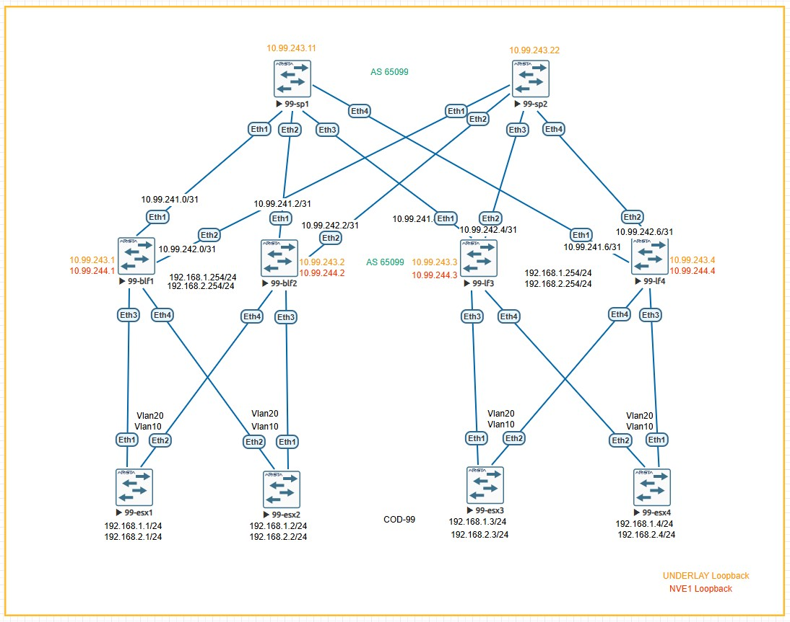

# Лабораторная работа:  Настройка Overlay на основе VxLAN EVPN для L2 связанности между клиентами

## Задание
1. Настроить Overlay на основе VxLAN EVPN для обеспечения L2-связности между всеми сетевыми устройствами
2. Задокументировать:
   - Схему сети
   - Конфигурацию устройств
3. Проверить IP-связность между устройствами в BGP домене

---

## Топология сети

## IP-план (Address Plan)

### Underlay сеть (Fabric Links - Point-to-Point /31)

| Device Name | IP Address/Маска | Port      | Remote Device | Remote Port | Description         |
|-------------|------------------|-----------|---------------|-------------|---------------------|
| 99-blf1     | 10.99.241.0/31   | Ethernet1 | 99-sp1        | Ethernet1   | to Spine1           |
| 99-blf1     | 10.99.242.0/31   | Ethernet2 | 99-sp2        | Ethernet1   | to Spine2           |
| 99-blf1     | -                | Ethernet3 | 99-esx1       | Ethernet1   | Server Trunk        |
| 99-blf1     | -                | Ethernet4 | 99-esx4       | Ethernet2   | Server Trunk        |
| 99-blf2     | 10.99.241.2/31   | Ethernet1 | 99-sp1        | Ethernet2   | to Spine1           |
| 99-blf2     | 10.99.242.2/31   | Ethernet2 | 99-sp2        | Ethernet2   | to Spine2           |
| 99-blf2     | -                | Ethernet3 | 99-esx2       | Ethernet1   | Server Trunk        |
| 99-blf2     | -                | Ethernet4 | 99-esx3       | Ethernet2   | Server Trunk        |
| 99-lf3      | 10.99.241.4/31   | Ethernet1 | 99-sp1        | Ethernet3   | to Spine1           |
| 99-lf3      | 10.99.242.4/31   | Ethernet2 | 99-sp2        | Ethernet3   | to Spine2           |
| 99-lf3      | -                | Ethernet3 | 99-esx3       | Ethernet1   | Server Trunk        |
| 99-lf3      | -                | Ethernet4 | 99-esx2       | Ethernet2   | Server Trunk        |
| 99-lf4      | 10.99.241.6/31   | Ethernet1 | 99-sp1        | Ethernet4   | to Spine1           |
| 99-lf4      | 10.99.242.6/31   | Ethernet2 | 99-sp2        | Ethernet4   | to Spine2           |
| 99-lf4      | -                | Ethernet3 | 99-esx4       | Ethernet1   | Server Trunk        |
| 99-lf4      | -                | Ethernet4 | 99-esx1       | Ethernet2   | Server Trunk        |

### Loopback адреса для BGP Underlay (Сеть 10.99.243.0/24)

| Device Name | Loopback0 Address | Description          |
|-------------|-------------------|----------------------|
| 99-blf1     | 10.99.243.1/32    | BGP Router-ID        |
| 99-blf2     | 10.99.243.2/32    | BGP Router-ID        |
| 99-lf3      | 10.99.243.3/32    | BGP Router-ID        |
| 99-lf4      | 10.99.243.4/32    | BGP Router-ID        |
| 99-sp1      | 10.99.243.11/32   | BGP Router-ID        |
| 99-sp2      | 10.99.243.22/32   | BGP Router-ID        |

### Loopback адреса для VXLAN NVE (Сеть 10.99.244.0/24)

| Device Name | Loopback1 Address | Description          |
|-------------|-------------------|----------------------|
| 99-blf1     | 10.99.244.1/32    | VTEP Source          |
| 99-blf2     | 10.99.244.2/32    | VTEP Source          |
| 99-lf3      | 10.99.244.3/32    | VTEP Source          |
| 99-lf4      | 10.99.244.4/32    | VTEP Source          |

### EVPN L2-домены (VLAN ↔ VNI Mapping)

| VLAN | Описание          | L2 VNI | Anycast Gateway   | Leaf с настроенным VNI |
|------|-------------------|--------|-------------------|------------------------|
| 10   | VLAN10   | 10010  | 192.168.1.254/24  | 99-blf1, 99-blf2, 99-lf3, 99-lf4 |
| 20   | VLAN20   | 10020  | 192.168.2.254/24  | 99-blf1, 99-blf2, 99-lf3, 99-lf4 |

### Конфигурация "ESXi" устройств (Arista эмуляция)

| ESXi Device | Физические порты (Trunk) | Виртуальные интерфейсы (SVI)                     | IP Address/Маска   | Gateway         |
|-------------|--------------------------|------------------------------------------------|-------------------|-----------------|
| 99-esx1     | Eth1 → 99-blf1 Eth3      | Vlan10 (SVI для VLAN10)                        | 192.168.1.1/24    | 192.168.1.254   |
|             | Eth2 → 99-lf4 Eth4       | Vlan20 (SVI для VLAN20)                        | 192.168.2.1/24    | 192.168.2.254   |
| 99-esx2     | Eth1 → 99-blf2 Eth3      | Vlan10 (SVI для VLAN10)                        | 192.168.1.2/24    | 192.168.1.254   |
|             | Eth2 → 99-lf3 Eth4       | Vlan20 (SVI для VLAN20)                        | 192.168.2.2/24    | 192.168.2.254   |
| 99-esx3     | Eth1 → 99-lf3 Eth3       | Vlan10 (SVI для VLAN10)                        | 192.168.1.3/24    | 192.168.1.254   |
|             | Eth2 → 99-blf2 Eth4      | Vlan20 (SVI для VLAN20)                        | 192.168.2.3/24    | 192.168.2.254   |
| 99-esx4     | Eth1 → 99-lf4 Eth3       | Vlan10 (SVI для VLAN10)                        | 192.168.1.4/24    | 192.168.1.254   |
|             | Eth2 → 99-blf1 Eth4      | Vlan20 (SVI для VLAN20)                        | 192.168.2.4/24    | 192.168.2.254   |

---

## Конфигурация BGP

### 99-blf1 (Border Leaf 1)
```bash
configure terminal
hostname 99-blf1

ip routing

vlan 10
   name Server-Network-1

interface Ethernet1
   description to-99-sp1-Eth1
   no switchport
   mtu 9100
   ip address 10.99.241.0/31
   bfd interval 300 min-rx 300 multiplier 3

interface Ethernet2
   description to-99-sp2-Eth1
   no switchport
   mtu 9100
   ip address 10.99.242.0/31
   bfd interval 300 min-rx 300 multiplier 3

interface Ethernet3
   description Server-Network1
   switchport access vlan 10
   mtu 9100
   no shutdown

interface Vlan10
   description Server-Network-1
   mtu 9100
   ip address 192.168.1.254/24

interface Loopback0
   description Router-ID
   ip address 10.99.243.1/32

route-map REDISTRIBUTE_CONNECTED permit 10
   match interface Loopback0

route-map REDISTRIBUTE_CONNECTED permit 20
   match interface Vlan10

router bgp 65099
   router-id 10.99.243.1
   no bgp default ipv4-unicast
   timers bgp 3 9
   maximum-paths 2 ecmp 2
   neighbor SPINE peer group
   neighbor SPINE remote-as 65099
   neighbor SPINE timers 3 9
   neighbor SPINE send-community
   neighbor 10.99.241.1 peer group SPINE
   neighbor 10.99.242.1 peer group SPINE
   redistribute connected route-map REDISTRIBUTE_CONNECTED
   
   address-family ipv4
      neighbor SPINE activate

 ```

 ### 99-blf2 (Border Leaf 2)
 ```bash
 configure terminal
hostname 99-blf2

ip routing

vlan 20
   name Server-Network-2

interface Ethernet1
   description to-99-sp1-Eth2
   no switchport
   mtu 9100
   ip address 10.99.241.2/31
   bfd interval 300 min-rx 300 multiplier 3

interface Ethernet2
   description to-99-sp2-Eth2
   no switchport
   mtu 9100
   ip address 10.99.242.2/31
   bfd interval 300 min-rx 300 multiplier 3

interface Ethernet3
   description Server-Network2
   switchport access vlan 20
   mtu 9100
   no shutdown

interface Vlan20
   description Server-Network-2
   mtu 9100
   ip address 192.168.2.254/24

interface Loopback0
   description Router-ID
   ip address 10.99.243.2/32

route-map REDISTRIBUTE_CONNECTED permit 10
   match interface Loopback0

route-map REDISTRIBUTE_CONNECTED permit 20
   match interface Vlan20

router bgp 65099
   router-id 10.99.243.2
   no bgp default ipv4-unicast
   timers bgp 3 9
   maximum-paths 2 ecmp 2
   neighbor SPINE peer group
   neighbor SPINE remote-as 65099
   neighbor SPINE timers 3 9
   neighbor SPINE send-community
   neighbor 10.99.241.3 peer group SPINE
   neighbor 10.99.242.3 peer group SPINE
   redistribute connected route-map REDISTRIBUTE_CONNECTED
   
   address-family ipv4
      neighbor SPINE activate

 ```
### 99-lf3 (Leaf 3)
```bash
configure terminal
hostname 99-lf3

ip routing

vlan 30
   name Server-Network-3

interface Ethernet1
   description to-99-sp1-Eth3
   no switchport
   mtu 9100
   ip address 10.99.241.4/31
   bfd interval 300 min-rx 300 multiplier 3

interface Ethernet2
   description to-99-sp2-Eth3
   no switchport
   mtu 9100
   ip address 10.99.242.4/31
   bfd interval 300 min-rx 300 multiplier 3

interface Ethernet3
   description Server-Network3
   switchport access vlan 30
   mtu 9100
   no shutdown

interface Vlan30
   description Server-Network-3
   mtu 9100
   ip address 192.168.3.254/24

interface Loopback0
   description Router-ID
   ip address 10.99.243.3/32

route-map REDISTRIBUTE_CONNECTED permit 10
   match interface Loopback0

route-map REDISTRIBUTE_CONNECTED permit 20
   match interface Vlan30

router bgp 65099
   router-id 10.99.243.3
   no bgp default ipv4-unicast
   timers bgp 3 9
   maximum-paths 2 ecmp 2
   neighbor SPINE peer group
   neighbor SPINE remote-as 65099
   neighbor SPINE timers 3 9
   neighbor SPINE send-community
   neighbor 10.99.241.5 peer group SPINE
   neighbor 10.99.242.5 peer group SPINE
   redistribute connected route-map REDISTRIBUTE_CONNECTED
   
   address-family ipv4
      neighbor SPINE activate
 ```
 ### 99-lf4 (Leaf 4)
```bash
configure terminal
hostname 99-lf4

ip routing

vlan 40
   name Server-Network-4

interface Ethernet1
   description to-99-sp1-Eth4
   no switchport
   mtu 9100
   ip address 10.99.241.6/31
   bfd interval 300 min-rx 300 multiplier 3

interface Ethernet2
   description to-99-sp2-Eth4
   no switchport
   mtu 9100
   ip address 10.99.242.6/31
   bfd interval 300 min-rx 300 multiplier 3

interface Ethernet3
   description Server-Network4
   switchport access vlan 40
   mtu 9100
   no shutdown

interface Vlan40
   description Server-Network-4
   mtu 9100
   ip address 192.168.4.254/24

interface Loopback0
   description Router-ID
   ip address 10.99.243.4/32

route-map REDISTRIBUTE_CONNECTED permit 10
   match interface Loopback0

route-map REDISTRIBUTE_CONNECTED permit 20
   match interface Vlan40

router bgp 65099
   router-id 10.99.243.4
   no bgp default ipv4-unicast
   timers bgp 3 9
   maximum-paths 2 ecmp 2
   neighbor SPINE peer group
   neighbor SPINE remote-as 65099
   neighbor SPINE timers 3 9
   neighbor SPINE send-community
   neighbor 10.99.241.7 peer group SPINE
   neighbor 10.99.242.7 peer group SPINE
   redistribute connected route-map REDISTRIBUTE_CONNECTED
   
   address-family ipv4
      neighbor SPINE activate
 ```

 ### 99-sp1 (Spine 1)
 ```bash
configure terminal
hostname 99-sp1

ip routing

interface Ethernet1
   description to-99-blf1-Eth1
   no switchport
   mtu 9100
   ip address 10.99.241.1/31
   bfd interval 300 min-rx 300 multiplier 3

interface Ethernet2
   description to-99-blf2-Eth1
   no switchport
   mtu 9100
   ip address 10.99.241.3/31
   bfd interval 300 min-rx 300 multiplier 3

interface Ethernet3
   description to-99-lf3-Eth1
   no switchport
   mtu 9100
   ip address 10.99.241.5/31
   bfd interval 300 min-rx 300 multiplier 3

interface Ethernet4
   description to-99-lf4-Eth1
   no switchport
   mtu 9100
   ip address 10.99.241.7/31
   bfd interval 300 min-rx 300 multiplier 3

interface Loopback0
   description Router-ID
   ip address 10.99.243.11/32

router bgp 65099
   router-id 10.99.243.11
   no bgp default ipv4-unicast
   timers bgp 3 9
   maximum-paths 2 ecmp 2
   neighbor LEAF peer group
   neighbor LEAF remote-as 65099
   neighbor LEAF route-reflector-client
   neighbor LEAF send-community
   bgp listen range 10.99.241.0/24 peer-group LEAF remote-as 65099
   neighbor LEAF next-hop-self
     
   address-family ipv4
      neighbor LEAF activate
      network 10.99.243.11/32
 ```

 ### 99-sp2 (Spine 2)
 ```bash
configure terminal
hostname 99-sp2

ip routing

interface Ethernet1
   description to-99-blf1-Eth2
   no switchport
   mtu 9100
   ip address 10.99.242.1/31
   bfd interval 300 min-rx 300 multiplier 3

interface Ethernet2
   description to-99-blf2-Eth2
   no switchport
   mtu 9100
   ip address 10.99.242.3/31
   bfd interval 300 min-rx 300 multiplier 3

interface Ethernet3
   description to-99-lf3-Eth2
   no switchport
   mtu 9100
   ip address 10.99.242.5/31
   bfd interval 300 min-rx 300 multiplier 3

interface Ethernet4
   description to-99-lf4-Eth2
   no switchport
   mtu 9100
   ip address 10.99.242.7/31
   bfd interval 300 min-rx 300 multiplier 3

interface Loopback0
   description Router-ID
   ip address 10.99.243.22/32

router bgp 65099
   router-id 10.99.243.22
   no bgp default ipv4-unicast
   timers bgp 3 9
   maximum-paths 2 ecmp 2
   neighbor LEAF peer group
   neighbor LEAF remote-as 65099
   neighbor LEAF route-reflector-client
   neighbor LEAF send-community
   neighbor LEAF next-hop-self
   neighbor 10.99.242.0 peer group LEAF
   neighbor 10.99.242.2 peer group LEAF
   neighbor 10.99.242.4 peer group LEAF
   neighbor 10.99.242.6 peer group LEAF
   
   address-family ipv4
      neighbor LEAF activate
      network 10.99.243.22/32

 ```
 !!Сделал разный конфиг соседей на спайнах чтоб проверить оба варианта добавления.

  ### 99-esxN (ESX N)
 ```bash
configure terminal
hostname 99-esxN
spanning-tree mode rstp
vlan N0
interface Ethernet1
   mtu 9100
   switchport access vlan N0
interface VlanN0
   ip address 192.168.N.1/24
   mtu 9100
ip routing
ip route 0.0.0.0/0 192.168.N.254

 ```
---

## Проверка IP связности
 ## 1. Проверка BGP соседств
```
99-sp1#sh ip bgp summary
BGP summary information for VRF default
Router identifier 10.99.243.11, local AS number 65099
Neighbor Status Codes: m - Under maintenance
  Neighbor         V  AS           MsgRcvd   MsgSent  InQ OutQ  Up/Down State   PfxRcd PfxAcc
  10.99.241.0      4  65099            823       829    0    0 00:24:52 Estab   4      4
  10.99.241.2      4  65099             99       102    0    0 00:04:42 Estab   2      2
  10.99.241.4      4  65099            995      1006    0    0 00:49:31 Estab   2      2
  10.99.241.6      4  65099            998      1004    0    0 00:49:35 Estab   4      4
  

```
## 2.  Проверка таблицы BGP  
```
99-sp1#sh ip bgp


         Network                Next Hop            Metric  LocPref Weight  Path
 * #     10.99.241.0/31         10.99.241.0           0       100     0       i
 * #     10.99.241.6/31         10.99.241.6           0       100     0       i
 * >     10.99.242.0/31         10.99.241.0           0       100     0       i
 * >     10.99.242.6/31         10.99.241.6           0       100     0       i
 * >     10.99.243.1/32         10.99.241.0           0       100     0       i
 * >     10.99.243.2/32         10.99.241.2           0       100     0       i
 * >     10.99.243.3/32         10.99.241.4           0       100     0       i
 * >     10.99.243.4/32         10.99.241.6           0       100     0       i
 * >     10.99.243.11/32        -                     0       0       -       i
 * >     192.168.1.0/24         10.99.241.0           0       100     0       i
 * >     192.168.2.0/24         10.99.241.2           0       100     0       i
 * >     192.168.3.0/24         10.99.241.4           0       100     0       i
 * >     192.168.4.0/24         10.99.241.6           0       100     0       i

```
```
99-lf3#sh ip bgp


         Network                Next Hop            Metric  LocPref Weight  Path
 * >     10.99.241.0/31         10.99.242.5           0       100     0       i Or-ID: 10.99.243.1 C-LST: 10.99.243.22
 * >     10.99.241.6/31         10.99.242.5           0       100     0       i Or-ID: 10.99.243.4 C-LST: 10.99.243.22
 * >     10.99.242.0/31         10.99.241.5           0       100     0       i Or-ID: 10.99.243.1 C-LST: 10.99.243.11
 * >     10.99.242.6/31         10.99.241.5           0       100     0       i Or-ID: 10.99.243.4 C-LST: 10.99.243.11
 * >Ec   10.99.243.1/32         10.99.241.5           0       100     0       i Or-ID: 10.99.243.1 C-LST: 10.99.243.11
 *  ec   10.99.243.1/32         10.99.242.5           0       100     0       i Or-ID: 10.99.243.1 C-LST: 10.99.243.22
 * >Ec   10.99.243.2/32         10.99.241.5           0       100     0       i Or-ID: 10.99.243.2 C-LST: 10.99.243.11
 *  ec   10.99.243.2/32         10.99.242.5           0       100     0       i Or-ID: 10.99.243.2 C-LST: 10.99.243.22
 * >     10.99.243.3/32         -                     0       0       -       i
 * >Ec   10.99.243.4/32         10.99.241.5           0       100     0       i Or-ID: 10.99.243.4 C-LST: 10.99.243.11
 *  ec   10.99.243.4/32         10.99.242.5           0       100     0       i Or-ID: 10.99.243.4 C-LST: 10.99.243.22
 * >     10.99.243.11/32        10.99.241.5           0       100     0       i
 * >     10.99.243.22/32        10.99.242.5           0       100     0       i
 * >Ec   192.168.1.0/24         10.99.241.5           0       100     0       i Or-ID: 10.99.243.1 C-LST: 10.99.243.11
 *  ec   192.168.1.0/24         10.99.242.5           0       100     0       i Or-ID: 10.99.243.1 C-LST: 10.99.243.22
 * >Ec   192.168.2.0/24         10.99.241.5           0       100     0       i Or-ID: 10.99.243.2 C-LST: 10.99.243.11
 *  ec   192.168.2.0/24         10.99.242.5           0       100     0       i Or-ID: 10.99.243.2 C-LST: 10.99.243.22
 * >     192.168.3.0/24         -                     1       0       -       i
 * >Ec   192.168.4.0/24         10.99.241.5           0       100     0       i Or-ID: 10.99.243.4 C-LST: 10.99.243.11
 *  ec   192.168.4.0/24         10.99.242.5           0       100     0       i Or-ID: 10.99.243.4 C-LST: 10.99.243.22
```

## 2. Проверка таблицы маршрутов
```
99-lf3#sh ip route

VRF: default
Codes: C - connected, S - static, K - kernel,
       O - OSPF, IA - OSPF inter area, E1 - OSPF external type 1,
       E2 - OSPF external type 2, N1 - OSPF NSSA external type 1,
       N2 - OSPF NSSA external type2, B - Other BGP Routes,
       B I - iBGP, B E - eBGP, R - RIP, I L1 - IS-IS level 1,
       I L2 - IS-IS level 2, O3 - OSPFv3, A B - BGP Aggregate,
       A O - OSPF Summary, NG - Nexthop Group Static Route,
       V - VXLAN Control Service, M - Martian,
       DH - DHCP client installed default route,
       DP - Dynamic Policy Route, L - VRF Leaked,
       G  - gRIBI, RC - Route Cache Route

Gateway of last resort is not set

 B I      10.99.241.0/31 [200/0] via 10.99.242.5, Ethernet2
 C        10.99.241.4/31 is directly connected, Ethernet1
 B I      10.99.241.6/31 [200/0] via 10.99.242.5, Ethernet2
 B I      10.99.242.0/31 [200/0] via 10.99.241.5, Ethernet1
 C        10.99.242.4/31 is directly connected, Ethernet2
 B I      10.99.242.6/31 [200/0] via 10.99.241.5, Ethernet1
 B I      10.99.243.1/32 [200/0] via 10.99.241.5, Ethernet1
                                 via 10.99.242.5, Ethernet2
 B I      10.99.243.2/32 [200/0] via 10.99.241.5, Ethernet1
                                 via 10.99.242.5, Ethernet2
 C        10.99.243.3/32 is directly connected, Loopback0
 B I      10.99.243.4/32 [200/0] via 10.99.241.5, Ethernet1
                                 via 10.99.242.5, Ethernet2
 B I      10.99.243.11/32 [200/0] via 10.99.241.5, Ethernet1
 B I      10.99.243.22/32 [200/0] via 10.99.242.5, Ethernet2
 B I      192.168.1.0/24 [200/0] via 10.99.241.5, Ethernet1
                                 via 10.99.242.5, Ethernet2
 B I      192.168.2.0/24 [200/0] via 10.99.241.5, Ethernet1
                                 via 10.99.242.5, Ethernet2
 C        192.168.3.0/24 is directly connected, Vlan30
 B I      192.168.4.0/24 [200/0] via 10.99.241.5, Ethernet1
                                 via 10.99.242.5, Ethernet2


```
## 3. Проверка межсерверной связности между VM 
```
99-esx4#ping 192.168.2.1
PING 192.168.2.1 (192.168.2.1) 72(100) bytes of data.
80 bytes from 192.168.2.1: icmp_seq=1 ttl=61 time=33.4 ms
80 bytes from 192.168.2.1: icmp_seq=2 ttl=61 time=25.1 ms
80 bytes from 192.168.2.1: icmp_seq=3 ttl=61 time=23.6 ms
80 bytes from 192.168.2.1: icmp_seq=4 ttl=61 time=21.7 ms
80 bytes from 192.168.2.1: icmp_seq=5 ttl=61 time=23.3 ms

--- 192.168.2.1 ping statistics ---
5 packets transmitted, 5 received, 0% packet loss, time 84ms
rtt min/avg/max/mdev = 21.760/25.475/33.424/4.122 ms, pipe 3, ipg/ewma 21.088/29.265 ms
99-esx4#
99-esx4#ping 192.168.3.1
PING 192.168.3.1 (192.168.3.1) 72(100) bytes of data.
80 bytes from 192.168.3.1: icmp_seq=1 ttl=61 time=54.4 ms
80 bytes from 192.168.3.1: icmp_seq=2 ttl=61 time=44.8 ms
80 bytes from 192.168.3.1: icmp_seq=3 ttl=61 time=36.0 ms
80 bytes from 192.168.3.1: icmp_seq=4 ttl=61 time=28.7 ms
80 bytes from 192.168.3.1: icmp_seq=5 ttl=61 time=21.5 ms

--- 192.168.3.1 ping statistics ---
5 packets transmitted, 5 received, 0% packet loss, time 44ms
rtt min/avg/max/mdev = 21.521/37.121/54.461/11.624 ms, pipe 5, ipg/ewma 11.094/44.962 ms
99-esx4#
99-esx4#ping 192.168.1.1 size 9000 df-bit
PING 192.168.1.1 (192.168.1.1) 8972(9000) bytes of data.
8980 bytes from 192.168.1.1: icmp_seq=1 ttl=61 time=40.0 ms
8980 bytes from 192.168.1.1: icmp_seq=2 ttl=61 time=30.5 ms
8980 bytes from 192.168.1.1: icmp_seq=3 ttl=61 time=32.5 ms
8980 bytes from 192.168.1.1: icmp_seq=4 ttl=61 time=26.2 ms
8980 bytes from 192.168.1.1: icmp_seq=5 ttl=61 time=26.9 ms

--- 192.168.1.1 ping statistics ---
5 packets transmitted, 5 received, 0% packet loss, time 71ms
rtt min/avg/max/mdev = 26.221/31.265/40.066/4.982 ms, pipe 4, ipg/ewma 17.804/35.393 ms

```
Пакеты 9K байт проходят, в предыдущей лабе проблема была в версии образа Аристы.

## 4. Проверка связности между loopback адресами
```
99-lf4#ping 10.99.243.1
PING 10.99.243.1 (10.99.243.1) 72(100) bytes of data.
80 bytes from 10.99.243.1: icmp_seq=1 ttl=63 time=16.0 ms
80 bytes from 10.99.243.1: icmp_seq=2 ttl=63 time=9.79 ms
80 bytes from 10.99.243.1: icmp_seq=3 ttl=63 time=8.53 ms
80 bytes from 10.99.243.1: icmp_seq=4 ttl=63 time=7.39 ms
80 bytes from 10.99.243.1: icmp_seq=5 ttl=63 time=9.31 ms

--- 10.99.243.1 ping statistics ---
5 packets transmitted, 5 received, 0% packet loss, time 55ms
rtt min/avg/max/mdev = 7.395/10.206/16.002/3.011 ms, pipe 2, ipg/ewma 13.761/12.989 ms
99-lf4#
99-lf4#ping 10.99.243.2
PING 10.99.243.2 (10.99.243.2) 72(100) bytes of data.
80 bytes from 10.99.243.2: icmp_seq=1 ttl=63 time=11.0 ms
80 bytes from 10.99.243.2: icmp_seq=2 ttl=63 time=10.9 ms
80 bytes from 10.99.243.2: icmp_seq=3 ttl=63 time=9.15 ms
80 bytes from 10.99.243.2: icmp_seq=4 ttl=63 time=9.42 ms
80 bytes from 10.99.243.2: icmp_seq=5 ttl=63 time=10.3 ms

--- 10.99.243.2 ping statistics ---
5 packets transmitted, 5 received, 0% packet loss, time 49ms
rtt min/avg/max/mdev = 9.152/10.182/11.027/0.782 ms, ipg/ewma 12.442/10.580 ms
99-lf4#
99-lf4#ping 10.99.243.3
PING 10.99.243.3 (10.99.243.3) 72(100) bytes of data.
80 bytes from 10.99.243.3: icmp_seq=1 ttl=63 time=16.6 ms
80 bytes from 10.99.243.3: icmp_seq=2 ttl=63 time=9.10 ms
80 bytes from 10.99.243.3: icmp_seq=3 ttl=63 time=15.4 ms
80 bytes from 10.99.243.3: icmp_seq=4 ttl=63 time=8.76 ms
80 bytes from 10.99.243.3: icmp_seq=5 ttl=63 time=11.6 ms

--- 10.99.243.3 ping statistics ---
5 packets transmitted, 5 received, 0% packet loss, time 61ms
rtt min/avg/max/mdev = 8.763/12.323/16.650/3.224 ms, pipe 2, ipg/ewma 15.431/14.415 ms
99-lf4#
99-lf4#ping 10.99.243.11
PING 10.99.243.11 (10.99.243.11) 72(100) bytes of data.
80 bytes from 10.99.243.11: icmp_seq=1 ttl=64 time=9.04 ms
80 bytes from 10.99.243.11: icmp_seq=2 ttl=64 time=5.63 ms
80 bytes from 10.99.243.11: icmp_seq=3 ttl=64 time=3.73 ms
80 bytes from 10.99.243.11: icmp_seq=4 ttl=64 time=2.75 ms
80 bytes from 10.99.243.11: icmp_seq=5 ttl=64 time=2.95 ms

--- 10.99.243.11 ping statistics ---
5 packets transmitted, 5 received, 0% packet loss, time 35ms
rtt min/avg/max/mdev = 2.759/4.825/9.044/2.342 ms, ipg/ewma 8.788/6.801 ms
99-lf4#
99-lf4#ping 10.99.243.22
PING 10.99.243.22 (10.99.243.22) 72(100) bytes of data.
80 bytes from 10.99.243.22: icmp_seq=1 ttl=64 time=5.98 ms
80 bytes from 10.99.243.22: icmp_seq=2 ttl=64 time=3.06 ms
80 bytes from 10.99.243.22: icmp_seq=3 ttl=64 time=3.45 ms
80 bytes from 10.99.243.22: icmp_seq=4 ttl=64 time=2.77 ms
80 bytes from 10.99.243.22: icmp_seq=5 ttl=64 time=2.96 ms

--- 10.99.243.22 ping statistics ---
5 packets transmitted, 5 received, 0% packet loss, time 24ms
rtt min/avg/max/mdev = 2.776/3.649/5.984/1.189 ms, ipg/ewma 6.054/4.769 ms
99-lf4#

```
