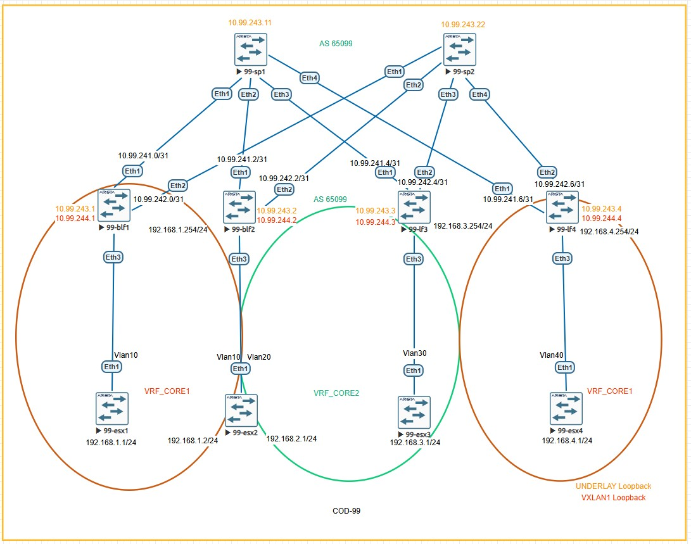

# Лабораторная работа:  Настройка Overlay на основе VxLAN EVPN для L3 связанности между клиентами

## Задание
1. Настроить Overlay на основе VxLAN EVPN для обеспечения L3-связности между всеми сетевыми устройствами. Настроить каждого клиента в своем VNI
2. Задокументировать:
   - Схему сети
   - Конфигурацию устройств
3. Проверить IP-связность между устройствами в BGP домене

---

## Топология сети

## IP-план (Address Plan) 

### Underlay сеть (Fabric Links - Point-to-Point /31)

| Device Name | IP Address/Маска | Port      | Remote Device | Remote Port | Description         |
|-------------|------------------|-----------|---------------|-------------|---------------------|
| 99-blf1     | 10.99.241.0/31   | Ethernet1 | 99-sp1        | Ethernet1   | to Spine1           |
| 99-blf1     | 10.99.242.0/31   | Ethernet2 | 99-sp2        | Ethernet1   | to Spine2           |
| 99-blf1     | -                | Ethernet3 | 99-esx1       | Ethernet1   | Server Trunk        |
| 99-blf1     | -                | Ethernet4 | 99-esx4       | Ethernet2   | Server Trunk        |
| 99-blf2     | 10.99.241.2/31   | Ethernet1 | 99-sp1        | Ethernet2   | to Spine1           |
| 99-blf2     | 10.99.242.2/31   | Ethernet2 | 99-sp2        | Ethernet2   | to Spine2           |
| 99-blf2     | -                | Ethernet3 | 99-esx2       | Ethernet1   | Server Trunk        |
| 99-blf2     | -                | Ethernet4 | 99-esx3       | Ethernet2   | Server Trunk        |
| 99-lf3      | 10.99.241.4/31   | Ethernet1 | 99-sp1        | Ethernet3   | to Spine1           |
| 99-lf3      | 10.99.242.4/31   | Ethernet2 | 99-sp2        | Ethernet3   | to Spine2           |
| 99-lf3      | -                | Ethernet3 | 99-esx3       | Ethernet1   | Server Trunk        |
| 99-lf3      | -                | Ethernet4 | 99-esx2       | Ethernet2   | Server Trunk        |
| 99-lf4      | 10.99.241.6/31   | Ethernet1 | 99-sp1        | Ethernet4   | to Spine1           |
| 99-lf4      | 10.99.242.6/31   | Ethernet2 | 99-sp2        | Ethernet4   | to Spine2           |
| 99-lf4      | -                | Ethernet3 | 99-esx4       | Ethernet1   | Server Trunk        |
| 99-lf4      | -                | Ethernet4 | 99-esx1       | Ethernet2   | Server Trunk        |

### Loopback адреса для BGP Underlay (Сеть 10.99.243.0/24)

| Device Name | Loopback0 Address | Description          |
|-------------|-------------------|----------------------|
| 99-blf1     | 10.99.243.1/32    | BGP Router-ID        |
| 99-blf2     | 10.99.243.2/32    | BGP Router-ID        |
| 99-lf3      | 10.99.243.3/32    | BGP Router-ID        |
| 99-lf4      | 10.99.243.4/32    | BGP Router-ID        |
| 99-sp1      | 10.99.243.11/32   | BGP Router-ID        |
| 99-sp2      | 10.99.243.22/32   | BGP Router-ID        |

### Loopback адреса для VXLAN NVE (Сеть 10.99.244.0/24)

| Device Name | Loopback1 Address | Description          |
|-------------|-------------------|----------------------|
| 99-blf1     | 10.99.244.1/32    | VTEP Source          |
| 99-blf2     | 10.99.244.2/32    | VTEP Source          |
| 99-lf3      | 10.99.244.3/32    | VTEP Source          |
| 99-lf4      | 10.99.244.4/32    | VTEP Source          |

### EVPN L2-домены (VLAN ↔ VNI Mapping)

| VLAN | Описание          | L2 VNI | Anycast Gateway   | Leaf с настроенным VNI |
|------|-------------------|--------|-------------------|------------------------|
| 10   | VLAN10   | 10010  | 192.168.1.254/24  | 99-blf1, 99-blf2 |
| 20   | VLAN20   | 10020  | 192.168.2.254/24  | 99-blf2 |
| 30   | VLAN30   | 10030  | 192.168.3.254/24  |  99-lf3 |
| 40   | VLAN40   | 10040  | 192.168.4.254/24  |  99-lf4 |


### Конфигурация "ESXi" устройств 

| ESXi Device | Физические порты (Trunk) | Виртуальные интерфейсы (SVI)                     | IP Address/Маска   | Gateway         |
|-------------|--------------------------|------------------------------------------------|-------------------|-----------------|
| 99-esx1     | Eth1 → 99-blf1 Eth3      | Vlan10 (SVI для VLAN10)                        | 192.168.1.1/24    | 192.168.1.254   |
| 99-esx2     | Eth1 → 99-blf2 Eth3      | Vlan10 (SVI для VLAN10)                        | 192.168.1.2/24    | 192.168.1.254   |
| 99-esx2     | Eth1 → 99-blf2 Eth3      | Vlan20 (SVI для VLAN10)                        | 192.168.2.1/24    | 192.168.2.254   |
| 99-esx3     | Eth1 → 99-lf3 Eth3       | Vlan30 (SVI для VLAN30)                        | 192.168.3.1/24    | 192.168.3.254   |
| 99-esx4     | Eth1 → 99-lf4 Eth3       | Vlan40 (SVI для VLAN40)                        | 192.168.4.1/24    | 192.168.4.254   |

---

## Конфигурация BGP

### 99-blf1 (Border Leaf 1)
```bash
configure terminal
hostname 99-blf1

ip routing
service routing protocols model multi-agent
ip virtual-router mac-address 0000.0000.0001

vrf instance VRF_CORE_1
vrf instance VRF_CORE_2

ip routing
ip routing VRF_CORE_1
ip routing VRF_CORE_2

vlan 10
   name VLAN10

interface Ethernet1
   description to-99-sp1-Eth1
   no switchport
   mtu 9100
   ip address 10.99.241.0/31
   

interface Ethernet2
   description to-99-sp2-Eth1
   no switchport
   mtu 9100
   ip address 10.99.242.0/31
   

interface Ethernet3
   description to-99-esx1-Eth1
   switchport mode trunk
   switchport trunk allowed vlan 10
   mtu 9100
   no shutdown


interface Vlan10
   description Vlan10
   mtu 9100
   vrf VRF_CORE_1
   ip address virtual 192.168.1.254/24


interface Loopback0
   description Router-ID
   ip address 10.99.243.1/32

interface Loopback1
   description VTEP-Source
   ip address 10.99.244.1/32

interface Vxlan1
   description VXLAN-Tunnel-Endpoint
   no shutdown
   vxlan source-interface Loopback1
   vxlan learn-restrict any
   vxlan vlan 10 vni 10010
   vxlan vrf VRF_CORE_1 vni 10001
   vxlan vrf VRF_CORE_2 vni 10002   
  
router bgp 65099
   router-id 10.99.243.1
   no bgp default ipv4-unicast
   timers bgp 3 9
   maximum-paths 10 ecmp 10

   neighbor SPINE-UNDERLAY peer group
   neighbor SPINE-UNDERLAY remote-as 65099
   neighbor SPINE-UNDERLAY timers 3 9
   neighbor SPINE-UNDERLAY send-community
   neighbor SPINE-UNDERLAY bfd interval 300 min-rx 300 multiplier 3
   neighbor 10.99.241.1 peer group SPINE-UNDERLAY
   neighbor 10.99.242.1 peer group SPINE-UNDERLAY

   neighbor SPINE-EVPN peer group
   neighbor SPINE-EVPN remote-as 65099
   neighbor SPINE-EVPN update-source Loopback0
   neighbor SPINE-EVPN ebgp-multihop 2
   neighbor SPINE-EVPN send-community extended
   neighbor 10.99.243.11 peer group SPINE-EVPN
   neighbor 10.99.243.22 peer group SPINE-EVPN

   vlan 10
     rd auto
     route-target both 65099:10010
     redistribute learned

   address-family ipv4
      neighbor SPINE-UNDERLAY activate
      network 10.99.243.1/32
      network 10.99.244.1/32

   
   address-family evpn
      neighbor SPINE-EVPN activate
   

vrf VRF_CORE_1
      
      rd 65099:101
      route-target import evpn 65099:101
      route-target export evpn 65099:101
      address-family ipv4
      redistribute connected

 vrf VRF_CORE_2
      rd 65099:102
      route-target import evpn 65099:102
      route-target export evpn 65099:102
      address-family ipv4
      redistribute connected


 ```

 ### 99-blf2 (Border Leaf 2)
 ```bash
 configure terminal
hostname 99-blf2

ip routing
service routing protocols model multi-agent
ip virtual-router mac-address 0000.0000.0001

vrf instance VRF_CORE_1
vrf instance VRF_CORE_2

ip routing vrf VRF_CORE_1
ip routing vrf VRF_CORE_2

vlan 10
   name VLAN10

vlan 20
   name VLAN20

interface Ethernet1
   description to-99-sp1-Eth2
   no switchport
   mtu 9100
   ip address 10.99.241.2/31

interface Ethernet2
   description to-99-sp2-Eth2
   no switchport
   mtu 9100
   ip address 10.99.242.2/31

interface Ethernet3
   description to-99-esx2-Eth1
   switchport mode trunk
   switchport trunk allowed vlan 10,20
   mtu 9100
   no shutdown

interface Vlan10
   description Vlan10
   mtu 9100
   vrf VRF_CORE_1
   ip address virtual 192.168.1.254/24

interface Vlan20
   description Vlan20
   mtu 9100
   vrf VRF_CORE_2
   ip address virtual 192.168.2.254/24

interface Loopback0
   description Router-ID
   ip address 10.99.243.2/32

interface Loopback1
   description VTEP-Source
   ip address 10.99.244.2/32

interface Vxlan1
   description VXLAN-Tunnel-Endpoint
   no shutdown
   vxlan source-interface Loopback1
   vxlan learn-restrict any
   vxlan vlan 10 vni 10010
   vxlan vlan 20 vni 10020
   vxlan vrf VRF_CORE_1 vni 10001
   vxlan vrf VRF_CORE_2 vni 10002

router bgp 65099
   router-id 10.99.243.2
   no bgp default ipv4-unicast
   timers bgp 3 9
   maximum-paths 10 ecmp 10

   neighbor SPINE-UNDERLAY peer group
   neighbor SPINE-UNDERLAY remote-as 65099
   neighbor SPINE-UNDERLAY timers 3 9
   neighbor SPINE-UNDERLAY send-community
   neighbor SPINE-UNDERLAY bfd interval 300 min-rx 300 multiplier 3
   neighbor 10.99.241.3 peer group SPINE-UNDERLAY
   neighbor 10.99.242.3 peer group SPINE-UNDERLAY

   neighbor SPINE-EVPN peer group
   neighbor SPINE-EVPN remote-as 65099
   neighbor SPINE-EVPN update-source Loopback0
   neighbor SPINE-EVPN ebgp-multihop 2
   neighbor SPINE-EVPN send-community extended
   neighbor 10.99.243.11 peer group SPINE-EVPN
   neighbor 10.99.243.22 peer group SPINE-EVPN

   vlan 10
      rd auto
      route-target both 65099:10010
      redistribute learned

   address-family ipv4
      neighbor SPINE-UNDERLAY activate
      network 10.99.243.2/32
      network 10.99.244.2/32

   address-family evpn
      neighbor SPINE-EVPN activate

vrf VRF_CORE_1
   rd 65099:101
   route-target import evpn 65099:101
   route-target export evpn 65099:101
   
   address-family ipv4
      redistribute connected

vrf VRF_CORE_2
   rd 65099:102
   route-target import evpn 65099:102
   route-target export evpn 65099:102
   
   address-family ipv4
      redistribute connected
 ```
### 99-lf3 (Leaf 3)
```bash
configure terminal
hostname 99-lf3

ip routing
service routing protocols model multi-agent
ip virtual-router mac-address 0000.0000.0001

vrf instance VRF_CORE_1
vrf instance VRF_CORE_2

ip routing vrf VRF_CORE_1
ip routing vrf VRF_CORE_2

vlan 30
   name VLAN30

interface Ethernet1
   description to-99-sp1-Eth3
   no switchport
   mtu 9100
   ip address 10.99.241.4/31

interface Ethernet2
   description to-99-sp2-Eth3
   no switchport
   mtu 9100
   ip address 10.99.242.4/31

interface Ethernet3
   description to-99-esx3-Eth1
   switchport mode trunk
   switchport trunk allowed vlan 30
   mtu 9100
   no shutdown

interface Vlan30
   description Vlan30
   mtu 9100
   vrf VRF_CORE_2
   ip address virtual 192.168.3.254/24

interface Loopback0
   description Router-ID
   ip address 10.99.243.3/32

interface Loopback1
   description VTEP-Source
   ip address 10.99.244.3/32

interface Vxlan1
   description VXLAN-Tunnel-Endpoint
   no shutdown
   vxlan source-interface Loopback1
   vxlan learn-restrict any
   vxlan vlan 30 vni 10030
   vxlan vrf VRF_CORE_1 vni 10001
   vxlan vrf VRF_CORE_2 vni 10002

router bgp 65099
   router-id 10.99.243.3
   no bgp default ipv4-unicast
   timers bgp 3 9
   maximum-paths 10 ecmp 10

   neighbor SPINE-UNDERLAY peer group
   neighbor SPINE-UNDERLAY remote-as 65099
   neighbor SPINE-UNDERLAY timers 3 9
   neighbor SPINE-UNDERLAY send-community
   neighbor SPINE-UNDERLAY bfd interval 300 min-rx 300 multiplier 3
   neighbor 10.99.241.5 peer group SPINE-UNDERLAY
   neighbor 10.99.242.5 peer group SPINE-UNDERLAY

   neighbor SPINE-EVPN peer group
   neighbor SPINE-EVPN remote-as 65099
   neighbor SPINE-EVPN update-source Loopback0
   neighbor SPINE-EVPN ebgp-multihop 2
   neighbor SPINE-EVPN send-community extended
   neighbor 10.99.243.11 peer group SPINE-EVPN
   neighbor 10.99.243.22 peer group SPINE-EVPN


   address-family ipv4
      neighbor SPINE-UNDERLAY activate
      network 10.99.243.3/32
      network 10.99.244.3/32

   address-family evpn
      neighbor SPINE-EVPN activate

vrf VRF_CORE_1
   rd 65099:101
   route-target import evpn 65099:101
   route-target export evpn 65099:101
   
   address-family ipv4
      redistribute connected

vrf VRF_CORE_2
   rd 65099:102
   route-target import evpn 65099:102
   route-target export evpn 65099:102
   
   address-family ipv4
      redistribute connected
 ```

 ### 99-lf4 (Leaf 4)
```bash
configure terminal
hostname 99-lf4

ip routing
service routing protocols model multi-agent
ip virtual-router mac-address 0000.0000.0001

vrf instance VRF_CORE_1
vrf instance VRF_CORE_2

ip routing vrf VRF_CORE_1
ip routing vrf VRF_CORE_2

vlan 40
   name VLAN40

interface Ethernet1
   description to-99-sp1-Eth4
   no switchport
   mtu 9100
   ip address 10.99.241.6/31

interface Ethernet2
   description to-99-sp2-Eth4
   no switchport
   mtu 9100
   ip address 10.99.242.6/31

interface Ethernet3
   description to-99-esx4-Eth1
   switchport mode trunk
   switchport trunk allowed vlan 40
   mtu 9100
   no shutdown

interface Vlan40
   description Vlan40
   mtu 9100
   vrf VRF_CORE_1
   ip address virtual 192.168.4.254/24

interface Loopback0
   description Router-ID
   ip address 10.99.243.4/32

interface Loopback1
   description VTEP-Source
   ip address 10.99.244.4/32

interface Vxlan1
   description VXLAN-Tunnel-Endpoint
   no shutdown
   vxlan source-interface Loopback1
   vxlan learn-restrict any
   vxlan vlan 40 vni 10040
   vxlan vrf VRF_CORE_1 vni 10001
   vxlan vrf VRF_CORE_2 vni 10002

router bgp 65099
   router-id 10.99.243.4
   no bgp default ipv4-unicast
   timers bgp 3 9
   maximum-paths 10 ecmp 10

   neighbor SPINE-UNDERLAY peer group
   neighbor SPINE-UNDERLAY remote-as 65099
   neighbor SPINE-UNDERLAY timers 3 9
   neighbor SPINE-UNDERLAY send-community
   neighbor SPINE-UNDERLAY bfd interval 300 min-rx 300 multiplier 3
   neighbor 10.99.241.7 peer group SPINE-UNDERLAY
   neighbor 10.99.242.7 peer group SPINE-UNDERLAY

   neighbor SPINE-EVPN peer group
   neighbor SPINE-EVPN remote-as 65099
   neighbor SPINE-EVPN update-source Loopback0
   neighbor SPINE-EVPN ebgp-multihop 2
   neighbor SPINE-EVPN send-community extended
   neighbor 10.99.243.11 peer group SPINE-EVPN
   neighbor 10.99.243.22 peer group SPINE-EVPN


   address-family ipv4
      neighbor SPINE-UNDERLAY activate
      network 10.99.243.4/32
      network 10.99.244.4/32

   address-family evpn
      neighbor SPINE-EVPN activate

vrf VRF_CORE_1
   rd 65099:101
   route-target import evpn 65099:101
   route-target export evpn 65099:101
   
   address-family ipv4
      redistribute connected

vrf VRF_CORE_2
   rd 65099:102
   route-target import evpn 65099:102
   route-target export evpn 65099:102
   
   address-family ipv4
      redistribute connected

 ```

 ### 99-sp1 (Spine 1)
 ```bash
configure terminal
hostname 99-sp1

ip routing
service routing protocols model multi-agent

interface Ethernet1
   description to-99-blf1-Eth1
   no switchport
   mtu 9100
   ip address 10.99.241.1/31
   

interface Ethernet2
   description to-99-blf2-Eth1
   no switchport
   mtu 9100
   ip address 10.99.241.3/31
   

interface Ethernet3
   description to-99-lf3-Eth1
   no switchport
   mtu 9100
   ip address 10.99.241.5/31
   

interface Ethernet4
   description to-99-lf4-Eth1
   no switchport
   mtu 9100
   ip address 10.99.241.7/31
   

interface Loopback0
   description Router-ID
   ip address 10.99.243.11/32

router bgp 65099
   router-id 10.99.243.11
   no bgp default ipv4-unicast
   timers bgp 3 9
   maximum-paths 10 ecmp 10
   
   neighbor LEAF-UNDERLAY peer group
   neighbor LEAF-UNDERLAY remote-as 65099
   neighbor LEAF-UNDERLAY route-reflector-client
   neighbor LEAF-UNDERLAY send-community
   neighbor LEAF-UNDERLAY next-hop-self
   neighbor LEAF-UNDERLAY interval 300 min-rx 300 multiplier 3
   bgp listen range 10.99.241.0/24 peer-group LEAF-UNDERLAY remote-as 65099
   
   neighbor LEAF-EVPN peer group
   neighbor LEAF-EVPN remote-as 65099
   neighbor LEAF-EVPN update-source Loopback0
   neighbor LEAF-EVPN route-reflector-client
   neighbor LEAF-EVPN send-community extended
   neighbor 10.99.243.1 peer group LEAF-EVPN
   neighbor 10.99.243.2 peer group LEAF-EVPN
   neighbor 10.99.243.3 peer group LEAF-EVPN
   neighbor 10.99.243.4 peer group LEAF-EVPN
   
   address-family ipv4
      neighbor LEAF-UNDERLAY activate
      network 10.99.243.11/32
   
   address-family evpn
      neighbor LEAF-EVPN activate
 ```

 ### 99-sp2 (Spine 2)
 ```bash
configure terminal
hostname 99-sp2

ip routing
service routing protocols model multi-agent

interface Ethernet1
   description to-99-blf1-Eth2
   no switchport
   mtu 9100
   ip address 10.99.242.1/31
   

interface Ethernet2
   description to-99-blf2-Eth2
   no switchport
   mtu 9100
   ip address 10.99.242.3/31
   

interface Ethernet3
   description to-99-lf3-Eth2
   no switchport
   mtu 9100
   ip address 10.99.242.5/31
   

interface Ethernet4
   description to-99-lf4-Eth2
   no switchport
   mtu 9100
   ip address 10.99.242.7/31
   

interface Loopback0
   description Router-ID
   ip address 10.99.243.22/32

router bgp 65099
   router-id 10.99.243.22
   no bgp default ipv4-unicast
   timers bgp 3 9
   maximum-paths 10 ecmp 10
   
   neighbor LEAF-UNDERLAY peer group
   neighbor LEAF-UNDERLAY remote-as 65099
   neighbor LEAF-UNDERLAY route-reflector-client
   neighbor LEAF-UNDERLAY send-community
   neighbor LEAF-UNDERLAY next-hop-self
   neighbor LEAF-UNDERLAY bfd interval 300 min-rx 300 multiplier 3
   bgp listen range 10.99.241.0/24 peer-group LEAF-UNDERLAY remote-as 65099
   
   neighbor LEAF-EVPN peer group
   neighbor LEAF-EVPN remote-as 65099
   neighbor LEAF-EVPN update-source Loopback0
   neighbor LEAF-EVPN route-reflector-client
   neighbor LEAF-EVPN send-community extended
   neighbor 10.99.243.1 peer group LEAF-EVPN
   neighbor 10.99.243.2 peer group LEAF-EVPN
   neighbor 10.99.243.3 peer group LEAF-EVPN
   neighbor 10.99.243.4 peer group LEAF-EVPN
   
   address-family ipv4
      neighbor LEAF-UNDERLAY activate
      network 10.99.243.22/32
   
   address-family evpn
      neighbor LEAF-EVPN activate

 ```
 

  ### 99-esxN (ESX N)
 ```bash
configure terminal
hostname 99-esxN

ip routing
vlan N0

interface Ethernet1
   description to-99-lf4-Eth3
   switchport mode trunk
   switchport trunk allowed vlan 10,20
   mtu 9100
   no shutdown


interface Vlan10
   description VMKernel-VLAN10
   ip address 192.168.1.N/24
   mtu 9100
   no shutdown


ip route 0.0.0.0/0 192.168.1.254

 ```
### 99-esx2 (ESX 2)
```
 hostname 99-esx2
 spanning-tree mode rstp
 vlan 10,20
 vrf instance VRF_CORE_1
 vrf instance VRF_CORE_2

interface Ethernet1
   description to-99-blf2-Eth3
   mtu 9100
   switchport trunk allowed vlan 10,20
   switchport mode trunk

interface Ethernet2
   description to-99-lf3-Eth4
   mtu 9100
   switchport trunk allowed vlan 10,20
   switchport mode trunk


interface Vlan10
   description VMKernel-VLAN10
   mtu 9100
   vrf VRF_CORE_1
   ip address 192.168.1.2/24

interface Vlan20
   description VMKernel-VLAN20
   mtu 9100
   vrf VRF_CORE_2
   ip address 192.168.2.1/24

ip routing
ip routing vrf VRF_CORE_1
ip routing vrf VRF_CORE_2

ip route vrf VRF_CORE_1 0.0.0.0/0 192.168.1.254
ip route vrf VRF_CORE_2 0.0.0.0/0 192.168.2.254
```
---

## Проверка IP связности
 ## 1. Проверка связности внутри Vlan10 ( 1/2 blf)
```
99-blf1#sh bgp evpn route-type mac-ip
BGP routing table information for VRF default
Router identifier 10.99.243.1, local AS number 65099
Route status codes: * - valid, > - active, S - Stale, E - ECMP head, e - ECMP
                    c - Contributing to ECMP, % - Pending BGP convergence
Origin codes: i - IGP, e - EGP, ? - incomplete
AS Path Attributes: Or-ID - Originator ID, C-LST - Cluster List, LL Nexthop - Link Local Nexthop

          Network                Next Hop              Metric  LocPref Weight  Path
 * >Ec    RD: 10.99.243.2:10 mac-ip 5000.006b.2e70
                                 10.99.244.2           -       100     0       i Or-ID: 10.99.243.2 C-LST: 10.99.243.22
 *  ec    RD: 10.99.243.2:10 mac-ip 5000.006b.2e70
                                 10.99.244.2           -       100     0       i Or-ID: 10.99.243.2 C-LST: 10.99.243.11
 * >Ec    RD: 10.99.243.2:10 mac-ip 5000.006b.2e70 192.168.1.2
                                 10.99.244.2           -       100     0       i Or-ID: 10.99.243.2 C-LST: 10.99.243.22
 *  ec    RD: 10.99.243.2:10 mac-ip 5000.006b.2e70 192.168.1.2
                                 10.99.244.2           -       100     0       i Or-ID: 10.99.243.2 C-LST: 10.99.243.11
 * >      RD: 10.99.243.1:10 mac-ip 5000.00d5.5dc0
                                 -                     -       -       0       i
 * >      RD: 10.99.243.1:10 mac-ip 5000.00d5.5dc0 192.168.1.1
                                 -                     -       -       0       i
99-blf1#


```
```
99-blf1#sh mac address-table vl 10
          Mac Address Table
------------------------------------------------------------------

Vlan    Mac Address       Type        Ports      Moves   Last Move
----    -----------       ----        -----      -----   ---------
  10    0000.0000.0001    STATIC      Cpu
  10    5000.006b.2e70    DYNAMIC     Vx1        1       0:02:43 ago
  10    5000.00d5.5dc0    DYNAMIC     Et3        1       0:08:02 ago
Total Mac Addresses for this criterion: 3

```

## 2.  Проверка таблицы маршрутов VRF_CORE_1/2  
```
99-blf2#sh ip route vrf VRF_CORE_1
VRF: VRF_CORE_1

Gateway of last resort is not set

 B I      192.168.1.1/32 [200/0] via VTEP 10.99.244.1 VNI 10001 router-mac 50:00:00:d7:ee:0b local-interface Vxlan1
 C        192.168.1.0/24 is directly connected, Vlan10
 B I      192.168.4.0/24 [200/0] via VTEP 10.99.244.4 VNI 10002 router-mac 50:00:00:af:d3:f6 local-interface Vxlan1

```

```
99-blf2#sh ip route vrf VRF_CORE_2

VRF: VRF_CORE_2

 C        192.168.2.0/24 is directly connected, Vlan20
 B I      192.168.3.0/24 [200/0] via VTEP 10.99.244.3 VNI 10002 router-mac 50:00:00:f6:ad:37 local-interface Vxlan1
```


## 3. Проверка межсерверной связности между VM 
Пингуем с ESXI2 , который живет в двух VRF 
```
99-esx2#ping vrf VRF_CORE_1 192.168.1.1
PING 192.168.1.1 (192.168.1.1) 72(100) bytes of data.
80 bytes from 192.168.1.1: icmp_seq=1 ttl=64 time=26.6 ms
80 bytes from 192.168.1.1: icmp_seq=2 ttl=64 time=19.1 ms
80 bytes from 192.168.1.1: icmp_seq=3 ttl=64 time=25.7 ms
80 bytes from 192.168.1.1: icmp_seq=4 ttl=64 time=21.5 ms
80 bytes from 192.168.1.1: icmp_seq=5 ttl=64 time=16.8 ms

--- 192.168.1.1 ping statistics ---
5 packets transmitted, 5 received, 0% packet loss, time 75ms
rtt min/avg/max/mdev = 16.809/21.993/26.691/3.780 ms, pipe 3, ipg/ewma 18.999/24.173 ms
99-esx2#
99-esx2#ping vrf VRF_CORE_1 192.168.4.1
PING 192.168.4.1 (192.168.4.1) 72(100) bytes of data.
80 bytes from 192.168.4.1: icmp_seq=1 ttl=62 time=38.8 ms
80 bytes from 192.168.4.1: icmp_seq=2 ttl=62 time=28.7 ms
80 bytes from 192.168.4.1: icmp_seq=3 ttl=62 time=24.8 ms
80 bytes from 192.168.4.1: icmp_seq=4 ttl=62 time=31.5 ms
80 bytes from 192.168.4.1: icmp_seq=5 ttl=62 time=29.2 ms

--- 192.168.4.1 ping statistics ---
5 packets transmitted, 5 received, 0% packet loss, time 68ms
rtt min/avg/max/mdev = 24.863/30.662/38.888/4.642 ms, pipe 4, ipg/ewma 17.046/34.689 ms
99-esx2#
99-esx2#ping vrf VRF_CORE_2 192.168.3.1
PING 192.168.3.1 (192.168.3.1) 72(100) bytes of data.
80 bytes from 192.168.3.1: icmp_seq=1 ttl=62 time=74.8 ms
80 bytes from 192.168.3.1: icmp_seq=2 ttl=62 time=64.9 ms
80 bytes from 192.168.3.1: icmp_seq=3 ttl=62 time=55.6 ms
80 bytes from 192.168.3.1: icmp_seq=4 ttl=62 time=47.8 ms
80 bytes from 192.168.3.1: icmp_seq=5 ttl=62 time=40.1 ms

--- 192.168.3.1 ping statistics ---
5 packets transmitted, 5 received, 0% packet loss, time 45ms
rtt min/avg/max/mdev = 40.124/56.673/74.807/12.246 ms, pipe 5, ipg/ewma 11.315/64.863 ms
99-esx2#
99-esx2#ping vrf VRF_CORE_2 192.168.3.254
PING 192.168.3.254 (192.168.3.254) 72(100) bytes of data.
80 bytes from 192.168.3.254: icmp_seq=1 ttl=63 time=24.3 ms
80 bytes from 192.168.3.254: icmp_seq=2 ttl=63 time=16.4 ms
80 bytes from 192.168.3.254: icmp_seq=3 ttl=63 time=37.3 ms
80 bytes from 192.168.3.254: icmp_seq=4 ttl=63 time=27.3 ms
80 bytes from 192.168.3.254: icmp_seq=5 ttl=63 time=19.6 ms

--- 192.168.3.254 ping statistics ---
5 packets transmitted, 5 received, 0% packet loss, time 86ms
rtt min/avg/max/mdev = 16.434/25.029/37.331/7.204 ms, pipe 2, ipg/ewma 21.546/24.672 ms
99-esx2#
99-esx2#ping vrf VRF_CORE_1 192.168.4.254
PING 192.168.4.254 (192.168.4.254) 72(100) bytes of data.
80 bytes from 192.168.4.254: icmp_seq=1 ttl=63 time=44.1 ms
80 bytes from 192.168.4.254: icmp_seq=2 ttl=63 time=34.6 ms
80 bytes from 192.168.4.254: icmp_seq=3 ttl=63 time=25.4 ms
80 bytes from 192.168.4.254: icmp_seq=4 ttl=63 time=24.9 ms
80 bytes from 192.168.4.254: icmp_seq=5 ttl=63 time=25.5 ms

--- 192.168.4.254 ping statistics ---
5 packets transmitted, 5 received, 0% packet loss, time 74ms

```
## 4. Проверка межсерверной связности между VM из разных VRF 

```
99-esx4#
99-esx4#ping 192.168.2.1
PING 192.168.2.1 (192.168.2.1) 72(100) bytes of data.
From 192.168.4.254 icmp_seq=1 Destination Net Unreachable

--- 192.168.2.1 ping statistics ---
5 packets transmitted, 0 received, +1 errors, 100% packet loss, time 52ms
pipe 2
99-esx4#
99-esx4#ping 192.168.3.1
PING 192.168.3.1 (192.168.3.1) 72(100) bytes of data.
From 192.168.4.254 icmp_seq=1 Destination Net Unreachable

--- 192.168.3.1 ping statistics ---
5 packets transmitted, 0 received, +1 errors, 100% packet loss, time 37ms
```
Пинг отсутствует по скольку VRF изолированы друг от друга и esx-2 не выступает в виде router on stick 


