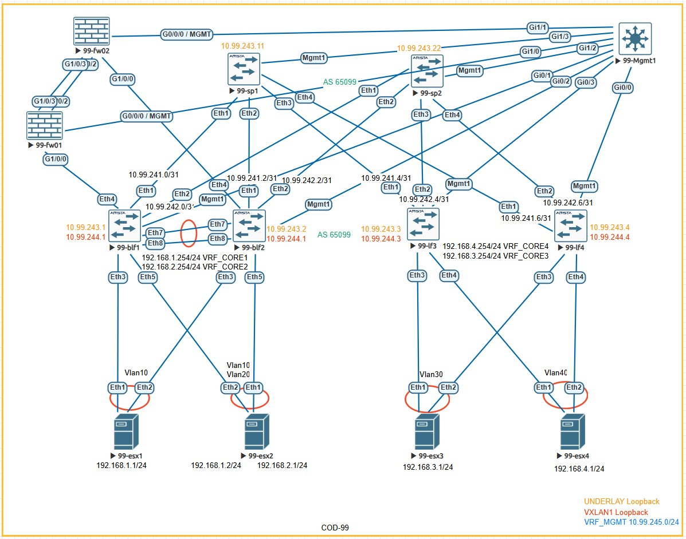

# Лабораторная работа:  Реализовать передачу суммарных префиксов через EVPN route-type 5

## Задание
1. Разместить каждый Vlan ( 10,20,30,40) в своем VRF
2. Затерминировать их на Фаерволле
3. Собрать отказоустойчивый кластер USG 6000
4. Настроить маршрутизацию между VRF через фаерволл

---

## Топология сети


Добавим в IP-план линки до фаерволлов, и адреса для пиринга с ними

## IP-план (Address Plan) 

### Underlay сеть (Fabric Links - Point-to-Point /31)

| Device Name | IP Address/Маска | Port      | Remote Device | Remote Port | Description         |
|-------------|------------------|-----------|---------------|-------------|---------------------|
| 99-blf1     | 10.99.241.0/31   | Ethernet1 | 99-sp1        | Ethernet1   | to Spine1           |
| 99-blf1     | 10.99.242.0/31   | Ethernet2 | 99-sp2        | Ethernet1   | to Spine2           |
| 99-blf1     | -                | Ethernet3 | 99-esx1       | Ethernet1   | Server Trunk        |
| 99-blf1     | 10.99.241.8/31   | Ethernet4 | 99-fw01       | Ethernet1   | to fw01             |
| 99-blf1     | -                | Ethernet5 | 99-esx2       | Ethernet2   | Server Trunk        |
| 99-blf1     | 10.99.242.8/31   | Ethernet6 | 99-fw02       | Ethernet1   | to fw02             |
| 99-blf2     | 10.99.241.2/31   | Ethernet1 | 99-sp1        | Ethernet2   | to Spine1           |
| 99-blf2     | 10.99.242.2/31   | Ethernet2 | 99-sp2        | Ethernet2   | to Spine2           |
| 99-blf2     | -                | Ethernet3 | 99-esx1       | Ethernet1   | Server Trunk        |
| 99-blf2     | 10.99.241.10/31  | Ethernet4 | 99-fw01       | Ethernet1   | to fw01             |
| 99-blf2     | -                | Ethernet5 | 99-esx2       | Ethernet2   | Server Trunk        |
| 99-blf2     | 10.99.242.10/31  | Ethernet6 | 99-fw02       | Ethernet1   | to fw02             |
| 99-lf3      | 10.99.241.4/31   | Ethernet1 | 99-sp1        | Ethernet3   | to Spine1           |
| 99-lf3      | 10.99.242.4/31   | Ethernet2 | 99-sp2        | Ethernet3   | to Spine2           |
| 99-lf3      | -                | Ethernet3 | 99-esx3       | Ethernet1   | Server Trunk        |
| 99-lf3      | -                | Ethernet4 | 99-esx4       | Ethernet2   | Server Trunk        |
| 99-lf4      | 10.99.241.6/31   | Ethernet1 | 99-sp1        | Ethernet4   | to Spine1           |
| 99-lf4      | 10.99.242.6/31   | Ethernet2 | 99-sp2        | Ethernet4   | to Spine2           |
| 99-lf4      | -                | Ethernet3 | 99-esx3       | Ethernet2   | Server Trunk        |
| 99-lf4      | -                | Ethernet4 | 99-esx4       | Ethernet1   | Server Trunk        |
| 99-fw01     | 10.99.242.12/31  | GI1/0/2   | 99-fw02       | GI1/0/2     | HRP LINK            |

### Loopback адреса для BGP Underlay (Сеть 10.99.243.0/24)

| Device Name | Loopback0 Address | Description          |
|-------------|-------------------|----------------------|
| 99-blf1     | 10.99.243.1/32    | BGP Router-ID        |
| 99-blf2     | 10.99.243.2/32    | BGP Router-ID        |
| 99-lf3      | 10.99.243.3/32    | BGP Router-ID        |
| 99-lf4      | 10.99.243.4/32    | BGP Router-ID        |
| 99-sp1      | 10.99.243.11/32   | BGP Router-ID        |
| 99-sp2      | 10.99.243.22/32   | BGP Router-ID        |

### Loopback адреса для VXLAN NVE (Сеть 10.99.244.0/24)

| Device Name | Loopback1 Address | Description          |
|-------------|-------------------|----------------------|
| 99-blf1     | 10.99.244.1/32    | VTEP Source          |
| 99-blf2     | 10.99.244.2/32    | VTEP Source          |
| 99-lf3      | 10.99.244.3/32    | VTEP Source          |
| 99-lf4      | 10.99.244.4/32    | VTEP Source          |

### MGMT адреса (Сеть 10.99.245.0/24)

| Device Name | Loopback0 Address | Description   |
|-------------|-------------------|---------------|
| 99-blf1     | 10.99.245.1/32    | Mgmt ip       |
| 99-blf2     | 10.99.245.2/32    | Mgmt ip       |
| 99-lf3      | 10.99.245.3/32    | Mgmt ip       |
| 99-lf4      | 10.99.245.4/32    | Mgmt ip       |
| 99-sp1      | 10.99.245.11/32   | Mgmt ip       |
| 99-sp2      | 10.99.245.22/32   | Mgmt ip       |
| 99-fw01     | 10.99.245.252/32  | Mgmt ip       |
| 99-fw02     | 10.99.245.253/32  | Mgmt ip       |
| 99-fw       | 10.99.245.254/32  | VIP GW        |


### EVPN L2-домены (VLAN ↔ VNI Mapping)
Поменяем эникаст ГВ на лифах, и добавим ГВ для VRF на фаерволле на VIP адресе 

| VLAN | Описание          | L2 VNI | Anycast Gateway   | Leaf с настроенным VNI |
|------|-------------------|--------|-------------------|------------------------|
| 10   | VLAN10   | 10010  | 192.168.1.100/24  | 99-blf1, 99-blf2 VRF_CORE1 |
| 20   | VLAN20   | 10020  | 192.168.2.100/24  | 99-blf1, 99-blf2 VRF_CORE2 |
| 30   | VLAN30   | 10030  | 192.168.3.100/24  | 99-lf3, 99-lf4 VRF_CORE3 |
| 40   | VLAN40   | 10040  | 192.168.4.100/24  | 99-lf3, 99-lf4 VRF_CORE4 |

| VLAN | VR VIP Gateway    |   Адреса на нодах 99-fw01/02   |
|------|-------------------|--------------------------------|
| 10   | 192.168.1.254/24  | 192.168.1.252/192.168.1.253/24 |
| 20   | 192.168.2.254/24  | 192.168.2.252/192.168.1.253/24 |
| 30   | 192.168.3.254/24  | 192.168.2.252/192.168.1.253/24 |
| 40   | 192.168.4.254/24  | 192.168.2.252/192.168.1.253/24 |


### Конфигурация "ESXi" устройств 

| ESXi Device | Физические порты (Trunk) | Виртуальные интерфейсы (SVI)                     | IP Address/Маска   | Gateway         |
|-------------|--------------------------|------------------------------------------------|-------------------|-----------------|
| 99-esx1     | Eth1 → 99-blf1 Eth3   Po1   | Vlan10 (SVI для VLAN10)                        | 192.168.1.1/24    | 192.168.1.100  |
| 99-esx1     | Eth2 → 99-blf2 Eth3   Po1   | Vlan10 (SVI для VLAN10)                        | 192.168.1.1/24    | 192.168.1.100  |
| 99-esx2     | Eth1 → 99-blf1 Eth5   Po2  | Vlan10 (SVI для VLAN10)                        | 192.168.1.2/24    | 192.168.1.100   |
| 99-esx2     | Eth1 → 99-blf2 Eth5    Po2   | Vlan20 (SVI для VLAN20)                        | 192.168.2.1/24    | 192.168.2.100   |
| 99-esx2     | Eth1 → 99-blf1 Eth5   Po2  | Vlan10 (SVI для VLAN10)                        | 192.168.1.2/24    | 192.168.1.100   |
| 99-esx2     | Eth1 → 99-blf2 Eth5    Po2   | Vlan20 (SVI для VLAN20)                        | 192.168.2.1/24    | 192.168.2.100   |
| 99-esx3     | Eth1 → 99-lf3 Eth3   Po1   | Vlan30 (SVI для VLAN30)                        | 192.168.3.1/24    | 192.168.3.100   |
| 99-esx3     | Eth1 → 99-lf4 Eth3   Po1    | Vlan30 (SVI для VLAN30)                        | 192.168.3.1/24    | 192.168.3.100   |
| 99-esx4     | Eth1 → 99-lf3 Eth5    Po1   | Vlan40 (SVI для VLAN40)                        | 192.168.4.1/24    | 192.168.4.100   |
| 99-esx4     | Eth1 → 99-lf4 Eth5    Po1   | Vlan40 (SVI для VLAN40)                        | 192.168.4.1/24    | 192.168.4.100  |

---

## Конфигурация 

## FW01/02
Для начала настроим доступ по ssh с blf поскольку нормальный доступ на хувиках в лабе не заработал, потому что после включения нужно прожать кнопку энтер чтоб устройство загрузилось, а в ssh режиме этого сделать не выходит.


```
system-config
sysname 99-fw01

interface GigabitEthernet0/0/0
 undo shutdown
 ip binding vpn-instance default
 ip address 10.99.245.252 255.255.255.0
 service-manage http permit
 service-manage https permit
 service-manage ping permit
 service-manage ssh permit

stelnet server enable
ssh authentication-type default password
user-interface vty 0 4
 authentication-mode aaa
 protocol inbound ssh
aaa
   manager-user admin
  password cipher *******
  service-type ssh
  q
 firewall zone trust
 set priority 85
 add interface GigabitEthernet0/0/0
 q
q
save 
```
```
system-config
sysname 99-fw02

interface GigabitEthernet0/0/0
 undo shutdown
 ip binding vpn-instance default
 ip address 10.99.245.253 255.255.255.0
 service-manage http permit
 service-manage https permit
 service-manage ping permit
 service-manage ssh permit
 
stelnet server enable
ssh authentication-type default password
user-interface vty 0 4
 authentication-mode aaa
 protocol inbound ssh
aaa
   manager-user admin
  password cipher *******
  service-type ssh
  q
 firewall zone trust
 set priority 85
 add interface GigabitEthernet0/0/0
q
q
save
```
Все, теперь мы можем зайти на них с любого из наших свичей по ssh или по http на менеджмент адрес 

## Поднимем HRP
99-fw01
```
interface Eth-Trunk23
ip address 10.99.241.12 255.255.255.254
description HRP LINK to 99-fw02
service-manage all permit
q
interface Gi1/0/2
eth-trunk 23
description HRP LINK to 99-fw02
interface Gi1/0/3
eth-trunk 23
description HRP LINK to 99-fw02
q
firewall zone trust 
add int Eth-Trunk23

hrp enable
hrp standby config enable
hrp interface Eth-Trunk23 remote 10.99.241.13
```
99-fw02
```
interface Eth-Trunk23
ip address 10.99.241.13 255.255.255.254
description HRP LINK to 99-fw01
service-manage all permit
q
interface Gi1/0/2
eth-trunk 23
description HRP LINK to 99-fw01
interface Gi1/0/3
eth-trunk 23
description HRP LINK to 99-fw01
q
firewall zone trust 
add int Eth-Trunk23

hrp enable
hrp standby config enable
hrp standby-device
hrp interface Eth-Trunk23 remote 10.99.241.12

```
Проверим:
```
HRP_S<99-fw02>disp hrp state
 Role: standby, peer: active
 Running priority: 45000, peer: 45000
 Core state: abnormal(standby), peer: abnormal(active)
 Backup channel usage: 0.00%
 Stable time: 0 days, 0 hours, 0 minutes
 Last state change information: 2026-03-01 23:46:52 HRP link changes to up.

```

### 99-blf1 (Border Leaf 1)
```bash
configure terminal
hostname 99-blf1

ip routing
service routing protocols model multi-agent
ip virtual-router mac-address 0000.0000.0001

vrf instance VRF_CORE_1
vrf instance VRF_CORE_2

vrf instance MGMT
 ip routing 

interface Management 1
vrf MGMT
ip address 10.99.245.1/24

ip routing
ip routing VRF_CORE_1
ip routing VRF_CORE_2

vlan 4094
name MLAG-PEERLINK
trunk group MLAG-PEERLINK

Int Po78
descr MLAG_PEERLINK
switchport mode trunk
switchport trunk group MLAG-PEERLINK
spanning-tree link-type point-to-point

int Vlan4094
no autostate
ip address 10.99.246.1/30

mlag configuration
   domain-id 12
   local-interface Vlan4094
   peer-address 10.99.246.2
   peer-address heartbeat 10.99.245.2 vrf MGMT
   peer-link Port-Channel78
   dual-primary detection delay 1 action errdisable all-interfaces


int et 7
description Po78 lf2
   channel-group 78 mode active
int et 8
description Po78 lf2
   channel-group 78 mode active


vlan 10
   name VLAN10

interface Ethernet1
   description to-99-sp1-Eth1
   no switchport
   mtu 9100
   ip address 10.99.241.0/31
   

interface Ethernet2
   description to-99-sp2-Eth1
   no switchport
   mtu 9100
   ip address 10.99.242.0/31
   

interface Ethernet3
   description to-99-esx1-Eth1
   mtu 9100
   switchport trunk allowed vlan 10,20
   switchport mode trunk
   channel-group 3 mode active

interface Ethernet5
   description 99-esx2-eth2
   mtu 9100
   speed forced 10000full
   switchport trunk allowed vlan 10,20
   switchport mode trunk
   channel-group 5 mode active


interface Port-Channel3
   description 99-esx1
   mtu 9100
   switchport trunk allowed vlan 10,20
   switchport mode trunk
   mlag 3
!
interface Port-Channel5
   mtu 9100
   switchport trunk allowed vlan 10,20
   switchport mode trunk
   mlag 5


interface Vlan10
   description Vlan10
   mtu 9100
   vrf VRF_CORE_1
   ip address virtual 192.168.1.254/24
   
  interface Vlan20
   description Vlan20
   mtu 9100
   vrf VRF_CORE_2
   ip address virtual 192.168.2.254/24 


interface Loopback0
   description Router-ID
   ip address 10.99.243.1/32

interface Loopback1
   description VTEP-Source
   ip address 10.99.244.1/32

interface Vxlan1
   description VXLAN-Tunnel-Endpoint
   no shutdown
   vxlan source-interface Loopback1
   vxlan learn-restrict any
   vxlan vlan 10 vni 10010
   vxlan vrf VRF_CORE_1 vni 10001
   vxlan vrf VRF_CORE_2 vni 10002   
  
router bgp 65099
   router-id 10.99.243.1
   no bgp default ipv4-unicast
   timers bgp 3 9
   maximum-paths 10 ecmp 10

   neighbor SPINE-UNDERLAY peer group
   neighbor SPINE-UNDERLAY remote-as 65099
   neighbor SPINE-UNDERLAY timers 3 9
   neighbor SPINE-UNDERLAY send-community
   neighbor SPINE-UNDERLAY bfd interval 300 min-rx 300 multiplier 3
   neighbor 10.99.241.1 peer group SPINE-UNDERLAY
   neighbor 10.99.242.1 peer group SPINE-UNDERLAY

   neighbor 10.99.246.1 remote-as 65099
   neighbor 10.99.246.1 next-hop-self

   neighbor SPINE-EVPN peer group
   neighbor SPINE-EVPN remote-as 65099
   neighbor SPINE-EVPN update-source Loopback0
   neighbor SPINE-EVPN ebgp-multihop 2
   neighbor SPINE-EVPN send-community extended
   neighbor 10.99.243.11 peer group SPINE-EVPN
   neighbor 10.99.243.22 peer group SPINE-EVPN

   vlan 10
     rd auto
     route-target both 65099:10010
     redistribute learned

   address-family ipv4
      neighbor SPINE-UNDERLAY activate
      network 10.99.243.1/32
      network 10.99.244.1/32
      neighbor 10.99.246.1 activate

   
   address-family evpn
      neighbor SPINE-EVPN activate
   

vrf VRF_CORE_1
      
      rd 65099:101
      route-target import evpn 65099:101
      route-target export evpn 65099:101
      address-family ipv4
      redistribute connected

 vrf VRF_CORE_2
      rd 65099:102
      route-target import evpn 65099:102
      route-target export evpn 65099:102
      address-family ipv4
      redistribute connected


 ```

 ### 99-blf2 (Border Leaf 2)
 ```bash
 configure terminal
hostname 99-blf2

ip routing
service routing protocols model multi-agent
ip virtual-router mac-address 0000.0000.0001

vrf instance VRF_CORE_1
vrf instance VRF_CORE_2

ip routing vrf VRF_CORE_1
ip routing vrf VRF_CORE_2

vrf instance MGMT
 ip routing 

interface Management 1
vrf MGMT
ip address 10.99.245.2/24

vlan 4094
name MLAG-PEERLINK
trunk group MLAG-PEERLINK

Int Po78
descr MLAG_PEERLINK
switchport mode trunk
switchport trunk group MLAG-PEERLINK
spanning-tree link-type point-to-point

int Vlan4094
no autostate
ip address 10.99.246.2/30

mlag configuration
   domain-id 12
   local-interface Vlan4094
   peer-address 10.99.246.1
   peer-address heartbeat 10.99.245.1 vrf MGMT
   peer-link Port-Channel78
   dual-primary detection delay 1 action errdisable all-interfaces


int eEthernet 7
description Po78 lf2
   channel-group 78 mode active
int eEthernet 8
description Po78 lf2
   channel-group 78 mode active

vlan 10
   name VLAN10

vlan 20
   name VLAN20

interface Ethernet1
   description to-99-sp1-Eth2
   no switchport
   mtu 9100
   ip address 10.99.241.2/31

interface Ethernet2
   description to-99-sp2-Eth2
   no switchport
   mtu 9100
   ip address 10.99.242.2/31

interface Ethernet3
   description to-99-esx1-Eth1
   mtu 9100
   switchport trunk allowed vlan 10,20
   switchport mode trunk
   channel-group 3 mode active
   
interface Ethernet5
   description 99-esx2-eth2
   mtu 9100
   speed forced 10000full
   switchport trunk allowed vlan 10,20
   switchport mode trunk
   channel-group 5 mode active

interface Port-Channel3
   description 99-esx1
   mtu 9100
   switchport trunk allowed vlan 10,20
   switchport mode trunk
   mlag 3

interface Port-Channel5
   mtu 9100
   switchport trunk allowed vlan 10,20
   switchport mode trunk
   mlag 5


interface Vlan10
   description Vlan10
   mtu 9100
   vrf VRF_CORE_1
   ip address virtual 192.168.1.254/24

interface Vlan20
   description Vlan20
   mtu 9100
   vrf VRF_CORE_2
   ip address virtual 192.168.2.254/24

interface Loopback0
   description Router-ID
   ip address 10.99.243.2/32

interface Loopback1
   description VTEP-Source
   ip address 10.99.244.1/32

interface Vxlan1
   description VXLAN-Tunnel-Endpoint
   no shutdown
   vxlan source-interface Loopback1
   vxlan learn-restrict any
   vxlan vlan 10 vni 10010
   vxlan vlan 20 vni 10020
   vxlan vrf VRF_CORE_1 vni 10001
   vxlan vrf VRF_CORE_2 vni 10002

router bgp 65099
   router-id 10.99.243.2
   no bgp default ipv4-unicast
   timers bgp 3 9
   maximum-paths 10 ecmp 10

   neighbor SPINE-UNDERLAY peer group
   neighbor SPINE-UNDERLAY remote-as 65099
   neighbor SPINE-UNDERLAY timers 3 9
   neighbor SPINE-UNDERLAY send-community
   neighbor SPINE-UNDERLAY bfd interval 300 min-rx 300 multiplier 3
   neighbor 10.99.241.3 peer group SPINE-UNDERLAY
   neighbor 10.99.242.3 peer group SPINE-UNDERLAY

   neighbor 10.99.246.2 remote-as 65099
   neighbor 10.99.246.2 next-hop-self

   neighbor SPINE-EVPN peer group
   neighbor SPINE-EVPN remote-as 65099
   neighbor SPINE-EVPN update-source Loopback0
   neighbor SPINE-EVPN ebgp-multihop 2
   neighbor SPINE-EVPN send-community extended
   neighbor 10.99.243.11 peer group SPINE-EVPN
   neighbor 10.99.243.22 peer group SPINE-EVPN

   vlan 10
      rd auto
      route-target both 65099:10010
      redistribute learned

   address-family ipv4
      neighbor SPINE-UNDERLAY activate
      network 10.99.243.2/32
      network 10.99.244.2/32
      neighbor 10.99.246.2 activate

   address-family evpn
      neighbor SPINE-EVPN activate


vrf VRF_CORE_1
   rd 65099:101
   route-target import evpn 65099:101
   route-target export evpn 65099:101
   
   address-family ipv4
      redistribute connected

vrf VRF_CORE_2
   rd 65099:102
   route-target import evpn 65099:102
   route-target export evpn 65099:102
   
   address-family ipv4
      redistribute connected
 ```
### 99-lf3 (Leaf 3)
```bash

hostname 99-lf3
!
spanning-tree mode mstp
!
vlan 10
   name VLAN10
!
vlan 20
   name VLAN20
!
vlan 30
   name VLAN30
!
vlan 40
   name VLAN40
!
vrf instance MGMT
!
vrf instance VRF_CORE_1
!
vrf instance VRF_CORE_2
!
interface Port-Channel3
   switchport trunk allowed vlan 30
   switchport mode trunk
   !
   evpn ethernet-segment
      identifier 0000:0000:0000:0000:3403
      designated-forwarder election algorithm preference 100
      route-target import 00:00:00:00:34:03
   lacp system-id 0000.0000.3403
!
interface Port-Channel4
   switchport trunk allowed vlan 40
   switchport mode trunk
   !
   evpn ethernet-segment
      identifier 0000:0000:0000:0000:3404
      designated-forwarder election algorithm preference 100
      route-target import 00:00:00:00:34:04
   lacp system-id 0000.0000.3404
!
interface Ethernet1
   description to-99-sp1-Eth3
   mtu 9100
   no switchport
   ip address 10.99.241.4/31
!
interface Ethernet2
   description to-99-sp2-Eth3
   mtu 9100
   no switchport
   ip address 10.99.242.4/31
!
interface Ethernet3
   description to esx3 int et 1
   mtu 9100
   switchport trunk allowed vlan 30
   switchport mode trunk
   channel-group 3 mode active
!
interface Ethernet4
   description to esx4 et1
   mtu 9100
   switchport trunk allowed vlan 40
   switchport mode trunk
   channel-group 4 mode active
!
interface Ethernet5
!
interface Ethernet6
!
interface Ethernet7
!
interface Ethernet8
!
interface Loopback0
   description Router-ID
   ip address 10.99.243.3/32
!
interface Loopback1
   description VTEP-Source
   ip address 10.99.244.3/32
!
interface Management1
   vrf MGMT
   ip address 10.99.245.3/24
!
interface Vlan30
   description Server-Network-3
   mtu 9100
   vrf VRF_CORE_2
   ip address virtual 192.168.3.254/24
!
interface Vlan40
   description Vlan40
   mtu 9100
   vrf VRF_CORE_1
   ip address virtual 192.168.4.254/24
!
interface Vxlan1
   description VXLAN-Tunnel-Endpoint
   vxlan source-interface Loopback1
   vxlan udp-port 4789
   vxlan vlan 30 vni 10030
   vxlan vlan 40 vni 10040
   vxlan vrf VRF_CORE_1 vni 10001
   vxlan vrf VRF_CORE_2 vni 10002
   vxlan learn-restrict any
!
ip virtual-router mac-address 00:00:00:00:00:01
!
ip routing
no ip routing vrf MGMT
ip routing vrf VRF_CORE_1
ip routing vrf VRF_CORE_2
!
router bgp 65099
   router-id 10.99.243.3
   no bgp default ipv4-unicast
   timers bgp 3 9
   maximum-paths 10 ecmp 10
   neighbor SPINE-EVPN peer group
   neighbor SPINE-EVPN remote-as 65099
   neighbor SPINE-EVPN update-source Loopback0
   neighbor SPINE-EVPN ebgp-multihop 2
   neighbor SPINE-EVPN send-community extended
   neighbor SPINE-UNDERLAY peer group
   neighbor SPINE-UNDERLAY remote-as 65099
   neighbor SPINE-UNDERLAY bfd
   neighbor SPINE-UNDERLAY timers 3 9
   neighbor SPINE-UNDERLAY send-community
   neighbor 10.99.241.5 peer group SPINE-UNDERLAY
   neighbor 10.99.242.5 peer group SPINE-UNDERLAY
   neighbor 10.99.243.11 peer group SPINE-EVPN
   neighbor 10.99.243.22 peer group SPINE-EVPN
   !
   vlan 30
      rd auto
      route-target both 65099:10030
      redistribute learned
   !
   vlan 40
      rd auto
      route-target both 65099:10040
      redistribute learned
   !
   address-family evpn
      neighbor SPINE-EVPN activate
   !
   address-family ipv4
      neighbor SPINE-UNDERLAY activate
      network 10.99.243.3/32
      network 10.99.244.3/32
   !
   vrf VRF_CORE_1
      rd 65099:101
      route-target import evpn 65099:101
      route-target export evpn 65099:101
      !
      address-family ipv4
         redistribute connected
   !
   vrf VRF_CORE_2
      rd 65099:102
      route-target import evpn 65099:102
      route-target export evpn 65099:102
      !
      address-family ipv4
         redistribute connected

 ```

 ### 99-lf4 (Leaf 4)
```bash

hostname 99-lf4
!
spanning-tree mode mstp
!
vlan 10
   name VLAN10
!
vlan 20
   name VLAN20
!
vlan 30
   name VLAN30
!
vlan 40
   name vlan40
!
vrf instance MGMT
!
vrf instance VRF_CORE_1
!
vrf instance VRF_CORE_2
!
interface Port-Channel3
   switchport trunk allowed vlan 30
   switchport mode trunk
   !
   evpn ethernet-segment
      identifier 0000:0000:0000:0000:3403
      designated-forwarder election algorithm preference 90
      route-target import 00:00:00:00:34:03
   lacp system-id 0000.0000.3403
!
interface Port-Channel4
   switchport trunk allowed vlan 40
   switchport mode trunk
   !
   evpn ethernet-segment
      identifier 0000:0000:0000:0000:3404
      designated-forwarder election algorithm preference 100
      route-target import 00:00:00:00:34:04
   lacp system-id 0000.0000.3404
!
interface Ethernet1
   description to-99-sp1-Eth4
   mtu 9100
   no switchport
   ip address 10.99.241.6/31
!
interface Ethernet2
   description to-99-sp2-Eth4
   mtu 9100
   no switchport
   ip address 10.99.242.6/31
!
interface Ethernet3
   description to esx3 int et2
   mtu 9100
   switchport trunk allowed vlan 30
   switchport mode trunk
   channel-group 3 mode active
!
interface Ethernet4
   description to esx4 int et 2
   mtu 9100
   switchport trunk allowed vlan 40
   switchport mode trunk
   channel-group 4 mode active
!
interface Ethernet5
!
interface Ethernet6
!
interface Ethernet7
!
interface Ethernet8
!
interface Loopback0
   description Router-ID
   ip address 10.99.243.4/32
!
interface Loopback1
   description VTEP-Source
   ip address 10.99.244.4/32
!
interface Management1
   vrf MGMT
   ip address 10.99.245.4/24
!
interface Vlan30
   description Server-Network-3
   mtu 9100
   vrf VRF_CORE_2
   ip address virtual 192.168.3.254/24
!
interface Vlan40
   description Vlan40
   mtu 9100
   vrf VRF_CORE_1
   ip address virtual 192.168.4.254/24
!
interface Vxlan1
   description VXLAN-Tunnel-Endpoint
   vxlan source-interface Loopback1
   vxlan udp-port 4789
   vxlan vlan 30 vni 10030
   vxlan vlan 40 vni 10040
   vxlan vrf VRF_CORE_1 vni 10001
   vxlan vrf VRF_CORE_2 vni 10002
   vxlan learn-restrict any
!
ip virtual-router mac-address 00:00:00:00:00:01
!
ip routing
no ip routing vrf MGMT
ip routing vrf VRF_CORE_1
ip routing vrf VRF_CORE_2
!
router bgp 65099
   router-id 10.99.243.4
   no bgp default ipv4-unicast
   timers bgp 3 9
   maximum-paths 10 ecmp 10
   neighbor SPINE-EVPN peer group
   neighbor SPINE-EVPN remote-as 65099
   neighbor SPINE-EVPN update-source Loopback0
   neighbor SPINE-EVPN ebgp-multihop 2
   neighbor SPINE-EVPN send-community extended
   neighbor SPINE-UNDERLAY peer group
   neighbor SPINE-UNDERLAY remote-as 65099
   neighbor SPINE-UNDERLAY bfd
   neighbor SPINE-UNDERLAY timers 3 9
   neighbor SPINE-UNDERLAY send-community
   neighbor 10.99.241.7 peer group SPINE-UNDERLAY
   neighbor 10.99.242.7 peer group SPINE-UNDERLAY
   neighbor 10.99.243.11 peer group SPINE-EVPN
   neighbor 10.99.243.22 peer group SPINE-EVPN
   !
   vlan 30
      rd auto
      route-target both 65099:10030
      redistribute learned
   !
   vlan 40
      rd auto
      route-target both 65099:10040
      redistribute learned
   !
   address-family evpn
      neighbor SPINE-EVPN activate
   !
   address-family ipv4
      neighbor SPINE-UNDERLAY activate
      network 10.99.243.4/32
      network 10.99.244.4/32
   !
   vrf VRF_CORE_1
      rd 65099:101
      route-target import evpn 65099:101
      route-target export evpn 65099:101
      !
      address-family ipv4
         redistribute connected
   !
   vrf VRF_CORE_2
      rd 65099:102
      route-target import evpn 65099:102
      route-target export evpn 65099:102
      !
      address-family ipv4
         redistribute connected


 ```

 ### 99-sp1 (Spine 1)
 ```bash
configure terminal
hostname 99-sp1

ip routing
service routing protocols model multi-agent

vrf instance MGMT
 ip routing 

interface Management 1
vrf MGMT
ip address 10.99.245.11/24

interface Ethernet1
   description to-99-blf1-Eth1
   no switchport
   mtu 9100
   ip address 10.99.241.1/31
   

interface Ethernet2
   description to-99-blf2-Eth1
   no switchport
   mtu 9100
   ip address 10.99.241.3/31
   

interface Ethernet3
   description to-99-lf3-Eth1
   no switchport
   mtu 9100
   ip address 10.99.241.5/31
   

interface Ethernet4
   description to-99-lf4-Eth1
   no switchport
   mtu 9100
   ip address 10.99.241.7/31
   

interface Loopback0
   description Router-ID
   ip address 10.99.243.11/32

router bgp 65099
   router-id 10.99.243.11
   no bgp default ipv4-unicast
   timers bgp 3 9
   maximum-paths 10 ecmp 10
   
   neighbor LEAF-UNDERLAY peer group
   neighbor LEAF-UNDERLAY remote-as 65099
   neighbor LEAF-UNDERLAY route-reflector-client
   neighbor LEAF-UNDERLAY send-community
   neighbor LEAF-UNDERLAY next-hop-self
   neighbor LEAF-UNDERLAY bfd interval 300 min-rx 300 multiplier 3
   bgp listen range 10.99.241.0/24 peer-group LEAF-UNDERLAY remote-as 65099
   
   neighbor LEAF-EVPN peer group
   neighbor LEAF-EVPN remote-as 65099
   neighbor LEAF-EVPN update-source Loopback0
   neighbor LEAF-EVPN route-reflector-client
   neighbor LEAF-EVPN send-community extended
   neighbor 10.99.243.1 peer group LEAF-EVPN
   neighbor 10.99.243.2 peer group LEAF-EVPN
   neighbor 10.99.243.3 peer group LEAF-EVPN
   neighbor 10.99.243.4 peer group LEAF-EVPN
   
   address-family ipv4
      neighbor LEAF-UNDERLAY activate
      network 10.99.243.11/32
   
   address-family evpn
      neighbor LEAF-EVPN activate
 ```

 ### 99-sp2 (Spine 2)
 ```bash
configure terminal
hostname 99-sp2

ip routing
service routing protocols model multi-agent

vrf instance MGMT
 ip routing 

interface Management 1
vrf MGMT
ip address 10.99.245.22/24

interface Ethernet1
   description to-99-blf1-Eth2
   no switchport
   mtu 9100
   ip address 10.99.242.1/31
   

interface Ethernet2
   description to-99-blf2-Eth2
   no switchport
   mtu 9100
   ip address 10.99.242.3/31
   

interface Ethernet3
   description to-99-lf3-Eth2
   no switchport
   mtu 9100
   ip address 10.99.242.5/31
   

interface Ethernet4
   description to-99-lf4-Eth2
   no switchport
   mtu 9100
   ip address 10.99.242.7/31
   

interface Loopback0
   description Router-ID
   ip address 10.99.243.22/32

router bgp 65099
   router-id 10.99.243.22
   no bgp default ipv4-unicast
   timers bgp 3 9
   maximum-paths 10 ecmp 10
   
   neighbor LEAF-UNDERLAY peer group
   neighbor LEAF-UNDERLAY remote-as 65099
   neighbor LEAF-UNDERLAY route-reflector-client
   neighbor LEAF-UNDERLAY send-community
   neighbor LEAF-UNDERLAY next-hop-self
   neighbor LEAF-UNDERLAY bfd interval 300 min-rx 300 multiplier 3
   bgp listen range 10.99.241.0/24 peer-group LEAF-UNDERLAY remote-as 65099
   
   neighbor LEAF-EVPN peer group
   neighbor LEAF-EVPN remote-as 65099
   neighbor LEAF-EVPN update-source Loopback0
   neighbor LEAF-EVPN route-reflector-client
   neighbor LEAF-EVPN send-community extended
   neighbor 10.99.243.1 peer group LEAF-EVPN
   neighbor 10.99.243.2 peer group LEAF-EVPN
   neighbor 10.99.243.3 peer group LEAF-EVPN
   neighbor 10.99.243.4 peer group LEAF-EVPN
   
   address-family ipv4
      neighbor LEAF-UNDERLAY activate
      network 10.99.243.22/32
   
   address-family evpn
      neighbor LEAF-EVPN activate

 ```
 

  ### 99-esxN (ESX N)
 ```bash
configure terminal
hostname 99-esxN

ip routing
vlan N0

interface Ethernet1
   description to-99-lf4-Eth3
   switchport mode trunk
   switchport trunk allowed vlan 10,20
   mtu 9100
   no shutdown


interface Vlan10
   description VMKernel-VLAN10
   ip address 192.168.1.N/24
   mtu 9100
   no shutdown


ip route 0.0.0.0/0 192.168.1.254

 ```
### 99-esx2 (ESX 2)
```
 hostname 99-esx2
 spanning-tree mode mstp
 vlan 10,20
 vrf instance VRF_CORE_1
 vrf instance VRF_CORE_2

interface Ethernet1
   description to-99-blf2-Eth3
   mtu 9100
   switchport trunk allowed vlan 10,20
   switchport mode trunk

interface Ethernet2
   description to-99-lf3-Eth4
   mtu 9100
   switchport trunk allowed vlan 10,20
   switchport mode trunk


interface Vlan10
   description VMKernel-VLAN10
   mtu 9100
   vrf VRF_CORE_1
   ip address 192.168.1.2/24

interface Vlan20
   description VMKernel-VLAN20
   mtu 9100
   vrf VRF_CORE_2
   ip address 192.168.2.1/24

ip routing
ip routing vrf VRF_CORE_1
ip routing vrf VRF_CORE_2

ip route vrf VRF_CORE_1 0.0.0.0/0 192.168.1.254
ip route vrf VRF_CORE_2 0.0.0.0/0 192.168.2.254
```
---

## Проверка IP связности
 ## 1. Проверка настроенного mlag домена и портченнелов blf1/2
 ```
 99-blf1#sh mlag
MLAG Configuration:
domain-id                          :                  12
local-interface                    :            Vlan4094
peer-address                       :         10.99.246.2
peer-link                          :      Port-Channel78
hb-peer-address                    :         10.99.245.2
hb-peer-vrf                        :                MGMT
peer-config                        :          consistent

MLAG Status:
state                              :              Active
negotiation status                 :           Connected
peer-link status                   :                  Up
local-int status                   :                  Up
system-id                          :   52:00:00:cb:38:c2
dual-primary detection             :          Configured
dual-primary interface errdisabled :               False

MLAG Ports:
Disabled                           :                   0
Configured                         :                   0
Inactive                           :                   0
Active-partial                     :                   1
```
```
99-blf1#sh lacp peer
State: A = Active, P = Passive; S=ShortTimeout, L=LongTimeout;
       G = Aggregable, I = Individual; s+=InSync, s-=OutOfSync;
       C = Collecting, X = state machine expired,
       D = Distributing, d = default neighbor state
                 |                        Partner
 Port    Status  | Sys-id                    Port#   State     OperKey  PortPri
------ ----------|------------------------- ------- --------- --------- -------
Port Channel Port-Channel3*:
 Et3     Bundled | 8000,50-00-00-d5-5d-c0        1   ALGs+CD    0x0001    32768
Port Channel Port-Channel5*:
 Et5     Bundled | 8000,50-00-00-6b-2e-70        2   ALGs+CD    0x0002    32768
Port Channel Port-Channel78:
 Et7     Bundled | 8000,50-00-00-cb-38-c2        7   ALGs+CD    0x004e    32768
 Et8     Bundled | 8000,50-00-00-cb-38-c2        8   ALGs+CD    0x004e    32768


```
```
99-lf3#sh lacp peer
State: A = Active, P = Passive; S=ShortTimeout, L=LongTimeout;
       G = Aggregable, I = Individual; s+=InSync, s-=OutOfSync;
       C = Collecting, X = state machine expired,
       D = Distributing, d = default neighbor state
                 |                        Partner
 Port    Status  | Sys-id                    Port#   State     OperKey  PortPri
------ ----------|------------------------- ------- --------- --------- -------
Port Channel Port-Channel3:
 Et3     Bundled | 8000,50-00-00-1b-5e-8d        1   ALGs+CD    0x0001    32768
Port Channel Port-Channel4:
 Et4     Bundled | 8000,50-00-00-03-37-66        1   ALGs+CD    0x0001    32768
```

```
99-blf1#sh mac address-table vl 20
          Mac Address Table
------------------------------------------------------------------

Vlan    Mac Address       Type        Ports      Moves   Last Move
----    -----------       ----        -----      -----   ---------
  20    0000.0000.0001    STATIC      Cpu
  20    5000.006b.2e70    DYNAMIC     Po5        1       0:09:03 ago
  20    5000.00cb.38c2    STATIC      Po78
Total Mac Addresses for this criterion: 3

99-blf1#sh mac address-table vl 10
          Mac Address Table
------------------------------------------------------------------

Vlan    Mac Address       Type        Ports      Moves   Last Move
----    -----------       ----        -----      -----   ---------
  10    0000.0000.0001    STATIC      Cpu
  10    5000.00cb.38c2    STATIC      Po78
Total Mac Addresses for this criterion: 2


```

## 2.  Проверка таблицы bgp VRF_CORE_1/2  
```
99-blf2#sh ip bgp vrf VRF_CORE_1
AS Path Attributes: Or-ID - Originator ID, C-LST - Cluster List, LL Nexthop - Link Local Nexthop

          Network                Next Hop              Metric  AIGP       LocPref Weight  Path
 * >      192.168.1.0/24         -                     -       -          -       0       i
          192.168.1.0/24         10.99.244.1           0       -          100     0       i Or-ID: 10.99.243.1 C-LST: 10.99.243.11
          192.168.1.1/32         10.99.244.1           0       -          100     0       i Or-ID: 10.99.243.1 C-LST: 10.99.243.22
          192.168.1.1/32         10.99.244.1           0       -          100     0       i Or-ID: 10.99.243.1 C-LST: 10.99.243.11
          192.168.1.2/32         10.99.244.1           0       -          100     0       i Or-ID: 10.99.243.1 C-LST: 10.99.243.11
          192.168.1.2/32         10.99.244.1           0       -          100     0       i Or-ID: 10.99.243.1 C-LST: 10.99.243.22
 * >Ec    192.168.4.0/24         10.99.244.4           0       -          100     0       i Or-ID: 10.99.243.4 C-LST: 10.99.243.22
 *  ec    192.168.4.0/24         10.99.244.4           0       -          100     0       i Or-ID: 10.99.243.4 C-LST: 10.99.243.11
 * >Ec    192.168.4.1/32         10.99.244.4           0       -          100     0       i Or-ID: 10.99.243.4 C-LST: 10.99.243.22
 *  ec    192.168.4.1/32         10.99.244.3           0       -          100     0       i Or-ID: 10.99.243.3 C-LST: 10.99.243.22
 *  ec    192.168.4.1/32         10.99.244.3           0       -          100     0       i Or-ID: 10.99.243.3 C-LST: 10.99.243.11
 *  ec    192.168.4.1/32         10.99.244.4           0       -          100     0       i Or-ID: 10.99.243.4 C-LST: 10.99.243.11


```

```
9sh ip bgp vrf VRF_CORE_2
BGP routing table information for VRF VRF_CORE_2
Router identifier 192.168.2.254, local AS number 65099
Route status codes: s - suppressed, * - valid, > - active, E - ECMP head, e - ECMP
                    S - Stale, c - Contributing to ECMP, b - backup, L - labeled-unicast
                    % - Pending BGP convergence
Origin codes: i - IGP, e - EGP, ? - incomplete
RPKI Origin Validation codes: V - valid, I - invalid, U - unknown
AS Path Attributes: Or-ID - Originator ID, C-LST - Cluster List, LL Nexthop - Link Local Nexthop

          Network                Next Hop              Metric  AIGP       LocPref Weight  Path
 * >      192.168.2.0/24         -                     -       -          -       0       i
          192.168.2.1/32         10.99.244.1           0       -          100     0       i Or-ID: 10.99.243.1 C-LST: 10.99.243.22
          192.168.2.1/32         10.99.244.1           0       -          100     0       i Or-ID: 10.99.243.1 C-LST: 10.99.243.11
 * >Ec    192.168.3.0/24         10.99.244.4           0       -          100     0       i Or-ID: 10.99.243.4 C-LST: 10.99.243.22
 *  ec    192.168.3.0/24         10.99.244.4           0       -          100     0       i Or-ID: 10.99.243.4 C-LST: 10.99.243.11
 * >Ec    192.168.3.1/32         10.99.244.4           0       -          100     0       i Or-ID: 10.99.243.4 C-LST: 10.99.243.22
 *  ec    192.168.3.1/32         10.99.244.3           0       -          100     0       i Or-ID: 10.99.243.3 C-LST: 10.99.243.22
 *  ec    192.168.3.1/32         10.99.244.4           0       -          100     0       i Or-ID: 10.99.243.4 C-LST: 10.99.243.11
 *  ec    192.168.3.1/32         10.99.244.3           0       -          100     0       i Or-ID: 10.99.243.3 C-LST: 10.99.243.11


```
Видим что каждый маршрут со стороны сети 192.168.3.0/24 и 192.168.4.0/24  имеет по два пути через каждый спайн с двумя разными vtep так как там настроен multihoming


```
99-lf3#sh ip bgp vrf VRF_CORE_1
BGP routing table information for VRF VRF_CORE_1
Router identifier 192.168.4.254, local AS number 65099

          Network                Next Hop              Metric  AIGP       LocPref Weight  Path
 * >Ec    192.168.1.0/24         10.99.244.1           0       -          100     0       i Or-ID: 10.99.243.2 C-LST: 10.99.243.22
 *  ec    192.168.1.0/24         10.99.244.1           0       -          100     0       i Or-ID: 10.99.243.1 C-LST: 10.99.243.11
 * >Ec    192.168.1.1/32         10.99.244.1           0       -          100     0       i Or-ID: 10.99.243.2 C-LST: 10.99.243.11
 *  ec    192.168.1.1/32         10.99.244.1           0       -          100     0       i Or-ID: 10.99.243.2 C-LST: 10.99.243.22
 *  ec    192.168.1.1/32         10.99.244.1           0       -          100     0       i Or-ID: 10.99.243.1 C-LST: 10.99.243.11
 *  ec    192.168.1.1/32         10.99.244.1           0       -          100     0       i Or-ID: 10.99.243.1 C-LST: 10.99.243.22
 * >      192.168.4.0/24         -                     -       -          -       0       i
 *        192.168.4.0/24         10.99.244.4           0       -          100     0       i Or-ID: 10.99.243.4 C-LST: 10.99.243.22
          192.168.4.1/32         10.99.244.4           0       -          100     0       i Or-ID: 10.99.243.4 C-LST: 10.99.243.22
          192.168.4.1/32         10.99.244.4           0       -          100     0       i Or-ID: 10.99.243.4 C-LST: 10.99.243.11
99-lf3#
99-lf3#sh ip bgp vrf VRF_CORE_2
BGP routing table information for VRF VRF_CORE_2
Router identifier 192.168.3.254, local AS number 65099

          Network                Next Hop              Metric  AIGP       LocPref Weight  Path
 * >Ec    192.168.2.0/24         10.99.244.1           0       -          100     0       i Or-ID: 10.99.243.2 C-LST: 10.99.243.22
 *  ec    192.168.2.0/24         10.99.244.1           0       -          100     0       i Or-ID: 10.99.243.2 C-LST: 10.99.243.11
 * >Ec    192.168.2.1/32         10.99.244.1           0       -          100     0       i Or-ID: 10.99.243.1 C-LST: 10.99.243.22
 *  ec    192.168.2.1/32         10.99.244.1           0       -          100     0       i Or-ID: 10.99.243.1 C-LST: 10.99.243.11
 *  ec    192.168.2.1/32         10.99.244.1           0       -          100     0       i Or-ID: 10.99.243.2 C-LST: 10.99.243.11
 *  ec    192.168.2.1/32         10.99.244.1           0       -          100     0       i Or-ID: 10.99.243.2 C-LST: 10.99.243.22
 * >      192.168.3.0/24         -                     -       -          -       0       i
 *        192.168.3.0/24         10.99.244.4           0       -          100     0       i Or-ID: 10.99.243.4 C-LST: 10.99.243.22
          192.168.3.1/32         10.99.244.4           0       -          100     0       i Or-ID: 10.99.243.4 C-LST: 10.99.243.22
          192.168.3.1/32         10.99.244.4           0       -          100     0       i Or-ID: 10.99.243.4 C-LST: 10.99.243.11
```
Видим что каждый маршрут со стороны сети 192.168.1.0/24 и 192.168.2.0/24  имеет по два пути через каждый спайн с двумя одинаковыми vtep но разными Or-ID  потому что blf1/2 собраны в mlag 
Также видим прилетающие роут тайп 1 и 4 маршруты с лифов 3/4 свидетельствующие об использовании multihoming
```
99-blf1#sh bgp evpn route-type auto-discovery
BGP routing table information for VRF default
Router identifier 10.99.243.1, local AS number 65099
Route status codes: * - valid, > - active, S - Stale, E - ECMP head, e - ECMP
                    c - Contributing to ECMP, % - Pending BGP convergence
Origin codes: i - IGP, e - EGP, ? - incomplete
AS Path Attributes: Or-ID - Originator ID, C-LST - Cluster List, LL Nexthop - Link Local Nexthop

          Network                Next Hop              Metric  LocPref Weight  Path
 * >Ec    RD: 10.99.243.3:30 auto-discovery 0 0000:0000:0000:0000:3403
                                 10.99.244.3           -       100     0       i Or-ID: 10.99.243.3 C-LST: 10.99.243.22
 *  ec    RD: 10.99.243.3:30 auto-discovery 0 0000:0000:0000:0000:3403
                                 10.99.244.3           -       100     0       i Or-ID: 10.99.243.3 C-LST: 10.99.243.11
 * >Ec    RD: 10.99.243.4:30 auto-discovery 0 0000:0000:0000:0000:3403
                                 10.99.244.4           -       100     0       i Or-ID: 10.99.243.4 C-LST: 10.99.243.22
 *  ec    RD: 10.99.243.4:30 auto-discovery 0 0000:0000:0000:0000:3403
                                 10.99.244.4           -       100     0       i Or-ID: 10.99.243.4 C-LST: 10.99.243.11
 * >Ec    RD: 10.99.244.3:1 auto-discovery 0000:0000:0000:0000:3403
                                 10.99.244.3           -       100     0       i Or-ID: 10.99.243.3 C-LST: 10.99.243.22
 *  ec    RD: 10.99.244.3:1 auto-discovery 0000:0000:0000:0000:3403
                                 10.99.244.3           -       100     0       i Or-ID: 10.99.243.3 C-LST: 10.99.243.11
 * >Ec    RD: 10.99.244.4:1 auto-discovery 0000:0000:0000:0000:3403
                                 10.99.244.4           -       100     0       i Or-ID: 10.99.243.4 C-LST: 10.99.243.22
 *  ec    RD: 10.99.244.4:1 auto-discovery 0000:0000:0000:0000:3403
                                 10.99.244.4           -       100     0       i Or-ID: 10.99.243.4 C-LST: 10.99.243.11
 * >Ec    RD: 10.99.243.3:40 auto-discovery 0 0000:0000:0000:0000:3404
                                 10.99.244.3           -       100     0       i Or-ID: 10.99.243.3 C-LST: 10.99.243.22
 *  ec    RD: 10.99.243.3:40 auto-discovery 0 0000:0000:0000:0000:3404
                                 10.99.244.3           -       100     0       i Or-ID: 10.99.243.3 C-LST: 10.99.243.11
 * >Ec    RD: 10.99.243.4:40 auto-discovery 0 0000:0000:0000:0000:3404
                                 10.99.244.4           -       100     0       i Or-ID: 10.99.243.4 C-LST: 10.99.243.22
 *  ec    RD: 10.99.243.4:40 auto-discovery 0 0000:0000:0000:0000:3404
                                 10.99.244.4           -       100     0       i Or-ID: 10.99.243.4 C-LST: 10.99.243.11
 * >Ec    RD: 10.99.244.3:1 auto-discovery 0000:0000:0000:0000:3404
                                 10.99.244.3           -       100     0       i Or-ID: 10.99.243.3 C-LST: 10.99.243.22
 *  ec    RD: 10.99.244.3:1 auto-discovery 0000:0000:0000:0000:3404
                                 10.99.244.3           -       100     0       i Or-ID: 10.99.243.3 C-LST: 10.99.243.11
 * >Ec    RD: 10.99.244.4:1 auto-discovery 0000:0000:0000:0000:3404
                                 10.99.244.4           -       100     0       i Or-ID: 10.99.243.4 C-LST: 10.99.243.22
 *  ec    RD: 10.99.244.4:1 auto-discovery 0000:0000:0000:0000:3404
                                 10.99.244.4           -       100     0       i Or-ID: 10.99.243.4 C-LST: 10.99.243.11
99-blf1#
99-blf1#sh bgp evpn route-type ethernet-segment
BGP routing table information for VRF default
Router identifier 10.99.243.1, local AS number 65099
Route status codes: * - valid, > - active, S - Stale, E - ECMP head, e - ECMP
                    c - Contributing to ECMP, % - Pending BGP convergence
Origin codes: i - IGP, e - EGP, ? - incomplete
AS Path Attributes: Or-ID - Originator ID, C-LST - Cluster List, LL Nexthop - Link Local Nexthop

          Network                Next Hop              Metric  LocPref Weight  Path
 * >Ec    RD: 10.99.244.3:1 ethernet-segment 0000:0000:0000:0000:3403 10.99.244.3
                                 10.99.244.3           -       100     0       i Or-ID: 10.99.243.3 C-LST: 10.99.243.22
 *  ec    RD: 10.99.244.3:1 ethernet-segment 0000:0000:0000:0000:3403 10.99.244.3
                                 10.99.244.3           -       100     0       i Or-ID: 10.99.243.3 C-LST: 10.99.243.11
 * >Ec    RD: 10.99.244.4:1 ethernet-segment 0000:0000:0000:0000:3403 10.99.244.4
                                 10.99.244.4           -       100     0       i Or-ID: 10.99.243.4 C-LST: 10.99.243.22
 *  ec    RD: 10.99.244.4:1 ethernet-segment 0000:0000:0000:0000:3403 10.99.244.4
                                 10.99.244.4           -       100     0       i Or-ID: 10.99.243.4 C-LST: 10.99.243.11
 * >Ec    RD: 10.99.244.3:1 ethernet-segment 0000:0000:0000:0000:3404 10.99.244.3
                                 10.99.244.3           -       100     0       i Or-ID: 10.99.243.3 C-LST: 10.99.243.22
 *  ec    RD: 10.99.244.3:1 ethernet-segment 0000:0000:0000:0000:3404 10.99.244.3
                                 10.99.244.3           -       100     0       i Or-ID: 10.99.243.3 C-LST: 10.99.243.11
 * >Ec    RD: 10.99.244.4:1 ethernet-segment 0000:0000:0000:0000:3404 10.99.244.4
                                 10.99.244.4           -       100     0       i Or-ID: 10.99.243.4 C-LST: 10.99.243.22
 *  ec    RD: 10.99.244.4:1 ethernet-segment 0000:0000:0000:0000:3404 10.99.244.4
                                 10.99.244.4           -       100     0       i Or-ID: 10.99.243.4 C-LST: 10.99.243.11
```


## 3. Проверка межсерверной связности между VM 
Пингуем с ESXI2 , который живет в двух VRF 
```
99-esx2#ping vrf VRF_CORE_1 192.168.1.1
PING 192.168.1.1 (192.168.1.1) 72(100) bytes of data.
80 bytes from 192.168.1.1: icmp_seq=1 ttl=64 time=125 ms
80 bytes from 192.168.1.1: icmp_seq=2 ttl=64 time=118 ms
80 bytes from 192.168.1.1: icmp_seq=3 ttl=64 time=112 ms
80 bytes from 192.168.1.1: icmp_seq=4 ttl=64 time=107 ms
80 bytes from 192.168.1.1: icmp_seq=5 ttl=64 time=100 ms

--- 192.168.1.1 ping statistics ---
5 packets transmitted, 5 received, 0% packet loss, time 47ms
rtt min/avg/max/mdev = 100.337/113.012/125.676/8.781 ms, pipe 5, ipg/ewma 11.800/118.707 ms
99-esx2#
99-esx2#ping vrf VRF_CORE_1 192.168.4.1
PING 192.168.4.1 (192.168.4.1) 72(100) bytes of data.
80 bytes from 192.168.4.1: icmp_seq=1 ttl=62 time=67.2 ms
80 bytes from 192.168.4.1: icmp_seq=2 ttl=62 time=58.1 ms
80 bytes from 192.168.4.1: icmp_seq=3 ttl=62 time=49.1 ms
80 bytes from 192.168.4.1: icmp_seq=4 ttl=62 time=41.7 ms
80 bytes from 192.168.4.1: icmp_seq=5 ttl=62 time=40.6 ms

--- 192.168.4.1 ping statistics ---
5 packets transmitted, 5 received, 0% packet loss, time 44ms
rtt min/avg/max/mdev = 40.621/51.376/67.227/10.113 ms, pipe 5, ipg/ewma 11.115/58.622 ms
99-esx2#
99-esx2#ping vrf VRF_CORE_2 192.168.3.1
PING 192.168.3.1 (192.168.3.1) 72(100) bytes of data.
80 bytes from 192.168.3.1: icmp_seq=1 ttl=62 time=35.7 ms
80 bytes from 192.168.3.1: icmp_seq=2 ttl=62 time=25.6 ms
80 bytes from 192.168.3.1: icmp_seq=3 ttl=62 time=22.2 ms
80 bytes from 192.168.3.1: icmp_seq=4 ttl=62 time=22.8 ms
80 bytes from 192.168.3.1: icmp_seq=5 ttl=62 time=26.3 ms

--- 192.168.3.1 ping statistics ---
5 packets transmitted, 5 received, 0% packet loss, time 67ms
rtt min/avg/max/mdev = 22.230/26.551/35.722/4.850 ms, pipe 4, ipg/ewma 16.879/31.003 ms
99-esx2#
99-esx2#ping vrf VRF_CORE_2 192.168.3.254
PING 192.168.3.254 (192.168.3.254) 72(100) bytes of data.
80 bytes from 192.168.3.254: icmp_seq=1 ttl=63 time=47.7 ms
80 bytes from 192.168.3.254: icmp_seq=2 ttl=63 time=38.2 ms
80 bytes from 192.168.3.254: icmp_seq=3 ttl=63 time=29.5 ms
80 bytes from 192.168.3.254: icmp_seq=4 ttl=63 time=21.8 ms
80 bytes from 192.168.3.254: icmp_seq=5 ttl=63 time=20.3 ms

--- 192.168.3.254 ping statistics ---
5 packets transmitted, 5 received, 0% packet loss, time 43ms
rtt min/avg/max/mdev = 20.358/31.563/47.787/10.318 ms, pipe 5, ipg/ewma 10.910/38.979 ms
99-esx2#
99-esx2#ping vrf VRF_CORE_1 192.168.4.254
PING 192.168.4.254 (192.168.4.254) 72(100) bytes of data.
80 bytes from 192.168.4.254: icmp_seq=1 ttl=63 time=35.3 ms
80 bytes from 192.168.4.254: icmp_seq=2 ttl=63 time=25.7 ms
80 bytes from 192.168.4.254: icmp_seq=3 ttl=63 time=23.0 ms
80 bytes from 192.168.4.254: icmp_seq=4 ttl=63 time=20.5 ms
80 bytes from 192.168.4.254: icmp_seq=5 ttl=63 time=13.8 ms

--- 192.168.4.254 ping statistics ---
5 packets transmitted, 5 received, 0% packet loss, time 65ms
rtt min/avg/max/mdev = 13.822/23.719/35.339/7.039 ms, pipe 4, ipg/ewma 16.375/29.060 ms
99-esx2#


```
## 4. Проверка межсерверной связности между VM из разных VRF 

```
99-esx4#
99-esx4#ping 192.168.2.1
PING 192.168.2.1 (192.168.2.1) 72(100) bytes of data.
From 192.168.4.254 icmp_seq=1 Destination Net Unreachable

--- 192.168.2.1 ping statistics ---
5 packets transmitted, 0 received, +1 errors, 100% packet loss, time 52ms
pipe 2
99-esx4#
99-esx4#ping 192.168.3.1
PING 192.168.3.1 (192.168.3.1) 72(100) bytes of data.
From 192.168.4.254 icmp_seq=1 Destination Net Unreachable

--- 192.168.3.1 ping statistics ---
5 packets transmitted, 0 received, +1 errors, 100% packet loss, time 37ms
```
Пинг отсутствует по скольку VRF изолированы друг от друга и esx-2 не выступает в виде Роутера объединяющего VRF  


